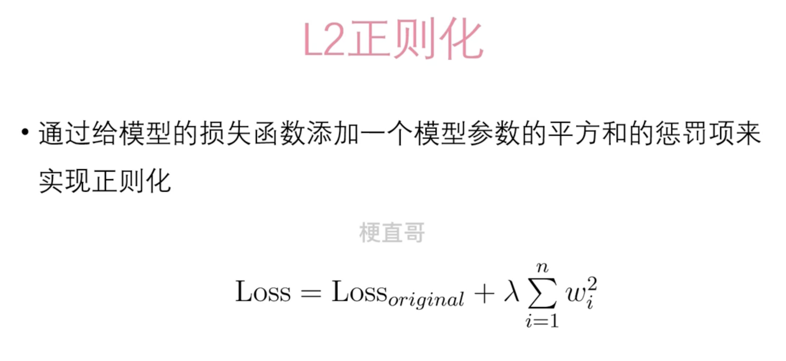
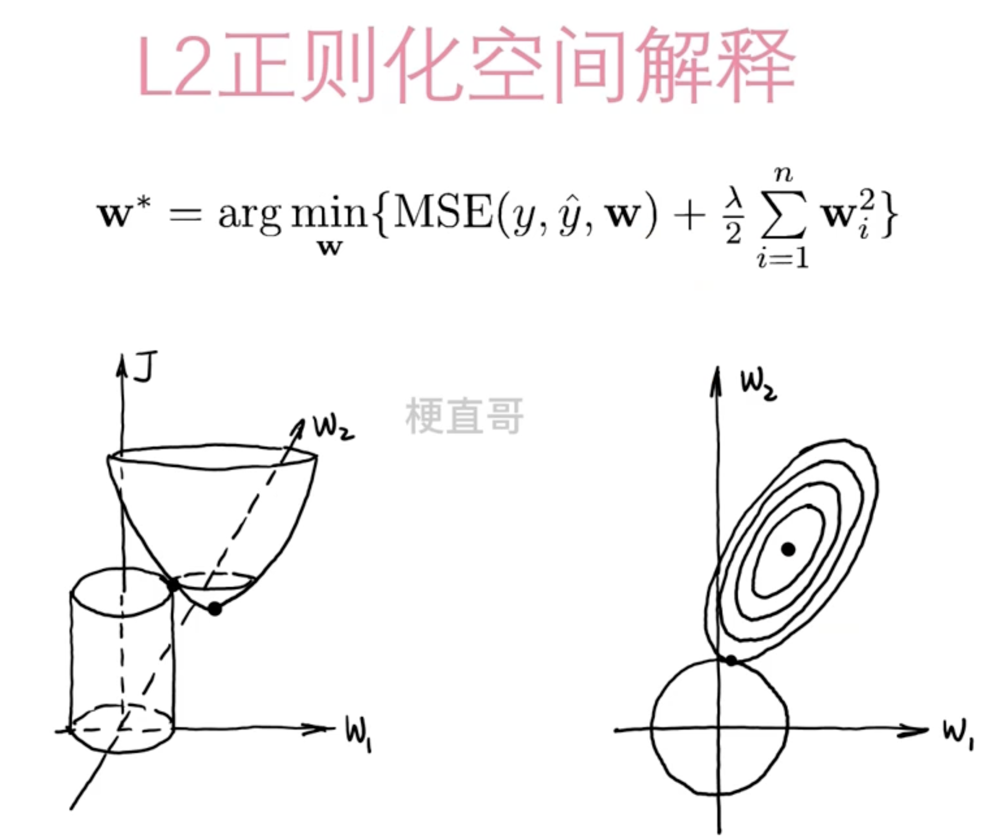
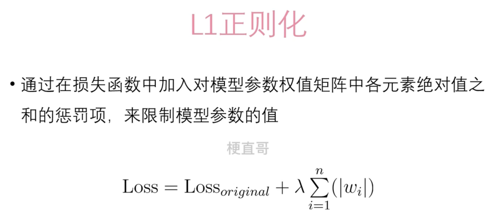
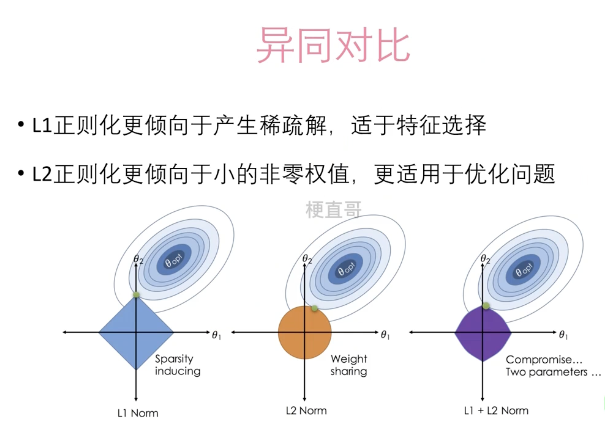

# 深度学习中的正则化

L2正则化有助于提高模型的泛化能力，减少过拟合，因为它使得模型更加平滑，避免了参数的过度波动。

## L2 正则化

其中，*λ* 是正则化系数，控制着正则化的强度。较大的*λ*值意味着更强的正则化。*w**i* 是模型的第 *i* 个参数。

# L1正则化（LASSO）

L1正则化通过在损失函数中增加一个正则化项来限制模型参数的大小。与L2正则化不同的是，L1正则化惩罚的是模型参数的L1范数（绝对值之和），而不是L2范数（平方和的平方根）。

与L2正则化相比，L1正则化更倾向于使参数稀疏化，即将一些参数推向零。这种稀疏性有助于特征选择和模型解释性，因为它可以帮助识别对最终预测贡献较小的特征，从而减少模型的复杂度。

# L1和L2的区别

1. **惩罚项计算方式**：
   - L1正则化使用模型参数的L1范数（参数的绝对值之和），因此正则化项为参数的绝对值之和。
   - L2正则化使用模型参数的L2范数（参数的平方和的平方根），因此正则化项为参数的平方和的平方根。
2. **影响模型的方式**：
   - L1正则化倾向于使模型参数变得稀疏，即将一些参数推向零，这使得模型更加简单，有助于特征选择和模型解释性。
   - L2正则化通过限制参数的大小来防止过拟合，它倾向于使参数接近于零但不会严格等于零，因此它更多地控制了模型的平滑度。
3. **计算效率**：
   - 通常情况下，L2正则化的计算更加高效，因为L2范数的梯度计算通常比L1范数的梯度计算更简单。
4. **对异常值的鲁棒性**：
   - L1正则化对异常值更加鲁棒，因为它基于绝对值，而L2正则化对异常值更加敏感，因为它基于平方。

