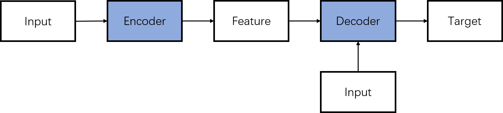
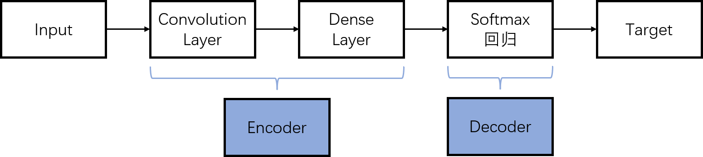
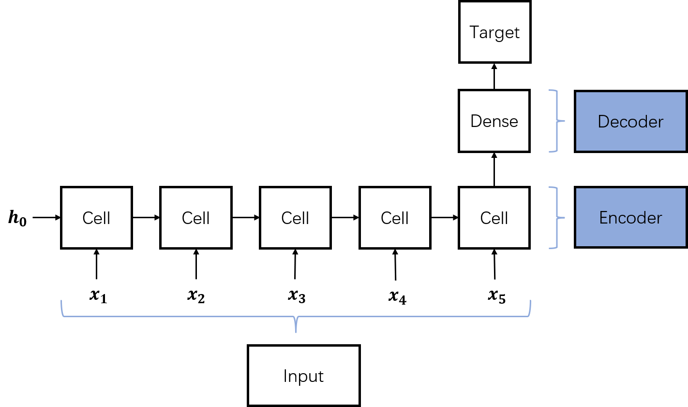

# 编码器-解码器架构

参考：https://zhuanlan.zhihu.com/p/572922549?utm_id=0

##架构的意义

编码器-解码器（Encoder-Decoder）是深度学习模型的抽象概念。

一般认为，许多模型的起源都是基于这一架构的。比如CNN，RNN，LSTM和Transformer等。

使用编码器-解码器架构的模型，编码器负责表示输入（Input），解码器负责输出（Target）

## 架构内容

编码器-解码器，显而易见是由2部分组成，

1. 编码器（Encoder）：负责将输入（Input）转化为特征（Feature）
1. 解码器（Decoder）：负责将特征（Feature）转化为目标（Target）

### 广义的架构

### CNN

CNN（卷积神经网络）可以认为是解码器（Decoder）可以不接受输入（Input）的情况。

### RNN

RNN（循环神经网络）可以认为是解码器（Decoder）同时接受输入（Input）的情况。

