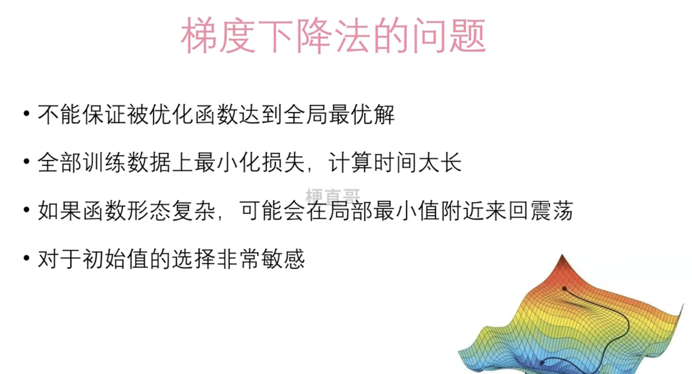
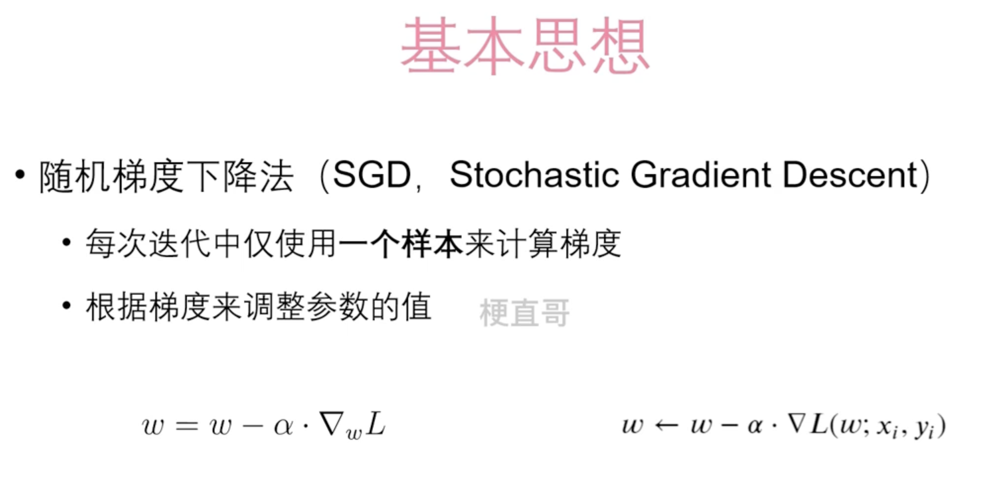
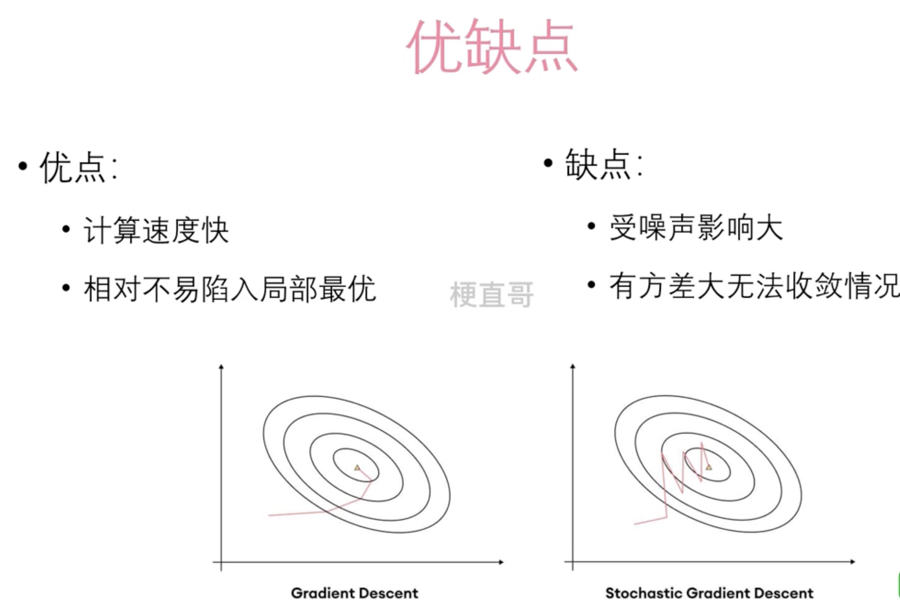
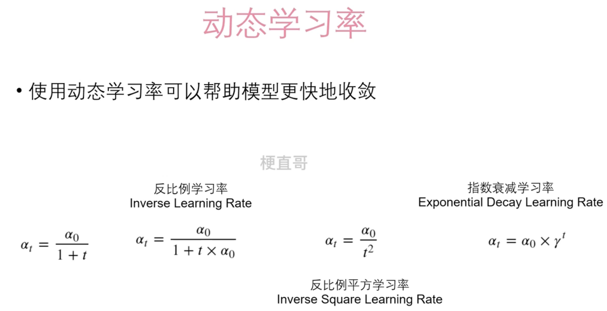

# 随机梯度下降

## 梯度下降的问题

## 随机梯度下降基本思想

## 优缺点

## 随机梯度下降和梯度下降的区别

梯度下降（Gradient Descent）和随机梯度下降（Stochastic Gradient Descent，SGD）是两种常用的优化算法，用于更新模型参数以最小化损失函数。它们的区别在于每次更新参数时所使用的数据量和计算量的不同。

1. **梯度下降（Gradient Descent）**：
   - 在每次参数更新时，梯度下降算法使用整个训练数据集的所有样本计算损失函数关于参数的梯度。
   - 因为需要计算整个数据集的梯度，所以梯度下降通常具有更高的计算复杂度，尤其是当数据集很大时。
   - 梯度下降通常能够更准确地朝着损失函数的最小值方向前进，但计算量较大，尤其对于大规模数据集来说。
2. **随机梯度下降（Stochastic Gradient Descent，SGD）**：
   - 在每次参数更新时，随机梯度下降算法只使用一个样本（或一个小批次样本）的数据来计算损失函数关于参数的梯度。
   - 因为只需要计算一个样本（或一个小批次样本）的梯度，所以随机梯度下降通常具有更低的计算复杂度，尤其是对于大规模数据集来说。
   - 随机梯度下降可能会在更新参数时引入更多的随机性，使得损失函数的优化路径更不稳定，但同时也能够更快地收敛到局部最优解。

综上所述，梯度下降和随机梯度下降的区别在于每次参数更新时所使用的数据量和计算量的不同。梯度下降使用整个数据集的所有样本来计算梯度，计算量较大但通常更准确；而随机梯度下降只使用一个样本（或一个小批次样本）的数据来计算梯度，计算量较小但可能会引入更多的随机性。

## 动态学习率

在使用SDG的时候，使用固定的学习率不是最优的。用动态学习率能够更快收敛。

## 适用场景

随机梯度下降（Stochastic Gradient Descent，SGD）适用于以下情况：

1. **大规模数据集**：随机梯度下降在每次迭代中只使用一个样本（或一个小批次样本）进行参数更新，因此对于大规模数据集来说，计算量相对较小，训练速度较快。
2. **在线学习**：随机梯度下降能够逐步地从新数据中学习，即在不断接收到新数据的情况下，持续地更新模型参数，适用于在线学习的场景。
3. **局部最优解**：随机梯度下降可能会在更新参数时引入更多的随机性，使得损失函数的优化路径更不稳定，有助于跳出局部最优解，更好地探索损失函数的整个空间。
4. **噪声较多的数据**：由于随机梯度下降在每次迭代中只使用一个样本（或一个小批次样本），因此对于噪声较多的数据，随机梯度下降可能具有更好的鲁棒性，能够更好地适应数据的变化。
5. **计算资源受限**：对于计算资源受限的情况，随机梯度下降是一个较好的选择，因为它只需要计算一个样本（或一个小批次样本）的梯度，计算量较小。

需要注意的是，随机梯度下降可能会导致收敛速度较慢、不稳定等问题，因此在应用时需要根据具体情况进行调整和优化。同时，随机梯度下降的学习率需要谨慎选择，过大的学习率可能会导致算法发散，而过小的学习率可能会导致收敛速度较慢。