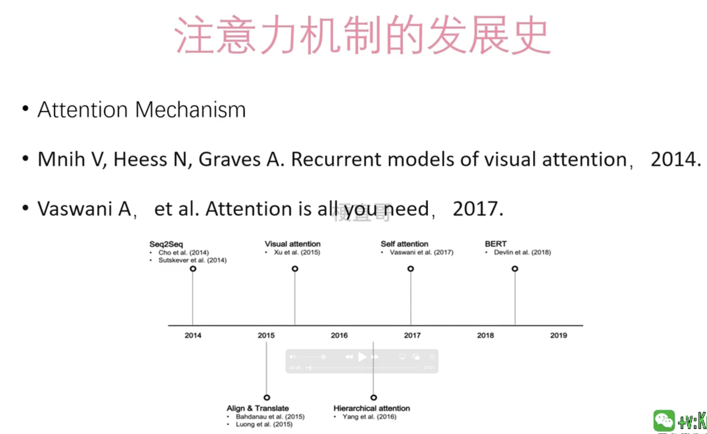
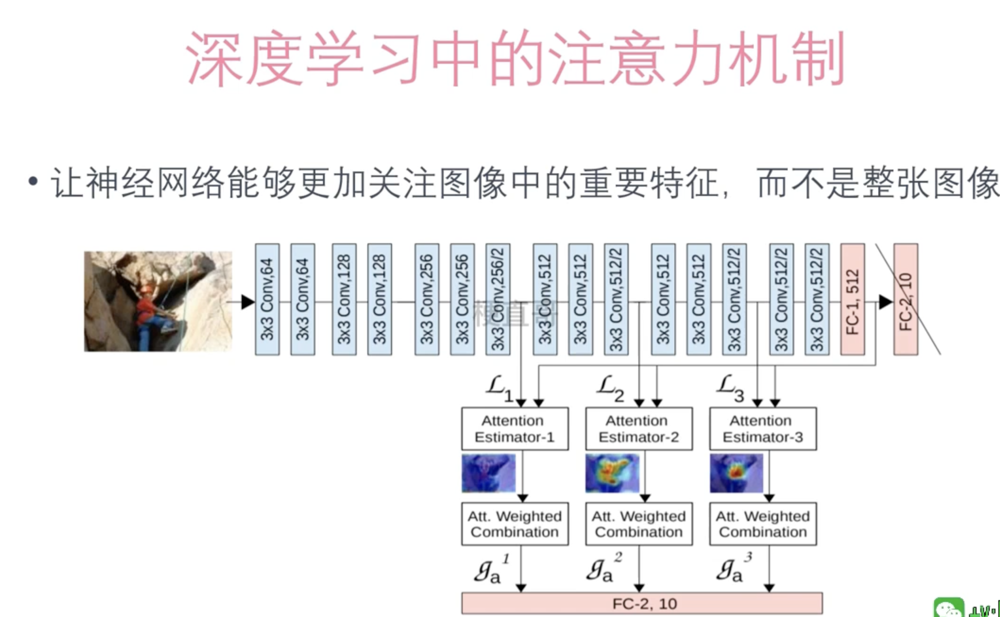
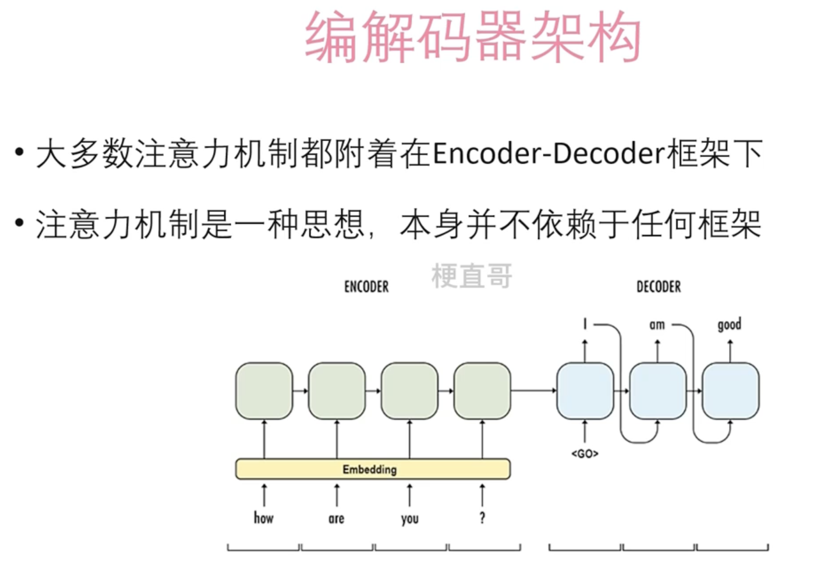
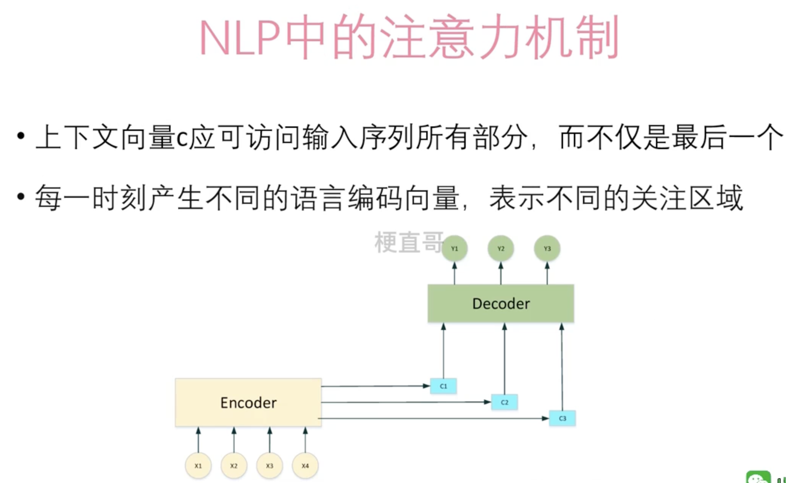
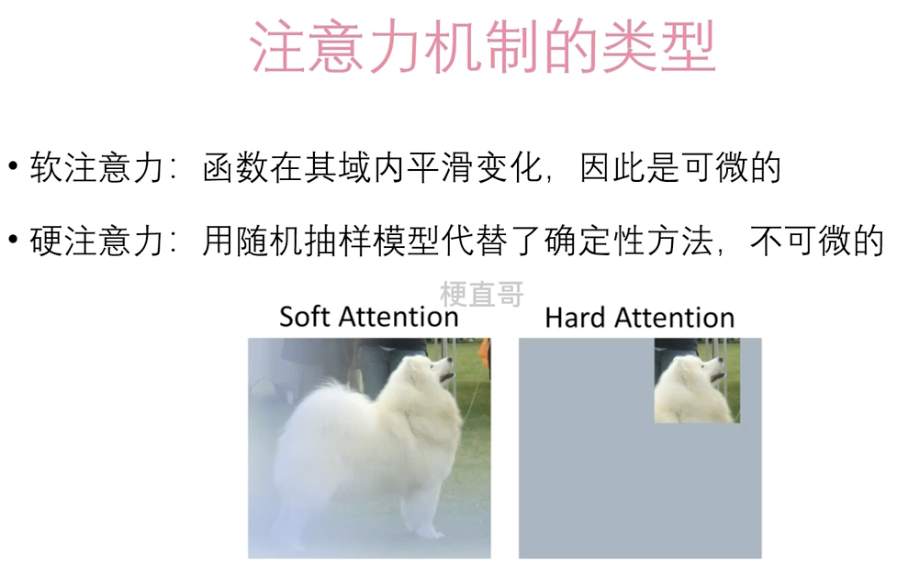
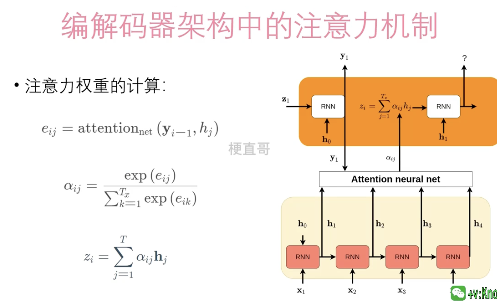
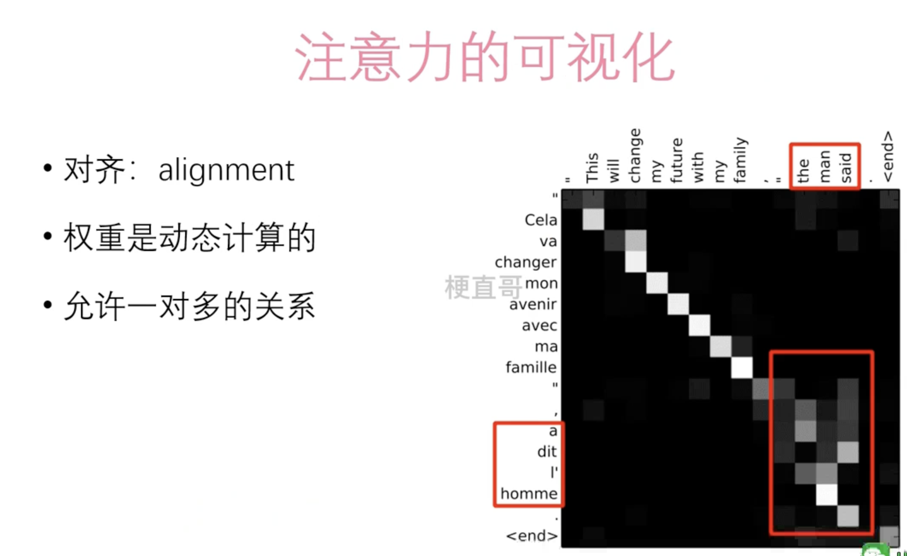

# 注意力机制概念 

注意力机制在多个领域和场景中被广泛应用，主要是因为它解决了序列处理中的一些关键问题，提高了模型处理复杂数据的能力。以下是一些主要的应用场景和它解决的问题：

1. **序列任务中的长距离依赖问题**：在自然语言处理（NLP）、时间序列分析等领域，输入数据往往以序列的形式出现。传统的序列处理模型（如RNNs）在处理长序列时往往难以捕捉长距离的依赖关系，即序列中相隔很远的元素之间的联系。注意力机制通过直接计算序列内各元素之间的关系，使模型能够捕捉到这种长距离的依赖，从而更好地理解和处理序列数据。
2. **信息筛选和聚焦**：在处理包含大量信息的数据时，不是所有信息都是等同重要的。注意力机制允许模型动态地聚焦于最关键的信息，就像人类在阅读文章或观察图片时会自然地关注某些关键信息一样。这种能力特别适用于如机器翻译、文本摘要等任务，其中模型需要从大量信息中提取出最关键的内容。
3. **提高模型的解释性**：注意力权重提供了一种解释模型决策过程的方式。例如，在文本分类或情感分析任务中，通过观察哪些单词或短语获得了更高的注意力权重，可以帮助理解模型做出特定决策的原因。
4. **增强模型的泛化能力**：在图像处理领域，注意力机制可以帮助模型聚焦于图像的关键部分，从而提高对新场景的泛化能力。例如，在图像分类或目标检测任务中，模型可以通过聚焦于关键对象而非背景噪声，提高识别准确性。
5. **多模态学习**：在处理需要融合来自不同来源的信息的任务时（如图像描述生成），注意力机制可以帮助模型决定何时聚焦于视觉信息，何时更依赖文本信息，从而有效地结合不同模态的信息。

通过这些应用场景和解决的问题，可以看出注意力机制极大地增强了模型处理复杂数据的能力，是现代深度学习模型的一个关键组成部分。

## 概念

## 注意力机制的分类

## 计算逻辑

