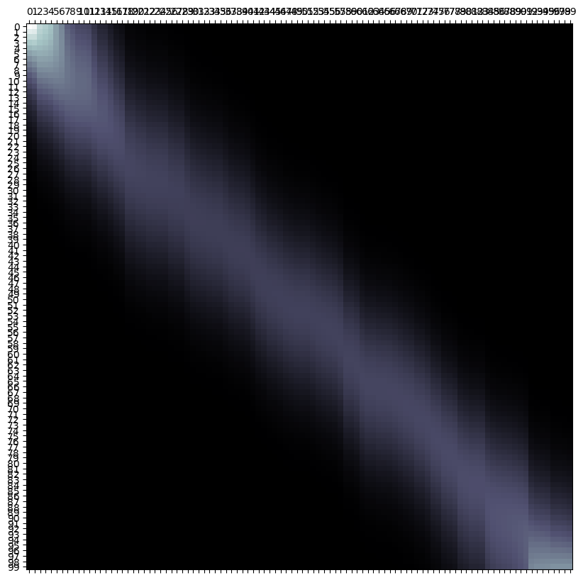

# 注意力可视化


```python
import torch
import matplotlib.pyplot as plt
from torch import nn
from matplotlib import ticker
import warnings
warnings.filterwarnings("ignore")
 
# 绘制注意力热图
def show_attention(axis, attention):
    fig = plt.figure(figsize=(10,10))
    ax=fig.add_subplot(111)
    cax=ax.matshow(attention, cmap='bone') #使用matshow函数绘制注意力矩阵
    if axis is not None:
        ax.set_xticklabels(axis[0])
        ax.set_yticklabels(axis[1])
    ax.xaxis.set_major_locator(ticker.MultipleLocator(1))
    ax.yaxis.set_major_locator(ticker.MultipleLocator(1))
    plt.show()
```


```python
# 生成一个样例
sentence = ' I love deep learning more than machine learning'
tokens = sentence.split(' ')
 
attention_weights = torch.eye(8).reshape((8, 8)) + torch.randn((8, 8)) * 0.1  # 生成注意力权重矩阵
attention_weights
```


    tensor([[ 1.2490, -0.0136, -0.2052,  0.0047,  0.3250,  0.0096,  0.2993,  0.0462],
            [ 0.1328,  1.0034,  0.1180,  0.0036, -0.2049,  0.0555,  0.1503,  0.0446],
            [-0.0439,  0.0449,  1.0112, -0.2507,  0.1009,  0.0155,  0.0483,  0.0183],
            [-0.1528,  0.0386,  0.1755,  1.0013, -0.0465,  0.0106,  0.1440, -0.0888],
            [ 0.0371,  0.2651, -0.1473, -0.0857,  1.0878,  0.0285, -0.2215, -0.0038],
            [ 0.0939,  0.0850,  0.0506,  0.0484,  0.1107,  0.9333,  0.0394,  0.0652],
            [ 0.0247,  0.0481, -0.1146,  0.0415,  0.0383, -0.0022,  0.9915,  0.0562],
            [-0.0333,  0.1140,  0.1033, -0.1050, -0.0519, -0.1894, -0.1182,  0.9198]])


```python
show_attention([tokens, tokens], attention_weights)  # 展示自注意力热图
```


​    

​    

# 注意力池化


```python
# 定义一个映射函数
def func(x):
    return x + torch.sin(x)  # 映射函数 y = x + sin(x)
 
n = 100  # 样本个数100
x, _ = torch.sort(torch.rand(n) * 10)   # 生成0-10的随机样本并排序
y = func(x) + torch.normal(0.0, 1, (n,))  # 生成训练样本对应的y值， 增加均值为0，标准差为1的扰动
x, y
```


    (tensor([0.1276, 0.2560, 0.6350, 0.7076, 0.7956, 0.9769, 1.1247, 1.3391, 1.4196,
             1.5032, 1.5190, 1.5493, 1.7273, 1.9054, 1.9171, 2.0815, 2.2663, 2.3772,
             2.7285, 2.7394, 2.8468, 2.8703, 2.9657, 2.9818, 3.0011, 3.0170, 3.1638,
             3.2041, 3.2094, 3.4106, 3.5534, 3.6055, 3.6444, 3.7070, 3.7443, 3.7587,
             3.8882, 4.0198, 4.0785, 4.1025, 4.1752, 4.3480, 4.5596, 4.6507, 4.8067,
             4.8519, 4.9450, 5.0531, 5.1158, 5.1744, 5.1993, 5.2039, 5.2920, 5.3946,
             5.4688, 5.5184, 5.5838, 5.7287, 6.0539, 6.0585, 6.1641, 6.4072, 6.5302,
             6.5337, 6.5966, 6.6132, 6.6385, 6.7121, 6.8031, 6.8903, 6.9509, 7.1060,
             7.1377, 7.2711, 7.4790, 7.5434, 7.7528, 7.8160, 7.8948, 8.1408, 8.2161,
             8.3000, 8.3002, 8.3348, 8.6009, 8.6944, 8.7547, 8.7901, 8.8199, 8.8714,
             8.9385, 9.0239, 9.4925, 9.5909, 9.6222, 9.6546, 9.8443, 9.8456, 9.8775,
             9.9371]),
     tensor([-0.2520,  3.2857,  1.9814,  3.4338,  2.1293,  1.9695,  4.1257,  1.8557,
              1.6076,  2.9829,  2.6065,  2.3403,  2.2219,  3.5883,  1.3931,  2.6847,
              3.4435,  4.8296,  3.7453,  3.1133,  3.3763,  3.7551,  4.0051,  3.2774,
              2.8920,  2.8148,  1.9959,  2.5947,  3.4608,  3.3935,  0.6675,  2.9012,
              3.9083,  2.9026,  1.5564,  3.7362,  2.4434,  3.0444,  4.5135,  2.2013,
              3.9065,  3.7723,  3.8699,  2.8968,  2.6759,  3.8322,  4.8772,  3.9640,
              3.4316,  4.5297,  5.4149,  3.1801,  4.1597,  5.5544,  5.8947,  5.2695,
              4.6360,  5.2960,  6.3447,  4.9574,  5.7890,  5.0492,  6.3820,  5.6423,
              7.2625,  5.9022,  6.8853,  7.6898,  5.8146,  7.7793,  7.6551,  7.1207,
              7.8767, 10.5048,  5.7866,  6.8861,  9.7548,  8.5042,  8.1624, 11.0397,
              8.6929,  9.0287,  9.5001,  9.1701,  8.3025, 10.6011,  8.6433, 11.3068,
              7.6471, 10.3445,  8.2675, 10.5413, 11.6965,  9.4051, 10.0267,  8.0870,
              8.6623,  9.2124,  9.2563,  9.4806]))


```python
# 绘制曲线上的点
x_curve = torch.arange(0, 10, 0.1)  
y_curve = func(x_curve)
plt.plot(x_curve, y_curve)
plt.plot(x, y, 'o')
plt.show()
```


​    

​    

# 非参数注意力池化


```python
# 平均池化
y_hat = torch.repeat_interleave(y.mean(), n) # 将y_train中的元素进行复制，输入张量为y.mean, 重复次数为n
plt.plot(x_curve, y_curve)
plt.plot(x, y, 'o')
plt.plot(x_curve, y_hat)
plt.show()
```


​    

​    


```python
# nadaraya-watson 核回归
x_nw = x_curve.repeat_interleave(n).reshape((-1, n))
x_nw.shape, x_nw
```


    (torch.Size([100, 100]),
     tensor([[0.0000, 0.0000, 0.0000,  ..., 0.0000, 0.0000, 0.0000],
             [0.1000, 0.1000, 0.1000,  ..., 0.1000, 0.1000, 0.1000],
             [0.2000, 0.2000, 0.2000,  ..., 0.2000, 0.2000, 0.2000],
             ...,
             [9.7000, 9.7000, 9.7000,  ..., 9.7000, 9.7000, 9.7000],
             [9.8000, 9.8000, 9.8000,  ..., 9.8000, 9.8000, 9.8000],
             [9.9000, 9.9000, 9.9000,  ..., 9.9000, 9.9000, 9.9000]]))


```python
# 带入公式得到注意力权重矩阵
attention_weights = nn.functional.softmax(-(x_nw - x)**2 / 2, dim=1)
attention_weights.shape, attention_weights
```


    (torch.Size([100, 100]),
     tensor([[1.2240e-01, 1.1942e-01, 1.0087e-01,  ..., 1.1017e-22, 8.0437e-23,
              4.4554e-23],
             [1.1244e-01, 1.1112e-01, 9.7487e-02,  ..., 2.6746e-22, 1.9590e-22,
              1.0916e-22],
             [1.0286e-01, 1.0297e-01, 9.3824e-02,  ..., 6.4660e-22, 4.7512e-22,
              2.6632e-22],
             ...,
             [7.9130e-22, 2.6830e-21, 8.9501e-20,  ..., 6.1834e-02, 6.1517e-02,
              6.0761e-02],
             [3.2071e-22, 1.1014e-21, 3.8162e-20,  ..., 6.6229e-02, 6.6099e-02,
              6.5677e-02],
             [1.2941e-22, 4.5018e-22, 1.6200e-20,  ..., 7.0621e-02, 7.0708e-02,
              7.0677e-02]]))


```python
# y_hat为注意力权重和y值的乘积，是加权平均值
y_hat = torch.matmul(attention_weights, y)
plt.plot(x_curve, y_curve)
plt.plot(x, y, 'o')
plt.plot(x_curve, y_hat)
plt.show()
```


​    

​    


```python
show_attention(None, attention_weights) # 展示注意力热图
```


​    

​    

