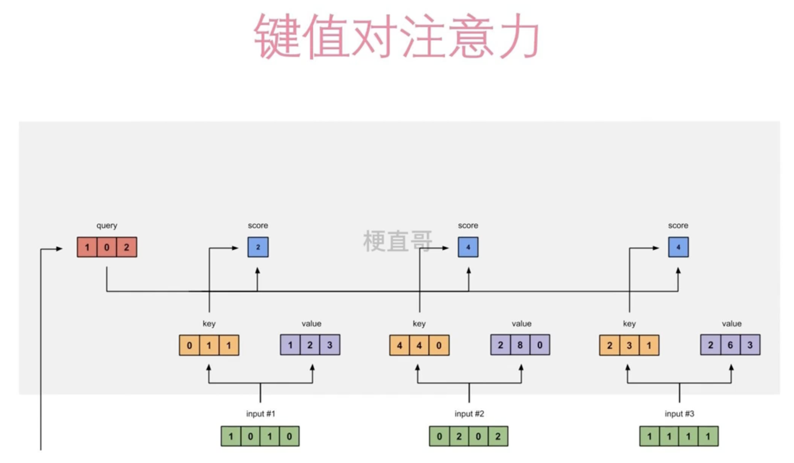
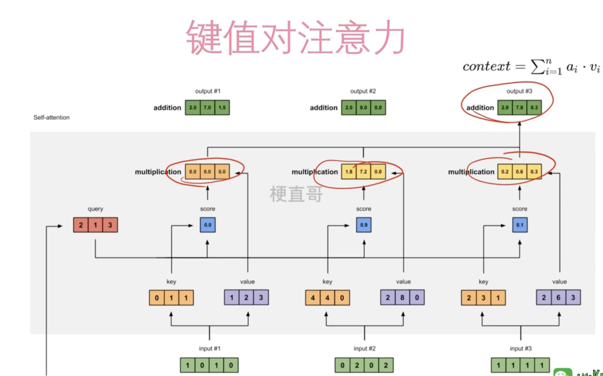

# 键值对注意力和多头注意力

## 经典注意力机制

传统的注意力机制通常指的是序列到序列模型（Seq2Seq）中的注意力机制，它允许模型在生成输出时，聚焦于输入序列的不同部分。这种机制通常涉及三个主要组成部分：查询（Query）、键（Key）和值（Value）。在这种框架下，Query通常与当前的目标序列有关，而Key和Value与输入序列相关。注意力权重计算是通过查询和键的相似度来完成的，然后这些权重被用来加权值，以产生加权的输出，该输出随后被用于后续的处理。

## 键值对注意力机制

键值对注意力机制是Transformer模型中引入的一个概念，它在传统注意力机制的基础上做了改进。在键值对注意力机制中，Key和Value是成对出现的，但是它们不必直接相等。这种机制允许模型在确定输出时，将更多的上下文信息考虑进来。Value值不参与score计算了。

- **键（Key）**：用于计算注意力权重，通常是通过比较查询（Query）和键（Key）之间的相似度来实现的。
- **值（Value）**：一旦计算出注意力权重后，这些权重将应用于值（Value），以生成加权的表示，该表示会被送入后续的网络层。

代入计算：

multiplication中的值= 紫色部分*蓝色部分

第二排三个黄色相加 得到 output#3:

## 多头注意力机制

1. **分割**：在多头注意力机制中，查询、键和值的表示首先被分割成多个“头”。这些头是较低维度的表示，允许模型在较小的子空间中捕捉不同类型的信息。
2. **并行处理**：每个头独立地进行相似度计算和加权和操作，这可以并行发生。因为这些计算是在较低维度的子空间进行的，所以可以更有效地捕捉到多样化的信息和依赖关系。
3. **拼接和投影**：一旦所有的头都计算出了它们各自的输出，这些输出会被拼接起来，并通过一个线性变换（或者说是一个可学习的投影）来产生最终的输出。这一步整合了所有头的信息，保证了输出能够捕捉到各个头提供的所有有用信息。