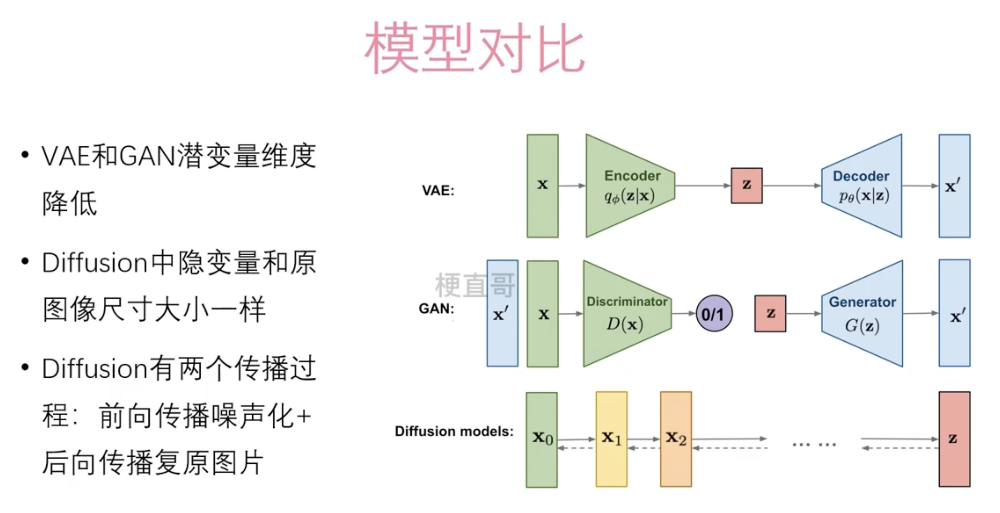
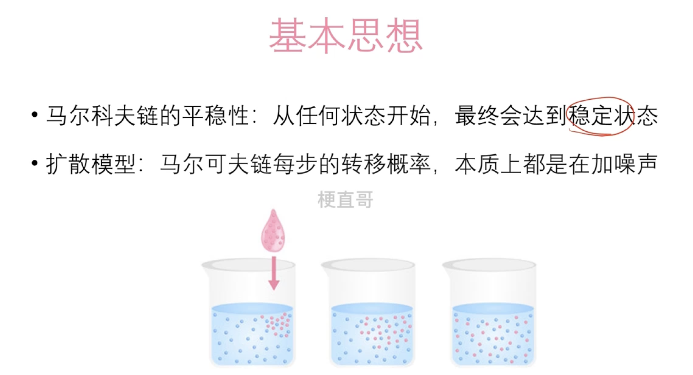
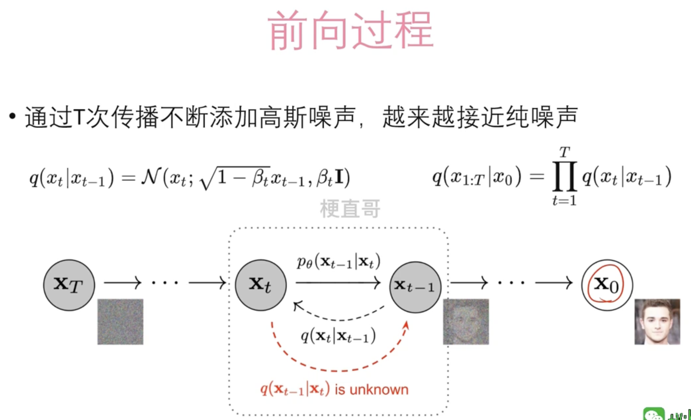
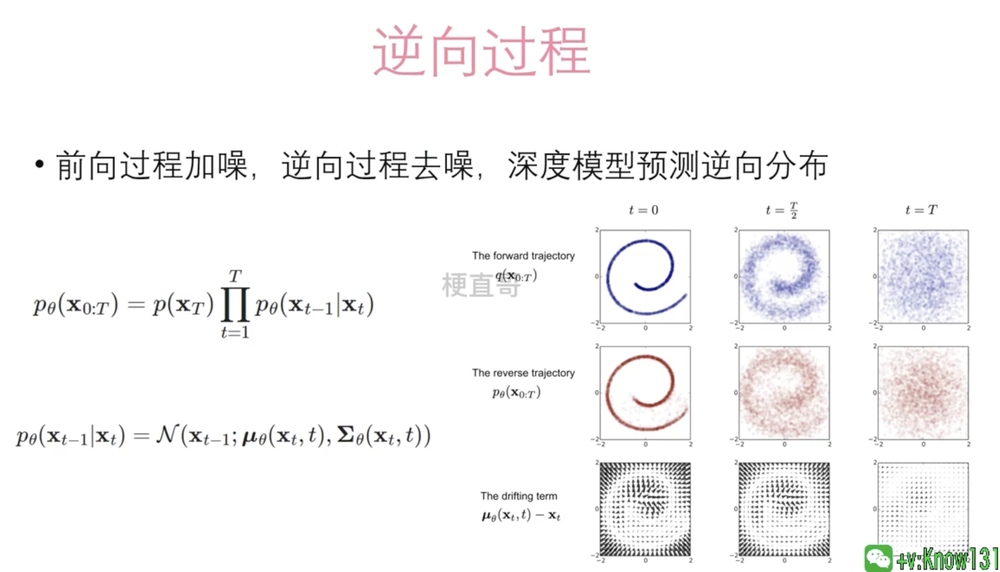

# Diffusion 扩散模型

## 简介

在深度学习领域，扩散模型（diffusion models）是一类生成模型，用于生成数据，如图像、音频和文本。这些模型通过模拟数据生成过程的逆向扩散过程来工作，从而生成高质量、多样性的数据样本。

扩散模型通常包含两个过程：前向过程和反向过程。在前向过程中，模型逐渐将数据样本加入噪声，直到数据完全转化为噪声。在反向过程中，模型学习如何逐步从噪声中恢复出原始数据，这个过程通过训练深度神经网络来完成。

在训练时，扩散模型学习如何反转这个噪声添加过程，从而可以从随机噪声生成数据样本。这个生成过程通常涉及多个步骤，逐渐减少噪声，直到恢复出清晰的数据样本。

扩散模型在生成图像、音乐、语音、文本等方面表现出了优异的性能，与GANs（生成对抗网络）和VAEs（变分自编码器）等其他生成模型相比，扩散模型在生成的质量和多样性方面显示出了竞争力。这些模型特别擅长生成高质量的图像，能够在细节上达到非常高的真实度。

扩散模型的一个关键优点是它们能够生成非常高质量的样本，但它们也面临一些挑战，如生成过程的计算成本较高，因为这个过程涉及多个步骤，并且每个步骤都需要神经网络的推断。尽管如此，扩散模型因其在各种任务上的强大性能和灵活性，已成为深度学习领域的一个热门研究话题。

## 对比

## 基本思想

## 前向过程

## 逆向过程

