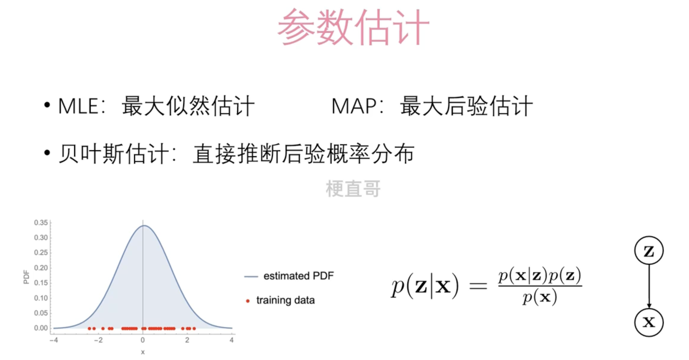
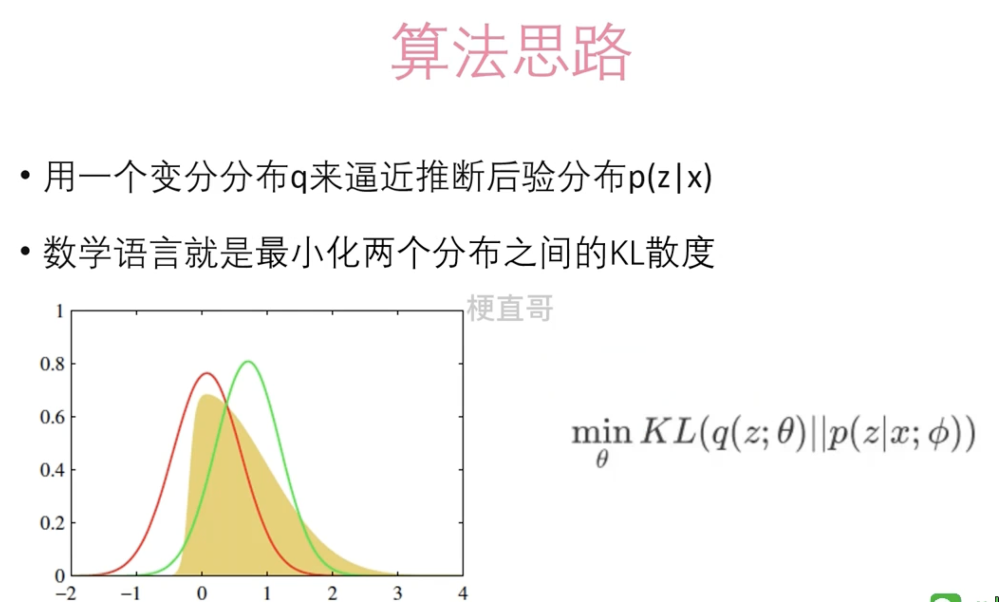

# 变分推断

变分推断（Variational Inference, VI）是一种在统计学和机器学习中使用的方法，旨在通过优化问题来近似复杂概率分布。它常用于贝叶斯统计中，尤其是当后验分布难以计算或无法直接采样时。

变分推断的基本思想是选择一个简单的分布族，然后找到这个分布族中最接近目标复杂分布的成员。这里的“接近”通常通过KL散度（Kullback-Leibler divergence）来衡量，KL散度是衡量两个概率分布差异的一种方法。

在变分推断中，我们首先假设一个易于处理的概率分布（如高斯分布）来近似我们感兴趣的复杂后验分布。然后，我们调整这个简单分布的参数，使得它尽可能地接近复杂分布。这个过程通常涉及到最优化算法，如梯度下降。

变分推断与蒙特卡洛方法（如马尔科夫链蒙特卡洛，MCMC）不同，后者通过从复杂分布中采样来近似这个分布，而变分推断则是通过解决一个优化问题来找到最佳的近似分布。

变分推断在多种领域得到应用，包括自然语言处理、计算机视觉和生物信息学等，尤其在处理大规模数据集或复杂模型时，变分推断由于其相对较快的计算速度而显得尤为重要。

简而言之，变分推断就像是在没有完整地图的情况下，用一张简化版的地图来探索一个复杂地区，虽然这张简化版地图可能有些偏差，但它足以帮助你大致了解地形并找到目的地。

