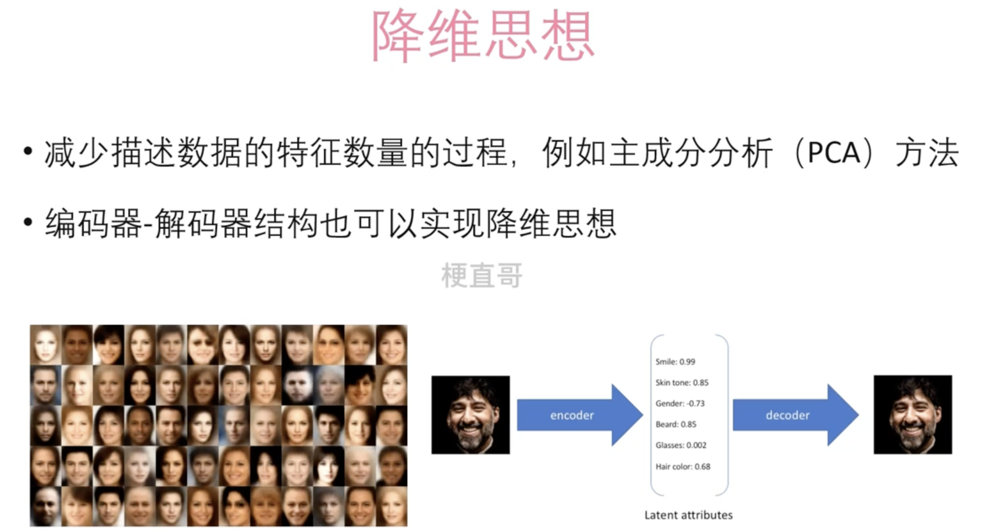
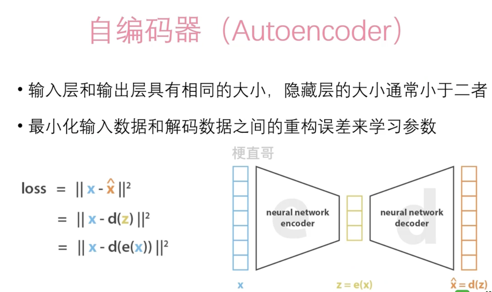

# 变分自编码器 （VAE）

变分自编码器（Variational Autoencoder，简称VAE）是一种深度学习模型，属于生成模型的范畴。它们被广泛应用于生成新的数据样本，如图像、文本或音频。VAE 通过学习输入数据的潜在表示来生成新的数据，这些潜在表示能够捕捉数据中的关键特征。

### 基本原理

1. **编码器**：VAE的第一部分是编码器。编码器的作用是将输入数据映射到潜在空间（latent space），通常是一个多维正态分布。这意味着对于每个输入数据点，编码器会输出一个平均值（mean）和一个方差（variance），这些值定义了潜在空间中的一个分布。
2. **潜在空间**：这个空间允许VAE学习到数据中的抽象表示。在潜在空间中，相似的数据点会被映射到相近的区域，这使得生成过程可以通过采样潜在空间中的点来进行。
3. **解码器**：VAE的第二部分是解码器。解码器的任务是将潜在空间中的点映射回原始数据空间。这意味着解码器学习如何根据潜在空间中的点重构输入数据。

### 训练过程

训练VAE时，目标是最小化重构误差（即原始数据和重构数据之间的差异）和一个正则化项。这个正则化项通常是KL散度（Kullback-Leibler divergence），用于测量编码器输出的分布和标准正态分布之间的差异。这有助于确保潜在空间的连续性和完整性，从而使生成的数据具有多样性和连贯性。

### 应用

VAE在多个领域都有广泛的应用，包括但不限于：

- **图像生成**：VAE可以生成新的图像，例如人脸或物体。
- **数据去噪**：VAE能够学习数据的稳健表示，有助于去除输入数据中的噪声。
- **风格转换**：VAE可以用于将一种风格的图像转换为另一种风格，例如将日间的风景照片转换为夜间的风景。
- **数据插值**：在潜在空间中进行插值可以生成两个数据点之间的连续过渡，用于各种创造性和分析应用。

## 底层思想

## 自编码器

