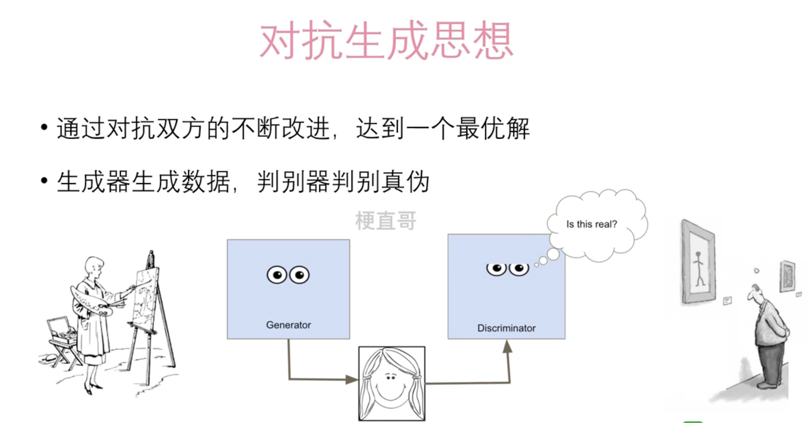
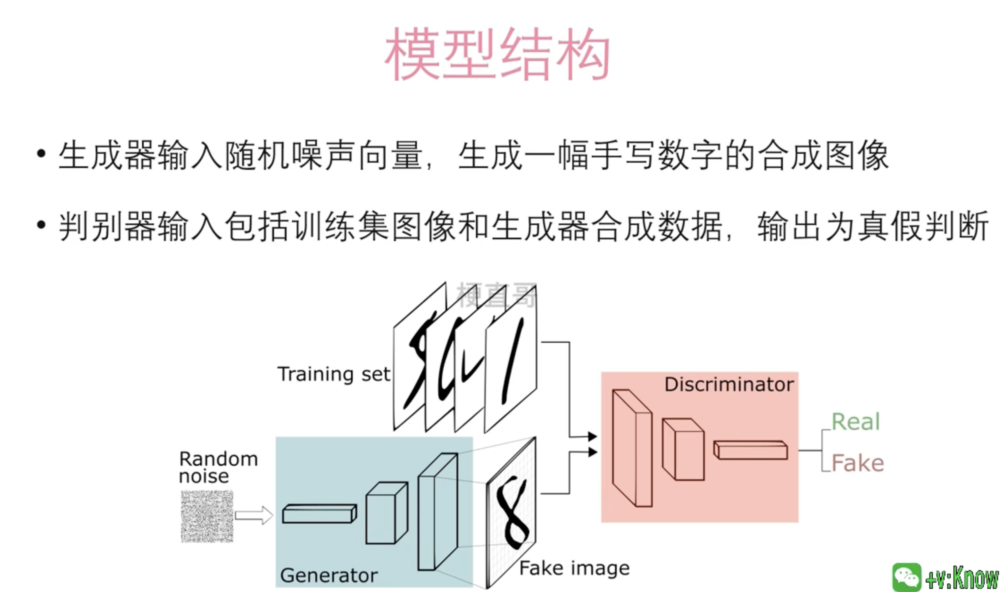
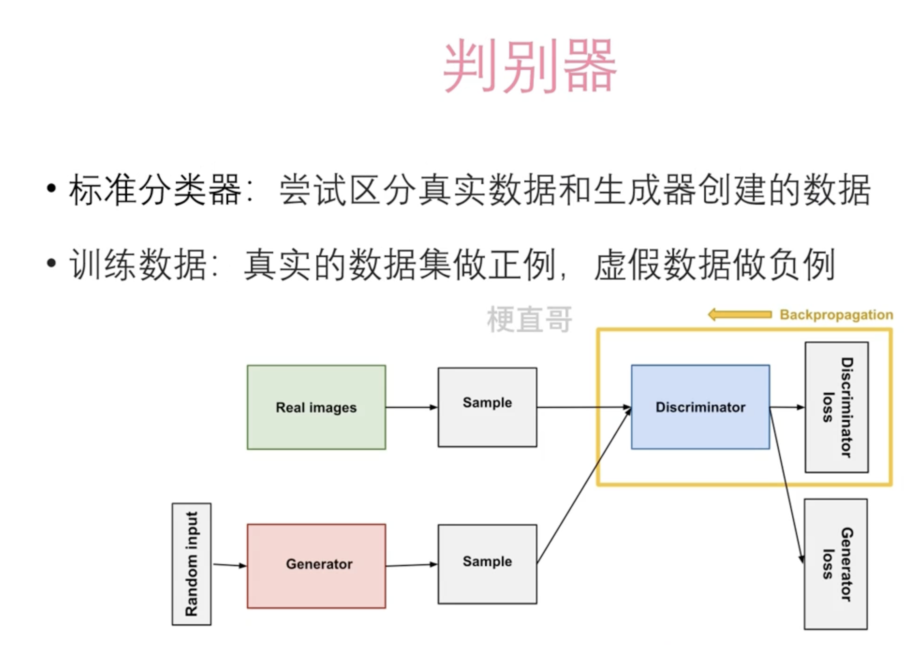
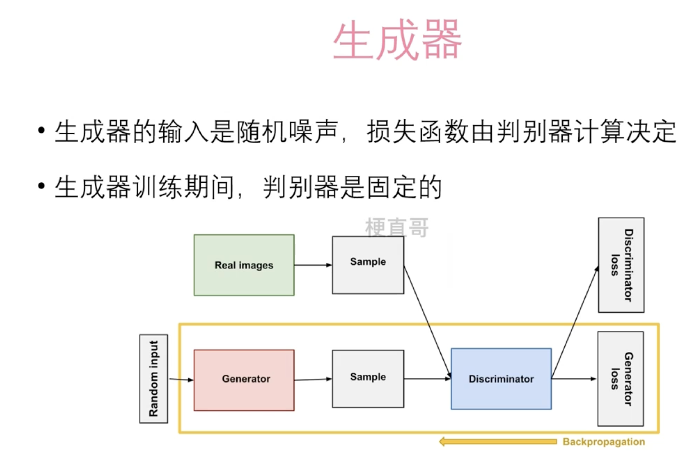
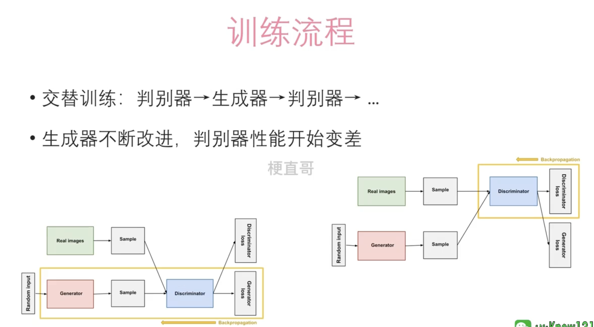
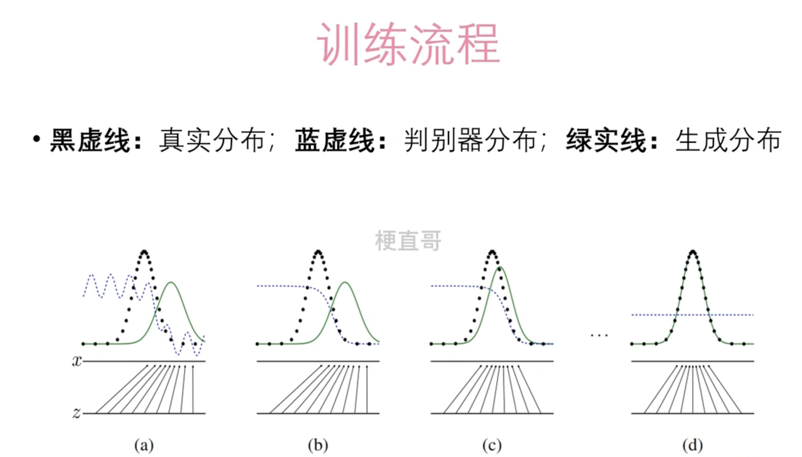
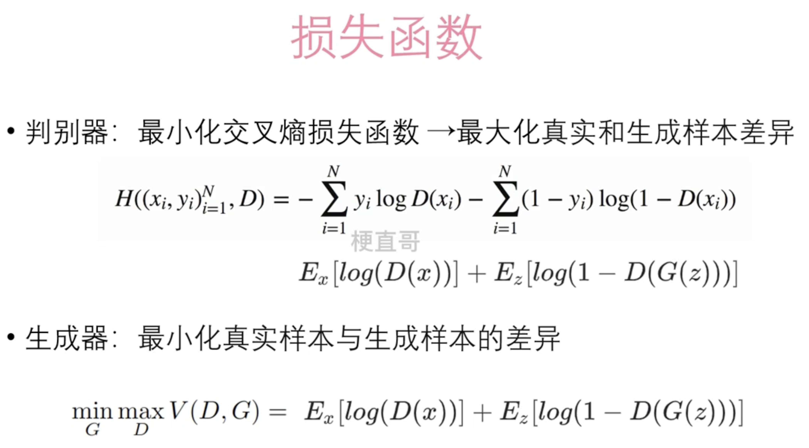

# 生成对抗网络

生成对抗网络（Generative Adversarial Networks，GANs）是一种非常有趣的机器学习框架，它由两个神经网络组成：一个生成器（Generator）和一个判别器（Discriminator）。这两个网络在学习过程中相互竞争，从而提高各自的性能。

想象一下，生成器就像是一位伪造艺术品的艺术家，它的目标是创造出足以以假乱真的艺术作品。而判别器则像是一个艺术品鉴定师，它的任务是分辨出哪些是真正的艺术品，哪些是伪造的。在这个过程中，伪造艺术家会不断学习如何制作更加逼真的作品，而鉴定师也会不断提高其鉴别真伪的能力。

在GAN的训练过程中，生成器接收随机噪声作为输入，尝试产生与真实数据相似的数据。判别器的任务是区分生成器产生的数据和真实数据。生成器的目标是欺骗判别器，让判别器认为其生成的数据是真实的。而判别器则要不断提高自己的判别能力，准确区分真实数据和生成器生成的数据。

通过这种对抗过程，生成器学会制造越来越逼真的数据，而判别器则变得越来越擅长识别真假数据。最终，如果GAN训练得当，生成器将能创造出极其接近真实数据的伪数据。

GANs在很多领域都有应用，比如图片生成、图像编辑、风格转换、声音生成等等。通过这种方式，机器不仅能理解数据，还能创造出新的数据，展现出一种创造力。

## 思想

## 结构

## 判别器

## 生成器

## 训练过程

