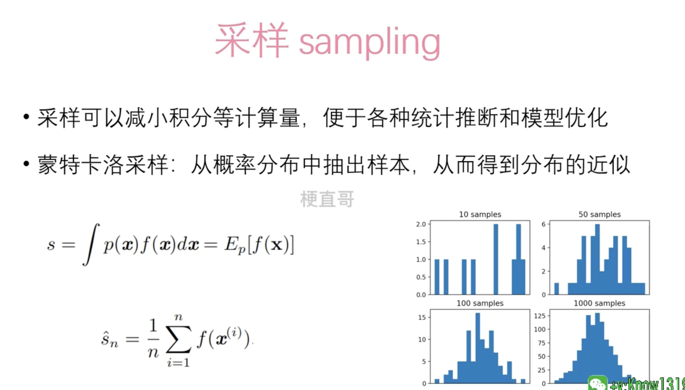
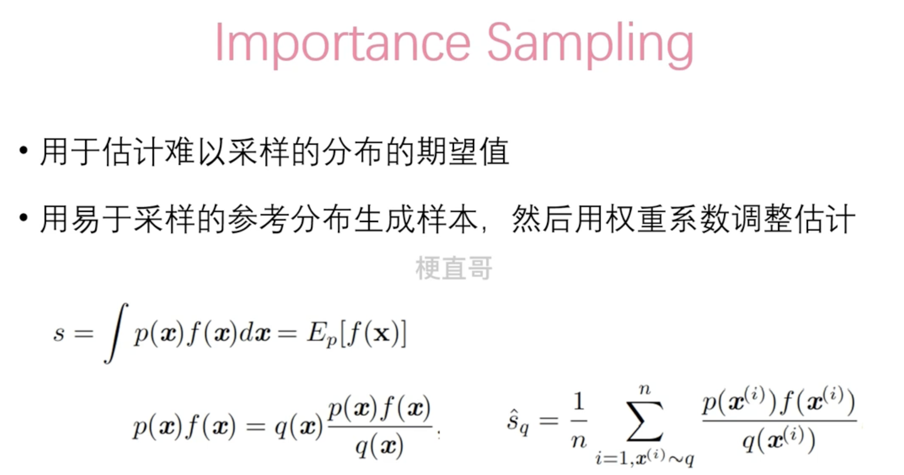
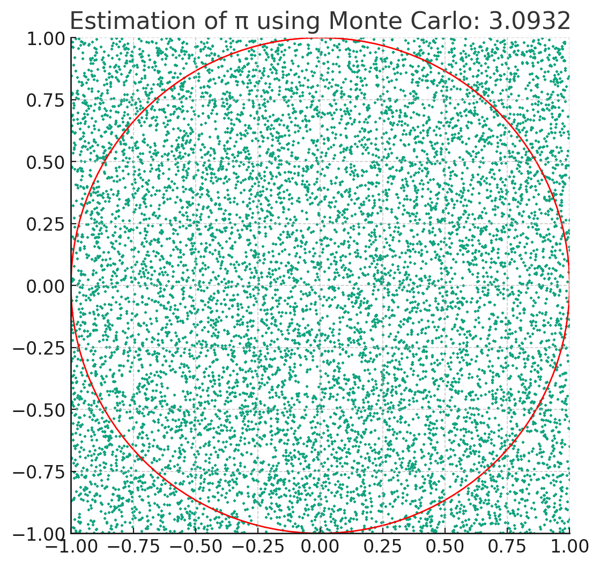
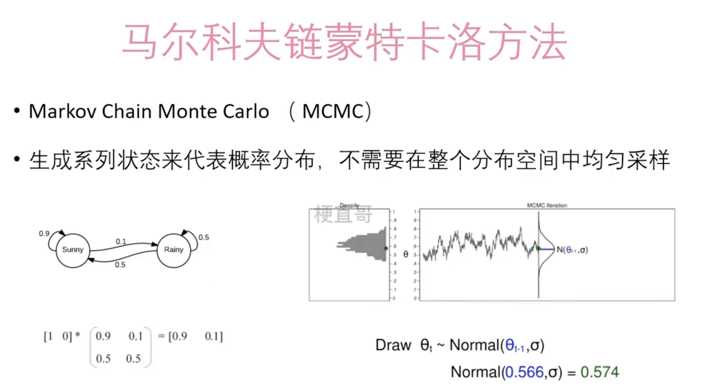

# 蒙特卡洛方法

蒙特卡洛方法是一种基于随机抽样和统计模拟的数学计算方法，用于解决各种数学、物理和工程问题，尤其是那些难以用传统分析方法解决的问题。这种方法通过模拟随机变量的值来计算可能的结果，进而得出问题的近似解。

以下是蒙特卡洛方法的一些关键特点和应用场景：

1. **随机抽样**：蒙特卡洛方法通过随机抽样来模拟或近似计算一个过程或系统的行为。这种方法不依赖于确定性的算法，而是利用概率分布来生成随机样本。
2. **近似解**：由于它基于抽样，所以得到的是问题的近似解，不是精确解。随着样本数量的增加，这个近似解通常会越来越接近真实的解。
3. **应用领域广泛**：蒙特卡洛方法在金融、物理、工程、统计学、计算生物学等许多领域都有应用。例如，在金融领域，蒙特卡洛方法可以用来评估复杂金融衍生品的价格或风险；在物理学中，它被用来模拟粒子的路径等。
4. **并行计算**：由于蒙特卡洛方法中的抽样通常是独立的，这使得它非常适合并行计算，能够有效地利用现代多核处理器的计算能力。

简而言之，蒙特卡洛方法通过随机抽样来进行数值模拟，为各种复杂问题提供了一种强大而灵活的求解工具。

## 基础知识

### Sampling

## 蒙特卡洛方法Demo

过蒙特卡洛方法，我们生成了10000个随机点，以估算圆周率π的值。在这个示例中，随机点落在单位圆内的比例乘以正方形的面积（4）给出了π的一个近似值，这里计算得到的π值约为3.0932。图中红色圆圈表示单位圆，而蓝色和橙色的点表示随机生成的点，落在圆内的点和落在圆外的点分别用不同的颜色表示。

这个结果只是一个近似值，随着随机点数量的增加，估算值会越来越接近真实的π值。这个示例展示了蒙特卡洛方法的基本原理和如何应用它来解决实际问题。 

## 马尔科夫链蒙特卡洛方法

