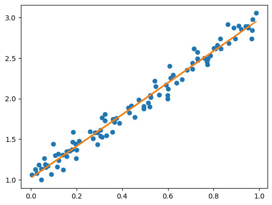

```python
import numpy as np
import torch

#设置随机数种子
np.random.seed(42)

#生成随机数据
x = np.random.rand(100,1)
y = 1 + 2 * x + 0.1 * np.random.randn(100,1)

#将数据转换为pytorch tensor
x_tensor = torch.from_numpy(x).float()
y_tensor = torch.from_numpy(y).float()
```


```python
#设置超参数
learning_rate = 0.1
num_epochs = 1000
```


```python
# 初始化参数
w = torch.randn(1, requires_grad = True) #equires_grad 表达的含义是，这一参数是否保留（或者说持有，即在前向传播完成后，是否在显存中记录这一参数的梯度，而非立即释放）梯度
b = torch.zeros(1, requires_grad = True)
```


```python
# 开始训练
for epoch in range(num_epochs):
    #计算预测值
    y_pred = x_tensor * w + b

    #计算损失
    loss = ((y_pred - y_tensor) ** 2).mean()

    #反向传播
    loss.backward()

    #更新参数
    with torch.no_grad(): 
        w -= learning_rate * w.grad
        b -= learning_rate * b.grad

        # 清空梯度
        w.grad.zero_()
        b.grad.zero_()

# 输出训练后的参数
print('w:',w)
print('b:',b)
```

    w: tensor([1.9540], requires_grad=True)
    b: tensor([1.0215], requires_grad=True)


```python
import matplotlib.pyplot as plt

plt.plot(x,y,'o')
plt.plot(x_tensor.numpy(),y_pred.detach().numpy())
plt.show()
```


​    

​    

