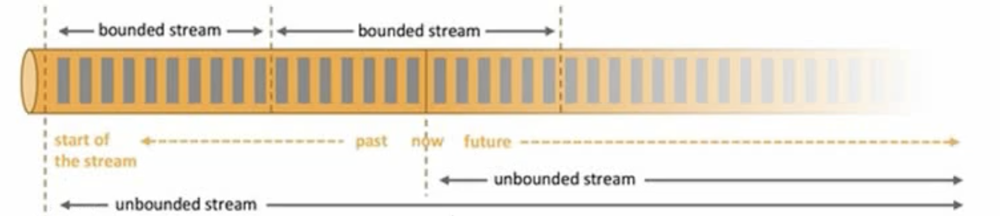
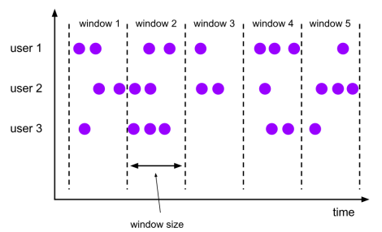
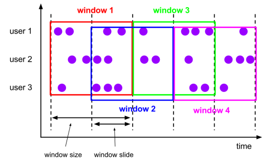
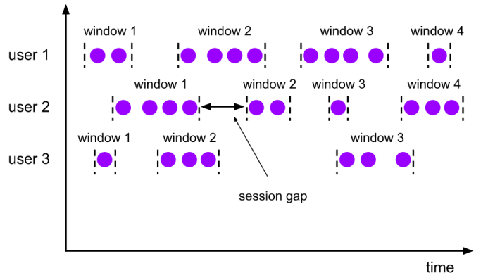

# Flink Window Api

## 概念

Window 是flink处理无限流的核心,Windows将流拆分为有限大小的“桶” (bucket)，我们可以在其上应用计算。

Flink 认为 Batch 是 Streaming 的一个特例，所以 Flink 底层引擎是一个流式引擎，在上面实现了流处理和批处理。

而窗口（window）就是从 Streaming 到 Batch 的一个桥梁。

## 类型

### 时间窗口 （Time Window）

#### Tumbling Window(翻滚窗口)

* 将数据依据固定的窗口长度对数据进行切分
* 时间对齐，窗口长度固定，没有重叠

#### Sliding Window(滑动窗口)

* 滑动窗口是固定窗口的更广义的一种形式，滑动窗口由固定的窗口长度和滑动间隔组成
* 窗口长度固定，可以哟重叠

#### Session Window(会话窗口)

* 由一系列事件组合一个指定时间长度的timeout间隙组成，也就是一段时间没有没收到信数据就会生成新的窗口
* 特点：时间无对齐

### 计数窗口 （Count Window）

* 滚动计数窗口
* 滑动技术窗口

