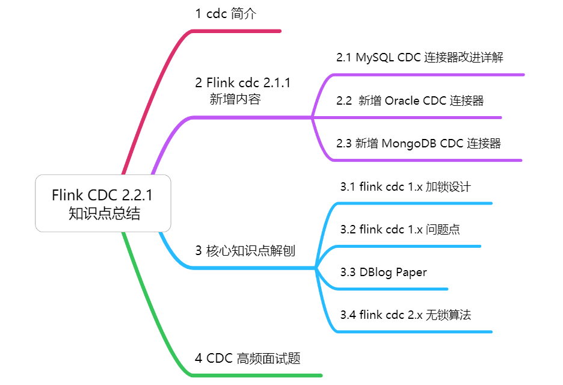

# Flink CDC 高频面试题

参考：https://blog.csdn.net/zjjcchina/article/details/124021493

Flink CDC Connectors 是 Flink 的一组 Source 连接器，是 Flink CDC 的核心组件，这些连接器负责从 MySQL、PostgreSQL、Oracle、MongoDB 等数据库读取存量历史数据和增量变更数据。

## 高频面试题

### flink  Dynamic Table & ChangeLog Stream 了解吗？

Dynamic Table 是 Flink SQL 定义的动态表，动态表和流的概念是对等的参照上图，流可以转换成动态表，动态表也可以转换成流。

在 Flink SQL 中，数据从一个算子以 Changelog Stream 的形式流向另外一个算子时，任意时刻的 Changelog Stream 可以翻译为一个表，也可以翻译为一个流。

### mysql 表与 binlog 的关系是什么?

MySQL 数据库的一张表所有的变更都记录在 binlog 日志中，如果一直对表进行更新，binlog 日志流也一直会追加，数据库中的表就相当于 binlog 日志流在某个时刻点物化的结果；日志流就是将表的变更数据持续捕获的结果。

这说明 Flink SQL 的 Dynamic Table 是可以非常自然地表示一张不断变化的 MySQL 数据库表。

### flink cdc 底层的采集工具用哪个？

选择 Debezium 作为 Flink CDC 的底层采集工具，原因是 debezium 支持全量同步，也支持增量同步，同时也支持全量 + 增量的同步，非常灵活，同时基于日志的 CDC 技术使得提供 Exactly-Once 成为可能

### flink sql 与 debezium 的数据结构有哪些相似性？

通过对 Flink SQL 的内部数据结构 RowData 和 Debezium 的数据结构进行对比，可以发现两者非常相似。

（1）每条 RowData 都有一个元数据 RowKind，包括 4 种类型， 分别是插入 (INSERT)、更新前镜像 (UPDATE_BEFORE)、更新后镜像 (UPDATE_AFTER)、删除 (DELETE)，这四种类型和数据库里面的 binlog 概念保持一致。

（2）Debezium 的数据结构，也有一个类似的元数据 op 字段， op 字段的取值也有四种，分别是 c、u、d、r，各自对应 create、update、delete、read。对于代表更新操作的 u，其数据部分同时包含了前镜像 (before) 和后镜像 (after)。

两者相似性很高，所以采用 debezium 作为底层采集工具

###  flink cdc 1.x 有哪些痛点？

#### (1) 一致性加锁的痛点

由于 flink cdc 底层选用 debezium 作为采集工具，在 flink cdc 1.x 全量 + 增量读取的版本设计中，Debezium 为保证数据一致性，通过对读取的数据库或者表进行加锁，但是 加锁 在数据库层面上是一个十分高危的操作。全局锁可能导致数据库锁住，表级锁会锁住表的读，DBA 一般不给锁权限。

####（2）不支持水平扩展的痛点

因为 Flink CDC 底层是基于 Debezium，Debezium 架构是单节点，所以 Flink CDC 1.x 只支持单并发。

在全量读取阶段，如果表非常大 (亿级别)，读取时间在小时甚至天级别，用户不能通过增加资源去提升作业速度。

####（3）全量读取阶段不支持 checkpoint

Flink CDC  读取分为两个阶段，全量读取和增量读取，目前全量读取阶段是不支持 checkpoint 的;

因此会存在一个问题：当我们同步全量数据时，假设需要 5 个小时，当我们同步了 4 小时的时候作业失败，这时候就需要重新开始，再读取 5 个小时。

### flink cdc 1.x 的加锁发生在哪个阶段？

加锁是发生在全量阶段。

Flink CDC 底层使用 Debezium 同步一张表时分为两个阶段：

全量阶段：查询当前表中所有记录；

增量阶段：从 binlog 消费变更数据。

大部分用户使用的场景都是全量 + 增量同步，加锁是发生在全量阶段，目的是为了确定全量阶段的初始位点，保证增量 + 全量实现一条不多，一条不少，从而保证数据一致性。

###  flink cdc 1.x 全局锁加锁的流程

从下图中我们可以分析全局锁和表锁的一些加锁流程，左边红色线条是锁的生命周期，右边是 MySQL 开启可重复读事务的生命周期。

以全局锁为例：

（1）首先是获取一个锁，然后再去开启可重复读的事务。

这里锁住操作是读取 binlog 的起始位置和当前表的 schema。

这样做的目的是保证 binlog 的起始位置和读取到的当前 schema 可以一一对应，因为表的 schema 是会改变的，比如删除列或者增加列。

在读取这两个信息后，SnapshotReader 会在可重复读事务里读取全量数据，在全量数据读取完成后，会启动 BinlogReader 从读取的 binlog 起始位置开始增量读取，从而保证全量数据 + 增量数据的无缝衔接。

表级锁有个特征：锁提前释放了可重复读的事务默认会提交，所以锁需要等到全量数据读完后才能释放。

### 全局锁会造成怎样的后果？

举例：当使用 Flush tables with read lock 语句时：

(1) 该命令会等待所有正在进行的 update 完成，同时阻止所有新来的 update。

(2) 该命令执行前必须等待所有正在运行的 select 完成，所有等待执行的 update 会等待更久。更坏的情况是，在等待正在运行 select 完成时，DB 实际上处于不可用状态，即使是新加入的 SELECT 也会被阻止，这是 Mysql Query Cache 机制。

(3) 该命令阻止其他事务 commit。

结论：加锁时间不确定，极端情况会锁住数据库。

### Netflix 的 DBLog paper 核心设计描述一下?

在 Netflix 的 DBLog 论文中

Chunk 读取算法是通过在 DB 维护一张信号表，再通过信号表在 binlog 文件中打点，记录每个 chunk 读取前的 Low Position (低位点) 和读取结束之后 High Position (高位点) ，在低位点和高位点之间去查询该 Chunk 的全量数据。在读取出这一部分 Chunk 的数据之后，再将这 2 个位点之间的 binlog 增量数据合并到 chunk 所属的全量数据，从而得到高位点时刻，该 chunk 对应的全量数据。

### flink cdc 2.x 如何设计的无锁算法？

Flink CDC 2.x 结合自身的情况，在 Chunk 读取算法上做了去信号表的改进，不需要额外维护信号表，通过直接读取 binlog 位点替代在 binlog 中做标记的功能，整体的 chunk 读算法描述如下图所示：

#### 单个 Chunk 的一致性读:

(1) 记录当前 binlog 位置为 LOWoffset

(2)通过执行语句读取并缓存快照 chunk 记录 SELECT * FROM MyTable WHERE id > chunk_low AND id <= chunk_high

(3) 记录当前 binlog 位置作为 HIGH 偏移量

(4)从 LOWoffset 到 HIGHoffset 读取属于 snapshot chunk 的 binlog 记录

(5) 将读取到的 binlog 记录 Upsert 到缓冲的 chunk 记录中，将 buffer 中的所有记录作为 snapshot chunk 的最终输出（都作为 INSERT 记录）发出。

(6)HIGH 在 single binlog reader 中继续读取并发出属于 offset 之后的 chunk 的binlog 记录。

##  如果有多个表分了很多不同的 Chunk，且这些 Chunk 分发到了不同的 task 中，那么如何分发 Chunk 并保证全局一致性读呢？

在快照阶段，根据表的主键和表行的大小将 快照（Snapshot） 切割成多个 快照块(Snapshot Chunk) 。快照块 被分配给多个 快照读取器（SourceReader）。每个 快照读取器 使用 块读取算法（单个 Chunk 的一致性读） 读取其接收到的块，并将读取的数据发送到下游。源管理块的进程状态（已完成或未完成），因此 快照阶段的源可以支持块级别的检查点。如果发生故障，可以恢复源并继续从最后完成的块中读取块。

在所有快照块完成后，源将继续在单个任务（task）中读取 binlog。为了保证快照记录和binlog 记录的全局数据顺序，binlog reader 会开始读取数据，直到 snapshot chunks 完成后有一个完整的 checkpoint，以确保所有的快照数据都被下游消费了。binlog reader 在 state 中跟踪消耗的 binlog 位置，因此 binlog phase 的 source 可以支持行级别的 checkpoint。

Flink 定期为源执行检查点，在故障转移的情况下，作业将从上次成功的检查点状态重新启动并恢复，并保证恰好一次语义。

