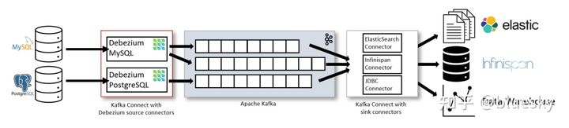
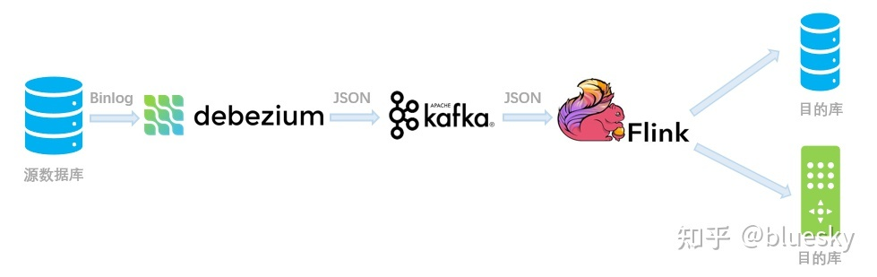
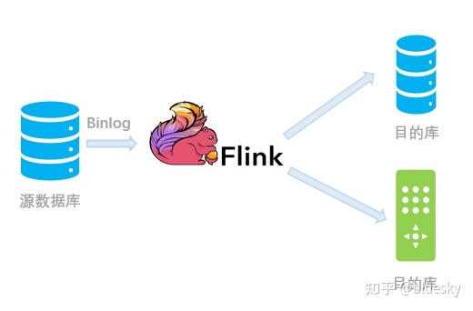

# Flink CDC

参考：https://zhuanlan.zhihu.com/p/430182083

## CDC 是什么？

CDC 是变更数据捕获（Change Data Capture）技术的缩写，它可以将源数据库（Source）的增量变动记录，同步到一个或多个数据目的（Sink）。在同步过程中，还可以对数据进行一定的处理，例如分组（GROUP BY）、多表的关联（JOIN）等。

例如对于电商平台，用户的订单会实时写入到某个源数据库；A 部门需要将每分钟的实时数据简单聚合处理后保存到 Redis 中以供查询，B 部门需要将当天的数据暂存到 Elasticsearch 一份来做报表展示，C 部门也需要一份数据到 ClickHouse 做实时数仓。随着时间的推移，后续 D 部门、E 部门也会有数据分析的需求，这种场景下，传统的拷贝分发多个副本方法很不灵活，而 CDC 可以实现一份变动记录，实时处理并投递到多个目的地。下图是一个示例，通过腾讯云 Oceanus 提供的 Flink CDC 引擎，可以将某个 MySQL 的数据库表的变动记录，实时同步到下游的 Redis、Elasticsearch、ClickHouse 等多个接收端。这样大家可以各自分析自己的数据集，互不影响，同时又和上游数据保持实时的同步。

## CDC 的实现原理

CDC 分为主动查询和事件接收两种技术实现模式。

### 主动查询

用户通常会在数据源表的某个字段中，保存上次更新的时间戳或版本号等信息，然后下游通过不断的查询和与上次的记录做对比，来确定数据是否有变动，是否需要同步。这种方式优点是不涉及数据库底层特性，实现比较通用；缺点是要对业务表做改造，且实时性不高，不能确保跟踪到所有的变更记录，且持续的频繁查询对数据库的压力较大。

###事件接收

可以通过触发器（Trigger）或者日志（例如 Transaction log、Binary log、Write-ahead log 等）来实现。当数据源表发生变动时，会通过附加在表上的触发器或者 binlog 等途径，将操作记录下来。下游可以通过数据库底层的协议，订阅并消费这些事件，然后对数据库变动记录做重放，从而实现同步。这种方式的优点是实时性高，可以精确捕捉上游的各种变动；缺点是部署数据库的事件接收和解析器（例如 Debezium、Canal 等），有一定的学习和运维成本，对一些冷门的数据库支持不够。

综合来看，事件接收模式整体在实时性、吞吐量方面占优

### 为什么选 Flink？

从上图可以看到，Debezium 官方架构图中，是通过 Kafka Streams 直接实现的 CDC 功能。而我们这里更建议使用 Flink CDC 模块，因为 Flink 相对 Kafka Streams 而言，有如下优势：

* Flink 的算子和 SQL 模块更为成熟和易用
* Flink 作业可以通过调整算子并行度的方式，轻松扩展处理能力
* Flink 支持高级的状态后端（State Backends），允许存取海量的状态数据
* Flink 提供更多的 Source 和 Sink 等生态支持
* Flink 有更大的用户基数和活跃的支持社群，问题更容易解决
* Flink 的开源协议允许云厂商进行全托管的深度定制，而 Kafka Streams 只能自行部署和运维

## Flink CDC 的使用方法

### 输入 Debezium 等数据流进行同步

例如 MySQL -> Debezium -> Kafka -> Flink -> PostgreSQL。适用于已经部署好了 Debezium，希望暂存一部分数据到 Kafka 中以供多次消费，只需要 Flink 解析并分发到下游的场景.

在该场景下，由于 CDC 变更记录会暂存到 Kafka 一段时间，因此可以在这期间任意启动/重启 Flink 作业进行消费；也可以部署多个 Flink 作业对这些数据同时处理并写到不同的数据目的（Sink）库表中，实现了 Source 变动与 Sink 的解耦。

###  直接对接上游数据库进行同步

我们还可以跳过 Debezium 和 Kafka 的中转，使用Flink CDC Connectors，对上游数据源的变动进行直接的订阅处理。从内部实现上讲，Flink CDC Connectors 内置了一套 Debezium 和 Kafka 组件，但这个细节对用户屏蔽，因此用户看到的数据链路如下图所示：

