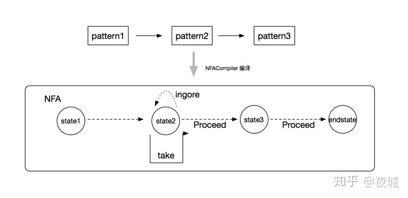
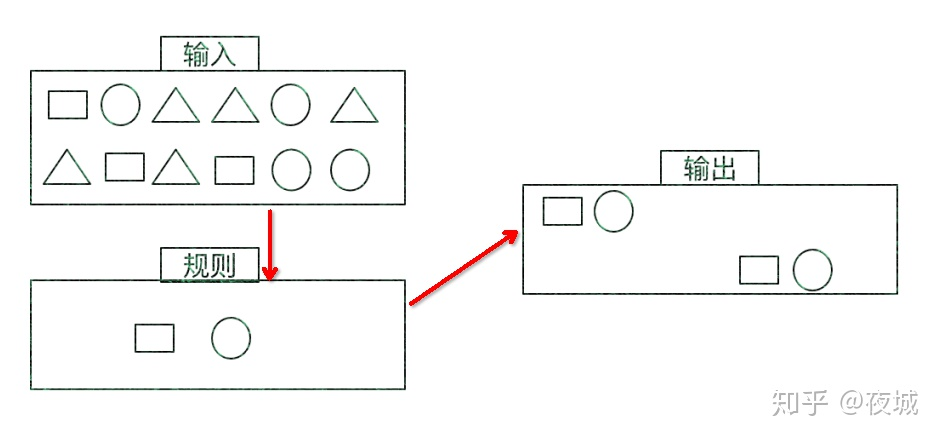
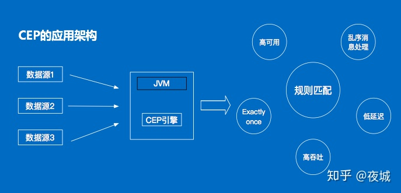
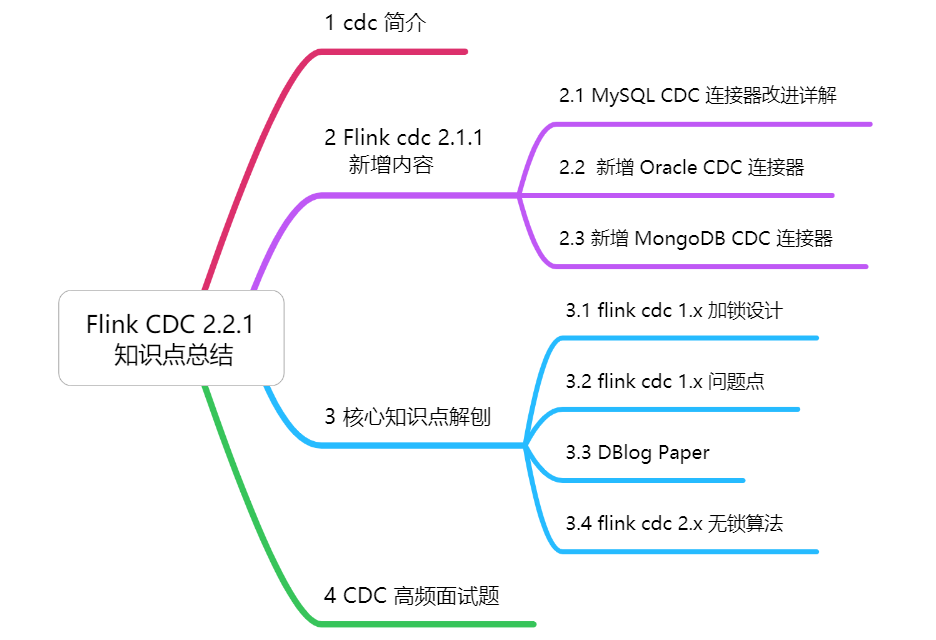
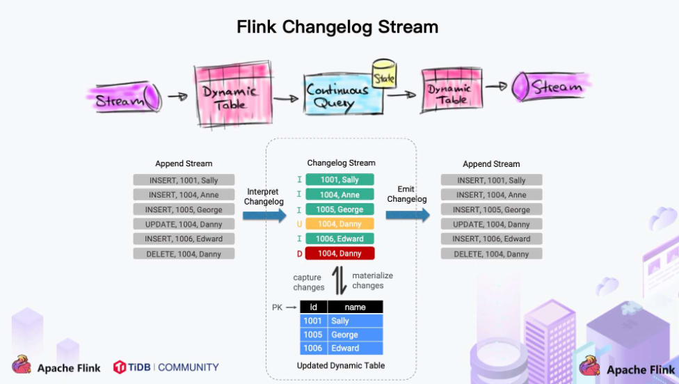

# Flink CEP

参考：https://zhuanlan.zhihu.com/p/43448829

## 什么是复杂事件CEP？

一个或多个由简单事件构成的事件流通过一定的规则匹配，然后输出用户想得到的数据，满足规则的复杂事件。Flink-Cep 是flink中的高级library，用于进行复杂事件处理，例如某一类事件连续出现三次就触发告警，可以类比Siddhi、Esper；

## CEP-NFA

Flink 的每个模式包含多个状态，模式匹配的过程就是状态转换的过程，每个状态(state)可以理解成由Pattern构成，为了从当前的状态转换成下一个状态，用户可以在Pattern上指定条件，用于状态的过滤和转换。

实际上Flink CEP 首先需要用户创建定义一个个pattern，然后通过链表将由前后逻辑关系的pattern串在一起，构成模式匹配的逻辑表达。然后需要用户利用NFACompiler，将模式进行分拆，创建出NFA(非确定有限自动机)对象，NFA包含了该次模式匹配的各个状态和状态间转换的表达式。整个示意图就像如下：

## 三种状态迁移边

* Take: 表示事件匹配成功，将当前状态更新到新状态，并前进到“下一个”状态；
* Procceed: 当事件来到的时候，当前状态不发生变化，在状态转换图中事件直接“前进”到下一个目标状态；
* IGNORE: 当事件来到的时候，如果匹配不成功，忽略当前事件，当前状态不发生任何变化。

## 特征

目标：从有序的简单事件流中发现一些高阶特征

输入：一个或多个由简单事件构成的事件流

处理：识别简单事件之间的内在联系，多个符合一定规则的简单事件构成复杂事件

输出：满足规则的复杂事件

## CEP架构

## 主要组件

ink为CEP提供了专门的Flink CEP library，它包含如下组件：Event Stream、Pattern定义、Pattern检测和生成Alert。

首先，开发人员要在DataStream流上定义出模式条件，之后Flink CEP引擎进行模式检测，必要时生成警告

## Pattern API
处理事件的规则，被叫作模式（Pattern）

Flink CEP提供了Pattern API用于对输入流数据进行复杂事件规则定义，用来提取符合规则的事件序列。

###  ① 个体模式（Individual Patterns）

组成复杂规则的每一个单独的模式定义，就是个体模式。
    
	start.times(3).where(_.behavior.startsWith(‘fav’))    
	
	// 匹配出现4次
	start.time(4)
	// 匹配出现0次或4次
	start.time(4).optional
	// 匹配出现2、3或4次
	start.time(2,4)
	// 匹配出现2、3或4次，并且尽可能多地重复匹配
	start.time(2,4).greedy
	// 匹配出现1次或多次
	start.oneOrMore
	// 匹配出现0、2或多次，并且尽可能多地重复匹配
	start.timesOrMore(2).optional.greedy

### ② 组合模式（Combining Patterns，也叫模式序列）

很多个体模式组合起来，就形成了整个的模式序列。

模式序列必须以一个初始模式开始：
	
	val start = Pattern.begin(‘start’)
	

### ③ 模式组（Group of Pattern）

将一个模式序列作为条件嵌套在个体模式里，成为一组模式

## 模式序列

### 严格近邻

 所有事件按照严格的顺序出现，中间没有任何不匹配的事件，由.next()指定。例如对于模式“a next b”，事件序列“a,c,b1,b2”没有匹配。

### 宽松近邻

允许中间出现不匹配的事件，由

	.followedBy()

指定。例如对于模式“a followedBy b”，事件序列“a,c,b1,b2”匹配为{a,b1}。

### 非确定性宽松近邻

进一步放宽条件，之前已经匹配过的事件也可以再次使用，由

	.followedByAny()

指定。例如对于模式“a followedByAny b”，事件序列“a,c,b1,b2”匹配为{ab1}，{a,b2}。	

### 不希望出现某种近邻关系

	.notNext()：不想让某个事件严格紧邻前一个事件发生.
    .notFollowedBy()：不想让某个事件在两个事件之间发生。
     
### 需要注意：

* ①所有模式序列必须以.begin()开始；
* ②模式序列不能以.notFollowedBy()结束；
* ③“not”类型的模式不能被optional所修饰；
* ④可以为模式指定时间约束，用来要求在多长时间内匹配有效。

### demo

	val input: DataStream[Event] = ...
	
	val pattern = Pattern.begin[Event]("start").where(_.getId == 42)
	  .next("middle").subtype(classOf[SubEvent]).where(_.getVolume >= 10.0)
	  .followedBy("end").where(_.getName == "end")
	
	val patternStream = CEP.pattern(input, pattern)
	
	val result: DataStream[Alert] = patternStream.process(
	    new PatternProcessFunction[Event, Alert]() {
	        override def processMatch(
	              `match`: util.Map[String, util.List[Event]],
	              ctx: PatternProcessFunction.Context,
	              out: Collector[Alert]): Unit = {
	            out.collect(createAlertFrom(pattern))
	        }
	    })

      

## 案例

### 案例一

需求：检测一个用户在3秒内连续登陆失败。

#### 代码

	// 输入的登录事件样例类
	case class LoginEvent( userId: Long, ip: String, eventType: String, eventTime: Long )
	// 输出的异常报警信息样例类
	case class Warning( userId: Long, firstFailTime: Long, lastFailTime: Long, warningMsg: String)
	
	object LoginFailWithCep {
	  def main(args: Array[String]): Unit = {
	    val env = StreamExecutionEnvironment.getExecutionEnvironment
	    env.setStreamTimeCharacteristic(TimeCharacteristic.EventTime)
	    env.setParallelism(1)
	
	    // 1. 读取事件数据，创建简单事件流
	    val resource = getClass.getResource("/LoginLog.csv")
	    val loginEventStream = env.readTextFile(resource.getPath)
	      .map( data => {
	        val dataArray = data.split(",")
	        LoginEvent( dataArray(0).trim.toLong, dataArray(1).trim, dataArray(2).trim, dataArray(3).trim.toLong )
	      } )
	      .assignTimestampsAndWatermarks( new BoundedOutOfOrdernessTimestampExtractor[LoginEvent](Time.seconds(5)) {
	        override def extractTimestamp(element: LoginEvent): Long = element.eventTime * 1000L
	      } )
	      .keyBy(_.userId)
	
	    // 2. 定义匹配模式
	    val loginFailPattern = Pattern.begin[LoginEvent]("begin").where(_.eventType == "fail")
	      .next("next").where(_.eventType == "fail")
	      .within(Time.seconds(3))
	
	    // 3. 在事件流上应用模式，得到一个pattern stream
	    val patternStream = CEP.pattern(loginEventStream, loginFailPattern)
	
	    // 4. 从pattern stream上应用select function，检出匹配事件序列
	    val loginFailDataStream = patternStream.select( new LoginFailMatch() )
	
	    loginFailDataStream.print()
	
	    env.execute("login fail with cep job")
	  }
	}
	
	class LoginFailMatch() extends PatternSelectFunction[LoginEvent, Warning]{
	  override def select(map: util.Map[String, util.List[LoginEvent]]): Warning = {
	    // 从map中按照名称取出对应的事件
	    //    val iter = map.get("begin").iterator()
	    val firstFail = map.get("begin").iterator().next()
	    val lastFail = map.get("next").iterator().next()
	    Warning( firstFail.userId, firstFail.eventTime, lastFail.eventTime, "login fail!" )
	  }
	}

#### LoginLog.csv中的数据格式为：

	5402,83.149.11.115,success,1558430815
	23064,66.249.3.15,fail,1558430826
	5692,80.149.25.29,fail,1558430833
	7233,86.226.15.75,success,1558430832
	5692,80.149.25.29,success,1558430840
	29607,66.249.73.135,success,1558430841

#### pom依赖

	<dependency>
		<groupId>org.apache.flink</groupId>
		<artifactId>flink-cep-scala_2.11</artifactId>
		<version>1.7.0</version>
	</dependency>

### 案例二

物联网通常都是设备数据，比喻说设备的温度、耗电量等等，会有对设备的监控，例如求设备连续三个点的值大于10且三个点的求和值大于100，要求将这三个点发送到下游进行处理，首先看一下直接使用Flink-Cep api的实现：

	case class  DpData(dpId:String,value:Double)
	val pattern=Pattern.begin("start",AfterMatchSkipStrategy.skipPastLastEvent()).where(new SimpleCondition[DpData] {
	      override def filter(value: DpData): Boolean = value.value>10
	    }).times(2).consecutive()
	      .next("next").where(new IterativeCondition[DpData] {
	      override def filter(value: DpData, ctx: IterativeCondition.Context[DpData]): Boolean =      {
	        if(value.value>10) {
	          val sum=value.value+ctx.getEventsForPattern("start").map(_.value).sum
	          return sum>100
	        }
	        return false
	      }
	    })
	    
	case class  DpData(dpId:String,value:Double)
	val pattern=Pattern.begin("start",AfterMatchSkipStrategy.skipPastLastEvent()).where(new SimpleCondition[DpData] {
	      override def filter(value: DpData): Boolean = value.value>10
	    }).times(2).consecutive()
	      .next("next").where(new IterativeCondition[DpData] {
	      override def filter(value: DpData, ctx: IterativeCondition.Context[DpData]): Boolean =      {
	        if(value.value>10) {
	          val sum=value.value+ctx.getEventsForPattern("start").map(_.value).sum
	          return sum>100
	        }
	        return false
	      }
	    })
	    
	case class  DpData(dpId:String,value:Double)
	val pattern=Pattern.begin("start",AfterMatchSkipStrategy.skipPastLastEvent()).where(new SimpleCondition[DpData] {
	      override def filter(value: DpData): Boolean = value.value>10
	    }).times(2).consecutive()
	      .next("next").where(new IterativeCondition[DpData] {
	      override def filter(value: DpData, ctx: IterativeCondition.Context[DpData]): Boolean =      {
	        if(value.value>10) {
	          val sum=value.value+ctx.getEventsForPattern("start").map(_.value).sum
	          return sum>100
	        }
	        return false
	      }
	    })

### 案例三

当相同的card_id在十分钟内，从两个不同的location发生刷卡现象，就会触发报警机制，以便于监测信用卡盗刷等现象。

	CREATE TABLE datahub_stream (
	    `timestamp`               TIMESTAMP,
	    card_id                   VARCHAR,
	    location                  VARCHAR,
	    `action`                  VARCHAR,
	    WATERMARK wf FOR `timestamp` AS withOffset(`timestamp`, 1000)
	) WITH (
	    type = 'datahub'
	    ...
	);
	CREATE TABLE rds_out (
	    start_timestamp               TIMESTAMP,
	    end_timestamp                 TIMESTAMP,
	    card_id                       VARCHAR,
	    event                         VARCHAR
	) WITH (
	    type= 'rds'
	    ...
	);
	
	--案例描述
	-- 当相同的card_id在十分钟内，从两个不同的location发生刷卡现象，就会触发报警机制，以便于监测信用卡盗刷等现象
	-- 定义计算逻辑
	insert into rds_out
	select 
	`start_timestamp`, 
	`end_timestamp`, 
	card_id, `event`
	from datahub_stream
	MATCH_RECOGNIZE (
	    PARTITION BY card_id   -- 按card_id分区，将相同卡号的数据分到同一个计算节点上
	    ORDER BY `timestamp`   -- 在窗口内，对事件时间进行排序
	    MEASURES               --定义如何根据匹配成功的输入事件构造输出事件
	        e2.`action` as `event`,                
	        e1.`timestamp` as `start_timestamp`,   --第一次的事件事件为start_timestamp
	        LAST(e2.`timestamp`) as `end_timestamp`--最新的事件事件为end_timestamp
	    ONE ROW PER MATCH           --匹配成功输出一条
	    AFTER MATCH SKIP TO NEXT ROW--匹配跳转到下一行后
	    PATTERN (e1 e2+) WITHIN INTERVAL '10' MINUTE  -- 定义两个事件，e1/e2
	    DEFINE                     --定义在PATTERN中出现的patternVariable的具体含义
	        e1 as e1.action = 'Tom',    --事件一的action标记为Tom
	        e2 as e2.action = 'Tom' and e2.location <> e1.location --事件二的action标记为Tom，且事件一和事件二的location不一致
	);
	
测试数据

	timestamp(TIMESTAMP)card_id(VARCHAR)location(VARCHAR)action(VARCHAR)
	
	2018-04-13 12:00:00，1，WW，Tom
	
	2018-04-13 12:10:00，1，WW2，Tom
	
	2018-04-13 12:10:00，1，WW2Tom
	
	2018-04-13 12:20:00，1，WW，Tom
	
测试结果

	start_timestamp(TIMESTAMP)end_timestamp(TIMESTAMP)card_id(VARCHAR)event(VARCHAR)
	
	2018-04-13 20:00:00.0，2018-04-13 20:05:00.01，Tom
	
	2018-04-13 20:05:00.0，2018-04-13 20:10:00.01，Tom