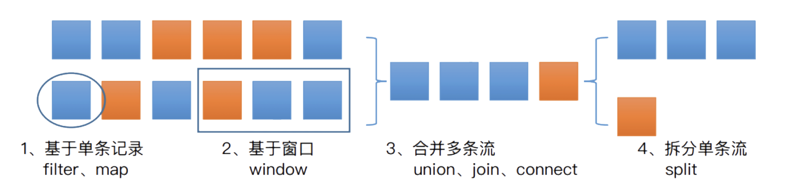
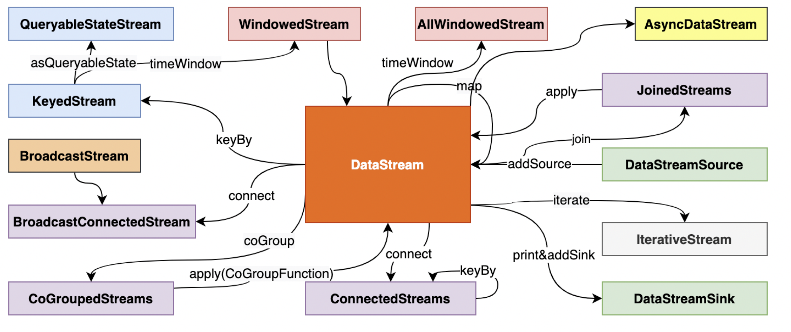
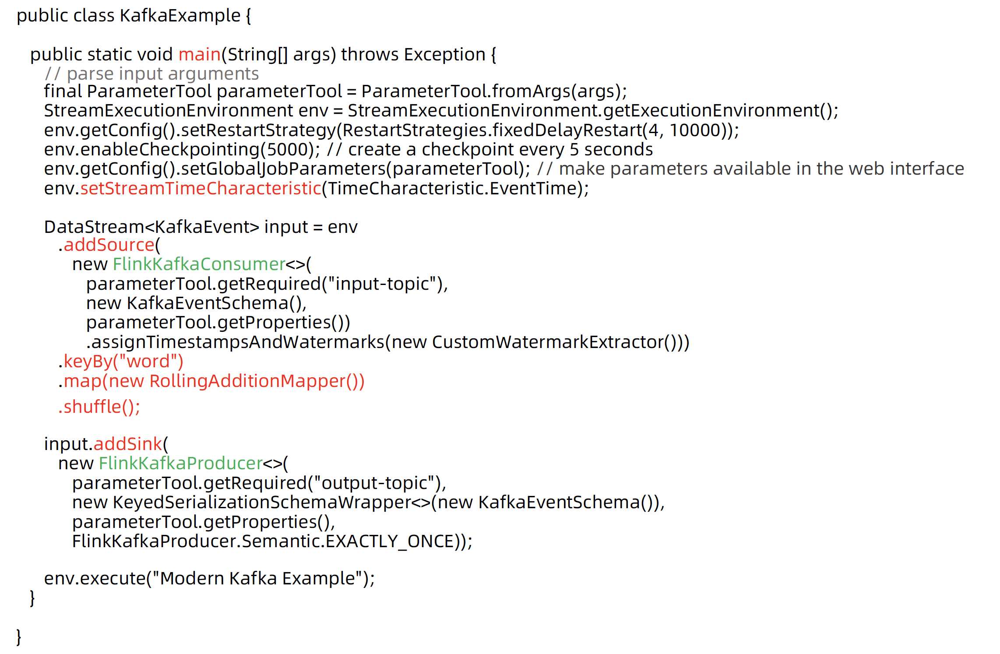

# Flink DataStream API 实践

### *DataStream 主要转换操作*

### DataStream 互相转换

### DdatStream Kafka 实例

关键代码解释：

1. **数据源配置**:

   - 通过 Kafka 读取输入数据。这里使用了`FlinkKafkaConsumer<>`来从 Kafka 主题（topic）读取数据。
   - `parameterTool.getRequired("input-topic")` 获取必需的输入主题名称。
   - `new KafkaEventSchema()` 和 `parameterTool.getProperties()` 分别用于定义 Kafka 消息的解析方式和获取 Kafka 连接属性。
   - `.assignTimestampsAndWatermarks(new CustomWatermarkExtractor())`：为流数据设置时间戳和水印，这是处理事件时间的重要部分。

2. **数据处理**:

   - `.keyBy("word")`：按“word”字段对事件流进行分区。
   - `.map(new RollingAdditionMapper())`：应用一个映射函数来处理每个事件。
   - `.shuffle()`：对事件进行随机分配，以均匀分布至下游操作。

3. **数据输出**:

   - 数据经过处理后，使用`FlinkKafkaProducer<>`将结果输出到另一个 Kafka 主题。
   - `parameterTool.getRequired("output-topic")` 获取必需的输出主题名称。
   - `FlinkKafkaProducer.Semantic.EXACTLY_ONCE` 确保每条记录精确一次的处理语义，这对于确保数据一致性非常重要。

   