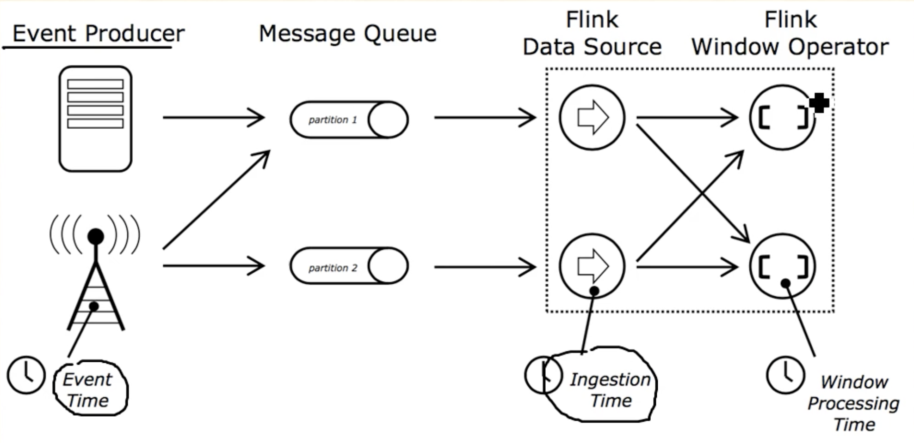

# Flink Time

## EventTime

* 事件生成时的时间，在进入Flink之前就已经存在，可以从event的字段中抽取、
* 必需指定waterMark的生成方式
* 优势：确定性。乱序、延时或者数据重发等情况，都能给出正确的结果
* 弱点：处理无序事件时性能和延迟收到影响

## IngestTime
* 事件进入flink的时间
* 不需要指定watermark
* 弱点：不能处理无序事件和延迟数据

## Processing Time 
执行操作的机器的当前系统时间，每个算子都不一样
不需流和机器之间的协调
优势：最佳的性能和最低的延迟
弱点：不确定性，容易受到各种因素影响（event产生的速度，到达flink的速度，在算子之间的传输速度等）

## 比较

* 性能：ProcessingTime > IngestTime > EventTime
* 延迟：EventTime > IngestTime > ProcessingTime
* 确定性： EventTime > IngestTime > ProcessingTime

## 实现代码

    val env = StreamExecutionEnvironment.getExecutionEnvironment
    env.setStreamTimeCharacteristic(TimeCharacteristic.EventTime)
    
    val env = StreamExecutionEnvironment.getExecutionEnvironment
    env.setStreamTimeCharacteristic(TimeCharacteristic.IngestionTime)
    
    val env = StreamExecutionEnvironment.getExecutionEnvironment
    env.setStreamTimeCharacteristic(TimeCharacteristic.ProcessingTime)
    
不设置time类型，默认是processing time