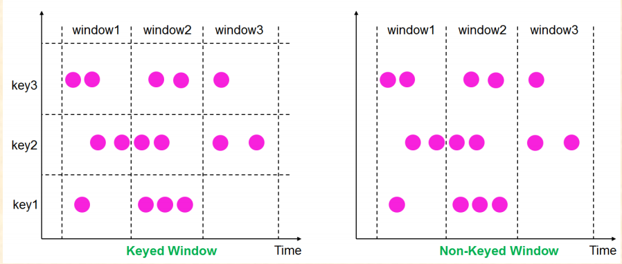
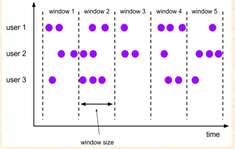
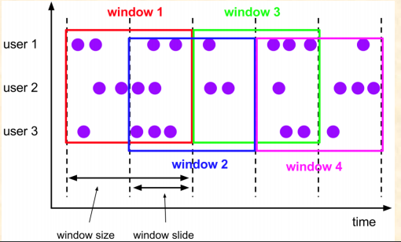
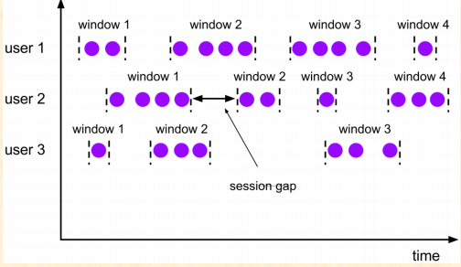
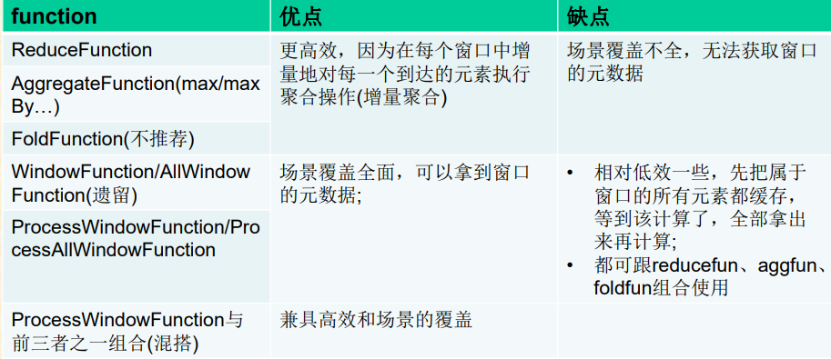

# Flink Window

## 分类和生命周期

在Flink中，Batch是Streaming的一个特例，window就是从Streaming到Batch的一个桥梁。window是一种切割无限数据集为有限块并进行相应计算的处理手段。

### 窗口的生命周期

窗口的生命周期，就是创建和销毁。

####创建：

当属于该窗口的第一个元素到达时就会创建该窗口

####销毁：

当时间(event/process time)超过窗口的结束时间戳+用户指定的延迟时
(allowedLateness(<time>))，窗口将被移除(仅限time-based window)

例如:对于一个每5分钟创建Tumbling Windows(即翻滚窗口)窗口，允许1分钟的时延，Flink将会在12:00
到12:05这段时间内第一个元素到达时创建窗口，当watermark超过12:06时，该窗口将被移除

### Keyed Windows

在已经按照key分组的基础上 （KeyedStream），再构建多任务并行window

### Non-keyed windows

在未分组的DataStream上构建单任务window，并行度是1，API都带ALL后缀

## 窗口分配器 （Window Assigners）

当你决定stream是否keyby之后，window是没有构建的，
你还需要指定一个window Assinger用于定义元素如何分配
到窗口中

### window Assinger如何指定？

- Keyedstream：window(WindowAssigner)
- non-keyed streams ：windowAll(WindowAssigner)

### window Assinger的作用：

负责将每个传入的元素分配给一个或多个窗口

## 窗口分类

### Count-based window:根据元素个数对数据流进行分组切片

- Tumbling CountWindow
- Sliding CountWindow

### Time-based window :根据时间对数据流进行分组切片

- Tumbling Window
- Sliding Window
- Session Window 

##  Tumbling Windows-翻滚窗口 

将数据依据固定的窗口长度对数据进行切片

### 特点：

- 时间对齐
- 窗口长度固定
- event无重叠

### 适用场景：

BI统计(计算各个时间段的指标)

	object CountTumblingWindow {
	  def main(args: Array[String]) {
	    val sev = StreamExecutionEnvironment.getExecutionEnvironment  
	    val socTextStream = sev.socketTextStream("localhost",4444)  //read from socket
	    val counts = socTextStream.flatMap{_.split("\\s")}  //split sentence into words
	      .map { (_, 1) }  //emit 1 for each word	
	      .keyBy(0)	 //group based on word
	      .countWindow(5)  //window for every 5 items in the group
	      .sum(1)						
	      .setParallelism(4);  //setting parallelism (optional)
	    counts.print()
	    sev.execute()
	  }
	} 

##  Sliding Window -滑动窗口 

是固定窗口的更广义的一种形式。滑动窗口由固定的窗口长度和滑动间隔组成

###特点：
- 时间对齐
- 窗口长度固定
- event有重叠

###适用场景： 

监控场景，对最近一个时间段内的统计(求某接口最近5min的失败率来决定是否要报警) 

	import org.apache.flink.api.scala.createTypeInformation
	import org.apache.flink.streaming.api.scala.StreamExecutionEnvironment
	import org.apache.flink.streaming.api.windowing.time.Time
	
	object TimeSlidingWindow {
	
	  def main(args: Array[String]): Unit = {
	
	
	    val sev = StreamExecutionEnvironment.getExecutionEnvironment
	    val socTextStream = sev.socketTextStream("localhost",4444)
	    val counts = socTextStream.flatMap(line => line.split(" "))
	      .map { (_, 1) }
	      .keyBy(0)
	      .timeWindow(Time.seconds(15),Time.seconds(10))  //窗口大小和每次滑动距离
	      .sum(1).setParallelism(4);
	
	    counts.print()
	    sev.execute()
	  }	
	}

## Session Windows 

类似于web应用 的session，即一段时间没有接受到新数据就会生成新的窗口(固定gap/gap fun)

###特点：
- 时间无对齐
- event不重叠
- 没有固定开始和结束时间

###适用场景： 

线上用户行为分析

	import org.apache.flink.api.scala.createTypeInformation
	import org.apache.flink.streaming.api.scala.StreamExecutionEnvironment
	import org.apache.flink.streaming.api.windowing.assigners.{EventTimeSessionWindows, TumblingEventTimeWindows}
	import org.apache.flink.streaming.api.windowing.time.Time
	
	object CountTumblingWindow {
	
	  def main(args: Array[String]): Unit = {
	    
	    val sev = StreamExecutionEnvironment.getExecutionEnvironment
	    val socTextStream = sev.socketTextStream("localhost",4444)
	    val counts = socTextStream.flatMap(line => line.split(" "))
	      .map { (_, 1) }
	      .keyBy(0)
	      .window(EventTimeSessionWindows.withGap(Time.minutes(1)))
	      .sum(1).setParallelism(4);
	
	    counts.print()
	    sev.execute()
	
	  }
	
	}

## 窗口函数

## 触发器 （Triggers）

### 什么是触发器

触发器决定了一个窗口何时可以被窗口函数处理(条件满足时触发并发出信号)

每一个WindowAssigner都有一个默认的触发器，如果默认的触发器不能满足你的需要，你可以通过调用trigger(...)来指定一个自定义的触发器

触发器有5个方法来允许触发器处理不同的事件(Trigger):

- onElement()方法：每个元素被添加到窗口时调用
- onEventTime()方法：当一个已注册的事件时间计时器启动时调用
- onProcessingTime()方法：当一个已注册的处理时间计时器启动时调用
- onMerge()方法，与状态性触发器相关，当使用session window时，两个触发器对应的窗口合并时，合并两个触发器的状态。
- clear() 相应窗口被清除时触发

前三个方法通过返回TriggerResult来决定如何对其调用事件进行操作。该操作可以是以下操作之一：

- ONTINUE:什么也不做
- FIRE:触发计算
- PURGE:清除窗口中的数据
- FIRE_AND_PURGE:触发计算并随后清除窗口中的元素

### 触发和清除（Fire and Purge）

一旦一个触发器决定一个窗口已经准备好进行处理，它将触发并返回FIRE或者FIRE_AND_PURGE。这是窗口操作发送当前窗口结果的信号，发送给一个带有ProcessWindowFunction的窗口，所有元素都被传递给ProcessWindowFunction(可能在将它们传递给回收器之后)。

信号发送给具有ReduceFunction、AggregateFunction或FoldFunction的窗口只发出它们聚合的结果。

当一个触发器触发时，它可以是FIRE或者FIRE_AND_PURGE，如果是FIRE的话，将保持window中的内容，FIRE_AND_PURGE的话会清除window的内容。默认情况下，预实现的触发器仅仅是FIRE，不会清除window的状态。

注意:清除操作仅清除window的内容，并留下潜在的窗口元信息和完整的触发器状态。

## 驱逐器 （Evictors）

Flink 窗口模式允许特别的算子Evictor（驱逐器），应用在WindowAssigner和trigger之间。通过evictor()方法使用。

Evictor驱逐器能够在element进入Window窗口聚合之前进行移除数据或者在进入Window窗口聚合后，Trigger触发计算操作之前移除数据。

Evictor的2个方法：

- evictBefore()：移除窗口元素，在Window Function之前调用。
- evictAfter()：移除窗口元素，在Window Function之后调用。

两个方法的参数都一样，分别是：

- Iterable<TimestampedValue> elements：当前窗口中的元素
- int size：当前窗口中的元素数量
- W window：当前窗口
- EvictorContext evictorContext：evict的上下文

Flink自带的3个Evictor：

- CountEvictor：保持窗口中用户指定数量的元素，并从窗口缓冲区的开头丢弃剩余的元素。
- DeltaEvictor：取一个DeltaFunction和一个threshold，计算窗口缓冲区中最后一个元素与其余每个元素之间的差值，并删除Delta大于或等于阈值的值。
- TimeEvictor：以interval毫秒为单位作为参数，对于给定窗口，它查找max_ts其元素的最大时间戳，并删除时间戳小于的所有元素max_ts-interval。

## 允许延迟 (Allowed Lateness)

