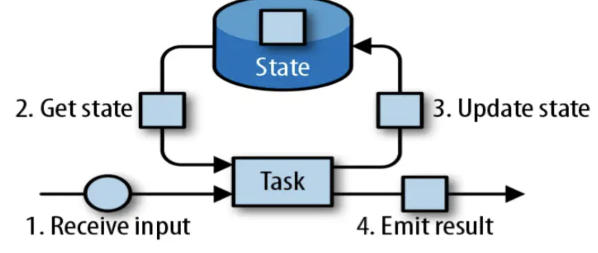
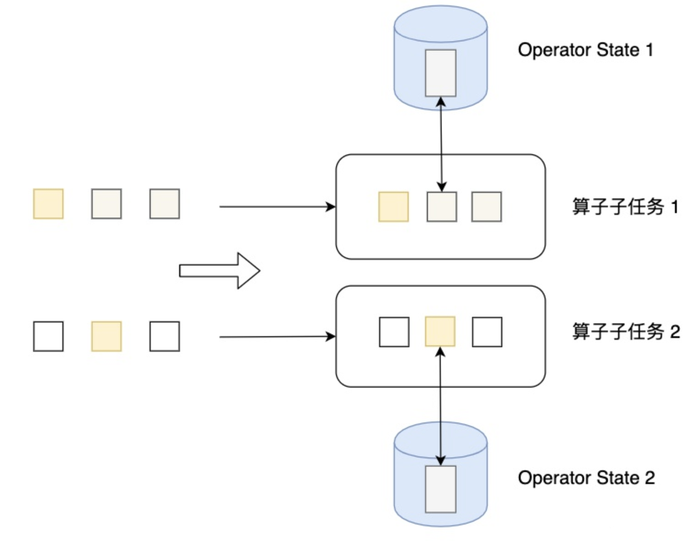
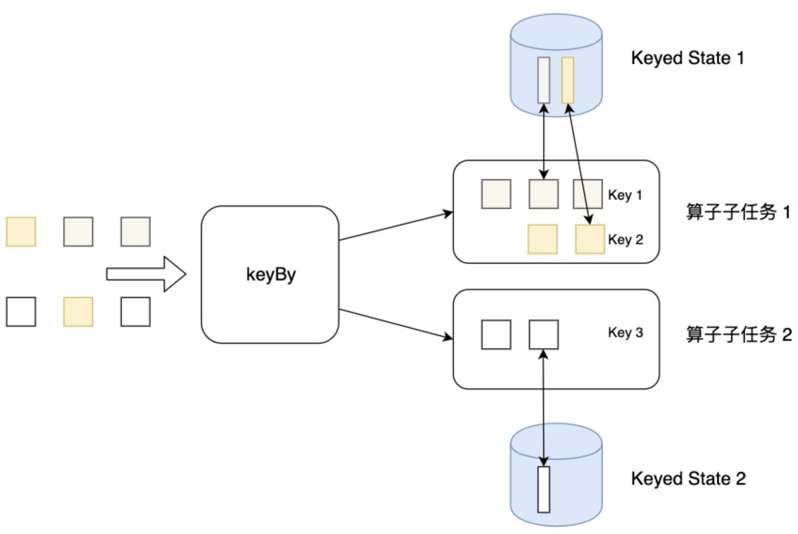

# Flink 状态管理

## 分类

### 算子状态（operation state）

Operator State可以用在所有算子上，每个算子子任务或者说每个算子实例共享一个状态，流入这个算子子任务的数据可以访问和更新这个状态。

算子状态不能由相同或不同算子的另一个实例访问。

Flink为算子状态提供三种基本数据结构：

* ListState：存储列表类型的状态。
* UnionListState：存储列表类型的状态，与 ListState 的区别在于：如果并行度发生变化，ListState 会将该算子的所有并发的状态实例进行汇总，然后均分给新的 Task；而 UnionListState 只是将所有并发的状态实例汇总起来，具体的划分行为则由用户进行定义。
* BroadcastState：用于广播的算子状态。如果一个算子有多项任务，而它的每项任务状态又都相同，那么这种特殊情况最适合应用广播状态。

### 键控状态 （keyed state）

Flink 为每个键值维护一个状态实例，并将具有相同键的所有数据，都分区到同一个算子任务中，这个任务会维护和处理这个key对应的状态。当任务处理一条数据时，它会自动将状态的访问范围限定为当前数据的key。因此，具有相同key的所有数据都会访问相同的状态。

需要注意的是键控状态只能在 KeyedStream 上进行使用，可以通过 stream.keyBy(...) 来得到 KeyedStream 。

Flink 提供了以下数据格式来管理和存储键控状态 (Keyed State)：

* ValueState：存储单值类型的状态。可以使用 update(T) 进行更新，并通过 T value() 进行检索。
* ListState：存储列表类型的状态。可以使用 add(T) 或 addAll(List) 添加元素；并通过 get() 获得整个列表。
* ReducingState：用于存储经过 ReduceFunction 计算后的结果，使用 add(T) 增加元素。
* AggregatingState：用于存储经过 AggregatingState 计算后的结果，使用 add(IN) 添加元素。
* FoldingState：已被标识为废弃，会在未来版本中移除，官方推荐使用 AggregatingState 代替。
* MapState：维护 Map 类型的状态。

