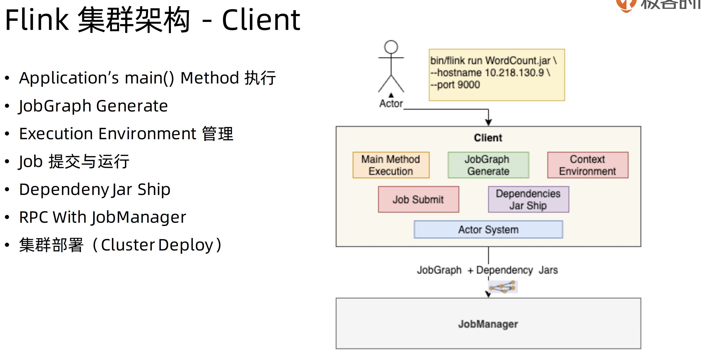

# Flink 集群架构

- JobManager: 管理节点，每个集群至少一个，管理整个集群的计算资源，job管理与协调执行，以及checkpoint协调
- TaskManager： 每个集群有多个TM，负责计算资源提供。
- Client：本地执行应用main()方法解析JobGraph 对象， 并最终将JobGraph提交到JobManager运行，同时监控Job执行的状态。

## JobManager

## TaskManager

## Clinet

## JobGraph

## 集群部署模式对比

- Session Mode: 共享JobManager和TaskManager, 所有提交的Job都在一个Runtime中运行
- Per-job Mode: 独享JobManager与TaskManager, 好比为每个Job单独启动一个Runtime
- Application Mode: Application的main（）运行在Cluster上，而不是客户端。每个application对应一个Runtime, Application 中可以含有多个Job。

### Session模式

### Per-job 模式

### Application mode 集

## 集群部署对比

