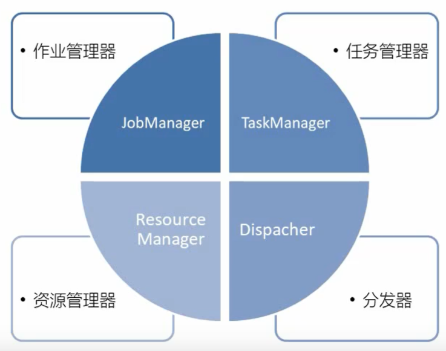
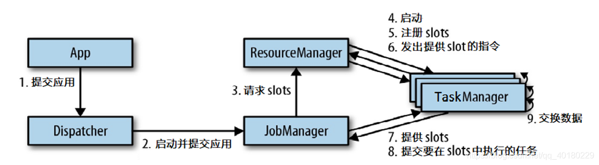
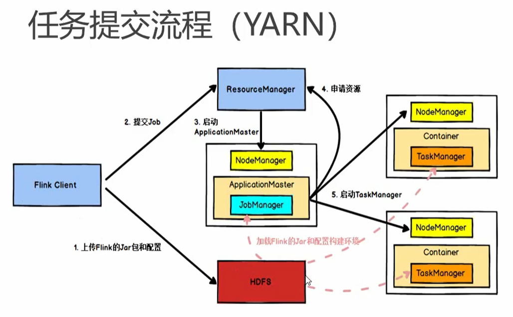
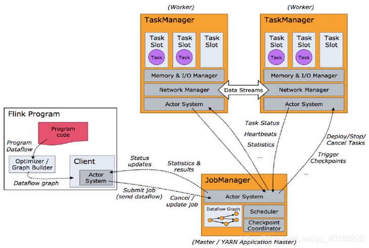
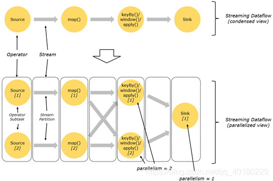
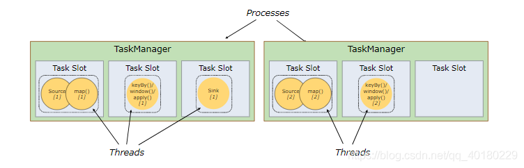
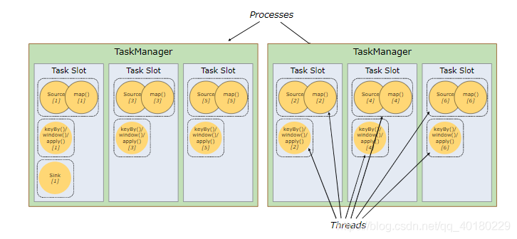
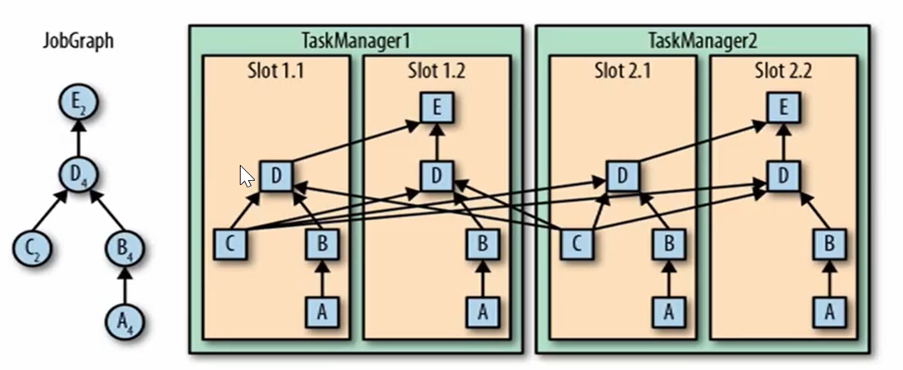
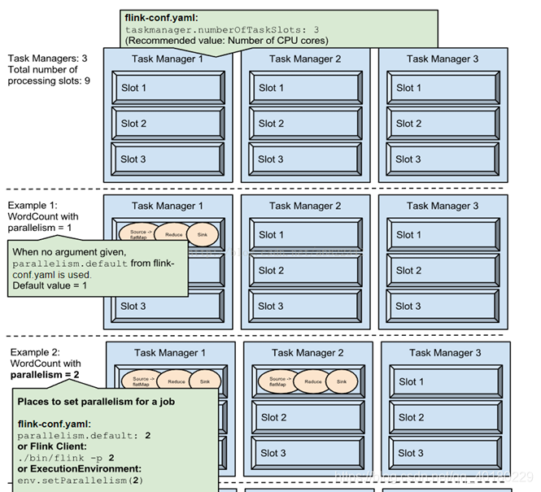
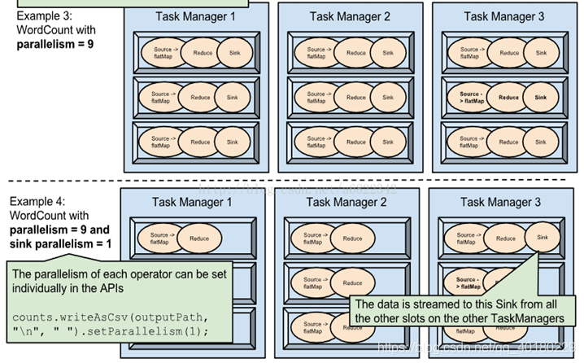

# Flink提交任务底层逻辑

参考资料：https://blog.csdn.net/qq_40180229/article/details/106321149

## 四大组件

### 作业管理器（JobManager）
1. 控制一个应用程序执行的主进程，也就是说，每个应用程序都会被一个不同的JobManager 所控制执行。
1. JobManager 会先接收到要执行的应用程序，这个应用程序会包括：作业图（JobGraph）、逻辑数据流图（logical dataflow graph）和打包了所有的类、库和其它资源的JAR包。
1. JobManager 会把JobGraph转换成一个物理层面的数据流图，这个图被叫做“执行图”（ExecutionGraph），包含了所有可以并发执行的任务。
1. JobManager 会向资源管理器（ResourceManager）请求执行任务必要的资源，也就是任务管理器（TaskManager）上的插槽（slot）。一旦它获取到了足够的资源，就会将执行图分发到真正运行它们的TaskManager上。而在运行过程中，JobManager会负责所有需要中央协调的操作，比如说检查点（checkpoints）的协调。

###任务管理器（TaskManager）
1. Flink中的工作进程。通常在Flink中会有多个TaskManager运行，每一个TaskManager都包含了一定数量的插槽（slots）。插槽的数量限制了TaskManager能够执行的任务数量。
1. 启动之后，TaskManager会向资源管理器注册它的插槽；收到资源管理器的指令后，TaskManager就会将一个或者多个插槽提供给JobManager调用。JobManager就可以向插槽分配任务（tasks）来执行了。
1. 在执行过程中，一个TaskManager可以跟其它运行同一应用程序的TaskManager交换数据。

### 资源管理器（ResourceManager）
1. 主要负责管理任务管理器（TaskManager）的插槽（slot），TaskManger 插槽是Flink中定义的处理资源单元。
1. Flink为不同的环境和资源管理工具提供了不同资源管理器，比如YARN、Mesos、K8s，以及standalone部署。
1. 当JobManager申请插槽资源时，ResourceManager会将有空闲插槽的TaskManager分配给JobManager。如果ResourceManager没有足够的插槽来满足JobManager的请求，它还可以向资源提供平台发起会话，以提供启动TaskManager进程的容器。

###分发器（Dispatcher）
1. 可以跨作业运行，它为应用提交提供了REST接口。
1. 当一个应用被提交执行时，分发器就会启动并将应用移交给一个JobManager。
1. Dispatcher也会启动一个Web UI，用来方便地展示和监控作业执行的信息。
1. Dispatcher在架构中可能并不是必需的，这取决于应用提交运行的方式。

## 任务提交流程

### yarn 提交流程

**注意**：这里的ResourceManger是Yarn的

流程如下：

1. Flink任务提交后，Client向HDFS上传Flink的Jar包和配置
1. 之后客户端向Yarn ResourceManager提交任务，ResourceManager分配Container资源并通知对应的NodeManager启动ApplicationMaster
1. ApplicationMaster启动后加载Flink的Jar包和配置构建环境，去启动JobManager，之后JobManager向Flink自身的RM进行申请资源，自身的RM向Yarn 的ResourceManager申请资源(因为是yarn模式，所有资源归yarn RM管理)启动TaskManager
1. Yarn ResourceManager分配Container资源后，由ApplicationMaster通知资源所在节点的NodeManager启动TaskManager
1. NodeManager加载Flink的Jar包和配置构建环境并启动TaskManager，TaskManager启动后向JobManager发送心跳包，并等待JobManager向其分配任务。

## 任务调度原理

1. 客户端不是运行时和程序执行的一部分，但它用于准备并发送dataflow(JobGraph)给Master(JobManager)，然后，客户端断开连接或者维持连接以等待接收计算结果。而Job Manager会产生一个执行图(Dataflow Graph)
1. 当 Flink 集群启动后，首先会启动一个 JobManger 和一个或多个的 TaskManager。由 Client 提交任务给 JobManager，JobManager 再调度任务到各个 TaskManager 去执行，然后 TaskManager 将心跳和统计信息汇报给 JobManager。TaskManager 之间以流的形式进行数据的传输。上述三者均为独立的 JVM 进程。
1. Client 为提交 Job 的客户端，可以是运行在任何机器上（与 JobManager 环境连通即可）。提交 Job 后，Client 可以结束进程（Streaming的任务），也可以不结束并等待结果返回。
1. JobManager 主要负责调度 Job 并协调 Task 做 checkpoint，职责上很像 Storm 的 Nimbus。从 Client 处接收到 Job 和 JAR 包等资源后，会生成优化后的执行计划，并以 Task 的单元调度到各个 TaskManager 去执行。
1. TaskManager 在启动的时候就设置好了槽位数（Slot），每个 slot 能启动一个 Task，Task 为线程。从 JobManager 处接收需要部署的 Task，部署启动后，与自己的上游建立 Netty 连接，接收数据并处理。

## 并行度 （Parallelism）

一个特定算子的子任务（subtask）的个数被称之为其平行度（Parallelism）。一般情况下，一个stream的并行度，可以认为就是其所有算子中最大的并行度。

## TaskManager 和 Slot

Flink中每一个TaskManger都是一个JVM进程，它可能会在独立的线程上执行一个或多个子任务

为了控制一个TaskManger能够接收多少个task， TaskManager通过task slot来进行控制（一个TaskManger至少有一个slot）

### 总结

1. Flink 中每一个 TaskManager 都是一个JVM进程，它可能会在独立的线程上执行一个或多个子任务
1. 为了控制一个 TaskManager 能接收多少个 task， TaskManager 通过 task slot 来进行控制（一个 TaskManager 至少有一个 slot）
1. 图中每个Task Manager中的Slot为3个，那么两个Task Manager一共有六个Slot, 而这6个Slot代表着Task Manager最大的并发执行能力，一共能可以执行6个task进行同时执行
1. Slot是静态概念，代表着Task Manager具有的并发执行能力，可以通过参数taskmanager.numberOfTaskSlots进行配置
1. 为了控制一个 TaskManager 能接收多少个 task， TaskManager 通过 task slot 来进行控制（一个 TaskManager 至少有一个 slot）
1. 图中Source和Map是一个Task，且并行度(我们设置的setParallelism())都为1，指这个task任务的并行能力为1，只占用一个Slot资源
1. 在第二张图中为Flink的共享子任务，如果一个TaskManager一个slot，那将意味着每个task group运行在独立的JVM中（该JVM可能是通过一个特定的容器启动的），而一个TaskManager多个slot意味着更多的subtask可以共享同一个JVM。而在同一个JVM进程中的task将共享TCP连接（基于多路复用）和心跳消息。它们也可能共享数据集和数据结构，因此这减少了每个task的负载。
1. 并行度parallelism是动态概念，即TaskManager运行程序时实际使用的并发能力，可以通过参数parallelism.default进行配置。
1. 也就是说，假设一共有3个TaskManager，每一个TaskManager中的分配3个TaskSlot，也就是每个TaskManager可以接收3个task，一共9个TaskSlot，如果我们设置parallelism.default=1，即运行程序默认的并行度为1，9个TaskSlot只用了1个，有8个空闲，因此，设置合适的并行度才能提高效率。
1. 一个特定算子的 子任务（subtask）的个数被称之为其并行度（parallelism），我们可以对单独的每个算子进行设置并行度，也可以直接用env设置全局的并行度，更可以在页面中去指定并行度。
1. 最后，由于并行度是实际Task Manager处理task 的能力，而一般情况下，一个 stream 的并行度，可以认为就是其所有算子中最大的并行度，则可以得出在设置Slot时，在所有设置中的最大设置的并行度大小则就是所需要设置的Slot的数量。

前后发生的算子会在slot下排队。将花费时间长的和花费时间短的任务混合。所以一般情况下，一个job需要尽可能多的设置slot利用数量。

## 并行子任务的分配

实际的例子：

