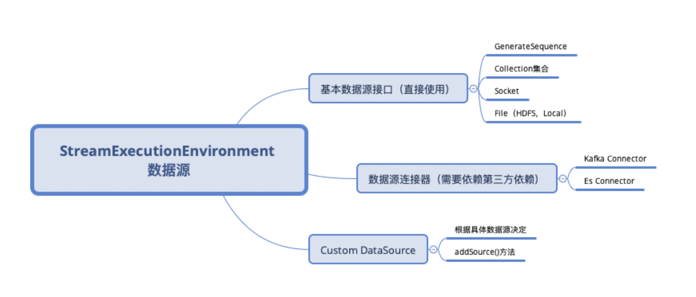

# Flink数据源概览

## 分类

## 基本数据源

	// 从给定的数据元素中转换
	DataStreamSource<OUT> fromElements(OUT... data)
	// 从指定的集合中转换成DataStream
	DataStreamSource<OUT> fromCollection(Collection<OUT> data) 
	// 读取文件并转换
	DataStreamSource<OUT> readFile(FileInputFormat<OUT> inputFormat, String filePath) 
	// 从Socket端口中读取
	DataStreamSource<String> socketTextStream(String hostname, int port, String delimiter) 
	// 直接通过InputFormat创建
	DataStreamSource<OUT> createInput(InputFormat<OUT, ?> inputFormat) 
	最终都是通过ExecutionEnvironment创建fromSource()·方法转换成DataStreamSource

## DataStream 数据源连接器

###Flink 内置 Connector:
* ApacheKafka(source/sink)
* ApacheCassandra(sink)
* AmazonKinesisStreams(source/sink) • Elasticsearch(sink)
* HadoopFileSystem(sink)
* RabbitMQ(source/sink)
* ApacheNiFi(source/sink)
* TwitterStreamingAPI(source)
* GooglePubSub(source/sink)
* JDBC(sink)

###Apache Bahir 项目:
* Apache ActiveMQ (source/sink)
* Apache Flume (sink)
* Redis (sink)
* Akka (sink)
* Netty (source)