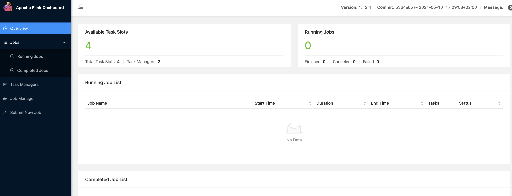

#1. Flink Standalone 搭建

## 准备

准备3台物理机

* 192.168.3.110  jobmanager
* 192.168.3.111   taskmanager
* 192.168.3.112. taskmanager

## 准备步骤

### 192.168.3.110

	hostnamectl set-hostname node1
	
	 vi /etc/hosts
	 #插入

	 192.168.3.110 node1
	 192.168.3.111 node2
	 192.168.3.112 node3
	 
	 # 关闭防火墙
	firewall-cmd --state
	systemctl stop firewalld.service
	systemctl disable firewalld.service 	
	 
	 #免密
	 ssh-keygen -t rsa
	 ssh-copy-id -p 22 -i ~/.ssh/id_rsa.pub root@192.168.3.110
	 ssh-copy-id -p 22 -i ~/.ssh/id_rsa.pub root@192.168.3.111
	 ssh-copy-id -p 22 -i ~/.ssh/id_rsa.pub root@192.168.3.112
	 
	 #安装java
	 yum -y install java-1.8.0-openjdk*
	 
	 reboot

### 192.168.3.111

	hostnamectl set-hostname node2
	
	 vi /etc/hosts
	 #插入
	 
	 192.168.3.110 node1
	 192.168.3.111 node2
	 192.168.3.112 node3
	 
	 # 关闭防火墙
	 firewall-cmd --state
	systemctl stop firewalld.service
	systemctl disable firewalld.service 
	 
	  #免密
	 ssh-keygen -t rsa
	 ssh-copy-id -p 22 -i ~/.ssh/id_rsa.pub root@192.168.3.110
	 ssh-copy-id -p 22 -i ~/.ssh/id_rsa.pub root@192.168.3.111
	 ssh-copy-id -p 22 -i ~/.ssh/id_rsa.pub root@192.168.3.112

	 #安装java
	 yum -y install java-1.8.0-openjdk*
	 
	 reboot

### 192.168.3.112

	hostnamectl set-hostname node3
	
	 vi /etc/hosts
	 #插入
	
	 192.168.3.110 node1
	 192.168.3.111 node2
	 192.168.3.112 node3	
	 
	 #免密
	 ssh-keygen -t rsa
	 ssh-copy-id -p 22 -i ~/.ssh/id_rsa.pub root@192.168.3.110
	 ssh-copy-id -p 22 -i ~/.ssh/id_rsa.pub root@192.168.3.111
	 ssh-copy-id -p 22 -i ~/.ssh/id_rsa.pub root@192.168.3.112
	 
	 # 关闭防火墙
	firewall-cmd --state
	systemctl stop firewalld.service
	systemctl disable firewalld.service 	 
	 
	 #安装java
	 yum -y install java-1.8.0-openjdk*

	reboot

## 192.168.3.110

### 解压
	
	cd /root
	tar -xzvf flink-1.12.4-bin-scala_2.12.tgz 
	tar -xzvf scala-2.12.14.tgz 
	
	
### 修改配置文件

#### flink-conf.yaml

	vi /root/flink-1.12.4/conf/flink-conf.yaml
	
修改

	jobmanager.rpc.address: node1
	taskmanager.numberOfTaskSlots: 2
	rest.port: 8081
	
这里的个数根服务器的GPU数的1倍或2倍
	

#### workers

	vi /root/flink-1.12.4/conf/workers

修改为

	node2
	node3

### 拷贝安装包
	
	scp -r  /root/flink-1.12.4/  root@node2:/root/flink-1.12.4/ 
	scp -r  /root/flink-1.12.4/  root@node3:/root/flink-1.12.4/ 

### 启动

	cd /root/flink-1.12.4/bin
	./start-cluster.sh

## 校验结果

job manager

	[root@node1 bin]# jps
	2212 StandaloneSessionClusterEntrypoint
	2281 Jps

task manager
	
	[root@node2 ~]# jps
	2117 TaskManagerRunner
	2139 Jps	
	
	
web 页面

	http://192.168.3.110:8081/#/overview
	

