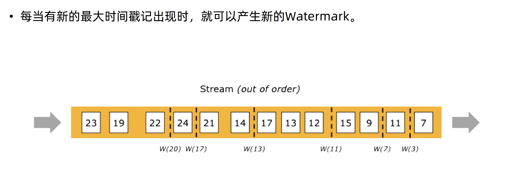

# Watermark 实践

## 概念

## 完美的Watermark

## *有界乱序事件下的Watermark*

### *迟到事件*

*maxOutOfOrderness = 4*

### *并行中的Watermark*

## *Watermark 与Window 之间的关系*

1. **Append Mode**:
   - 在 append mode 下，系统假设所有的输出数据是新增的，即没有修改或删除旧记录的操作。
   - 这种模式下，水印主要用于触发窗口的计算。一旦系统基于水印确定某个时间窗口的数据已全部到达，它会触发该窗口的计算并输出结果。
   - Append mode 是最简单的处理模式，因为输出只涉及添加操作，不需要跟踪记录的历史状态或进行更新。
2. **Update Mode**:
   - 在 update mode 下，输出可以包括对既存结果的更新或删除，这常见于聚合操作，如求和、平均等，其中输出结果可能随着新数据的到来而变化。
   - 在这种模式下，水印的作用除了触发窗口的计算外，还需要管理和调整状态更新。因为输出不仅仅是添加新元素，还可能涉及修改或删除旧元素。
   - 水印在这里确保所有依赖于某个特定时间点之前的数据的更新操作都在该时间点的水印到达后进行，以保证状态的一致性和准确性。

### Append mode

### Update mode

### Watermark总结

## 使用Watermark Demo

