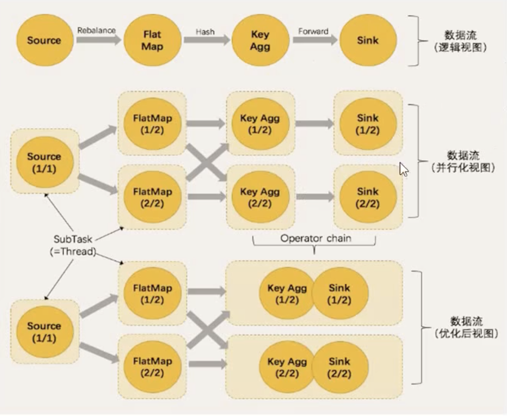
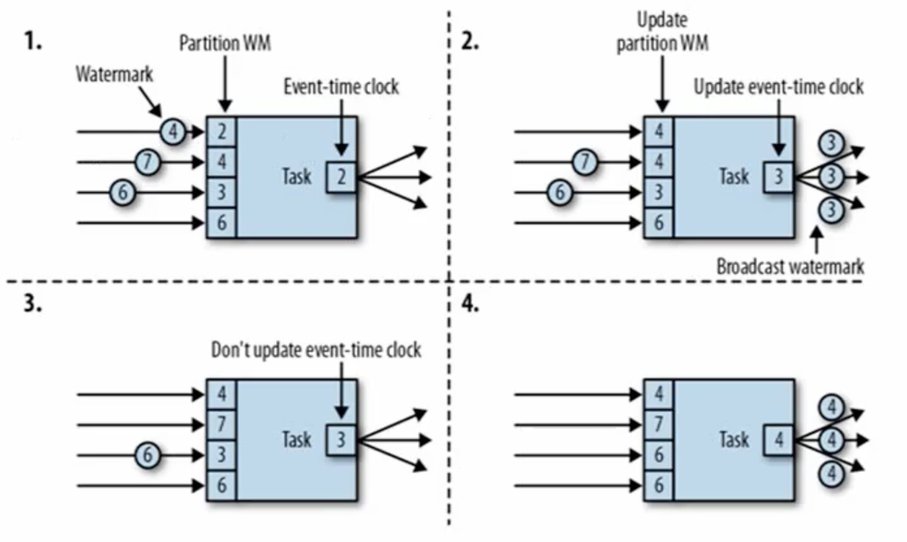

# Watermark

## 解决了什么问题

乱序数据带来计算不正确

## 概念

* 遇到一个时间戳达到了窗口关闭时间，不应该立即触发窗口计算，而是等待一段时间，等迟到的数据来了再关闭窗口
* Watermark是一种衡量Event Time进展的机制，可以设定延迟触发
* Watermark是用户处理乱序事件的，而正确的处理乱序事件，通常WaterMark机制结合window来实现
* 数据流中的Watermark用于表示timestamp小于Watermark的数据都已经到达了，因此window的执行也是由Watermark触发的
* Watermark用来让程序自己平衡延迟和结果正确性

## 特点

* Watermark是一条特殊的数据记录
* Watermark必须单调递增，以确保任务的事件时间时钟在向前推进，而不是在后退
* Watermark与数据的时间戳相关

## Watermark的传递

如图所示，在Flink的任务中有四个并行的子任务，它们初始的WaterMark分别是2，4，3，6，然后第一个子任务的WaterMark为4的数据来着，到达之后就更新自己的WaterMak变成4，那么就说明这个子任务的4之前的数据都到了，其他子任务也是一样。

##  测试Demo

	package com.wzy
	
	
	import java.time.Duration
	
	import org.apache.flink.api.common.eventtime.{SerializableTimestampAssigner, WatermarkStrategy}
	import org.apache.flink.streaming.api.environment.StreamExecutionEnvironment
	import org.apache.flink.api.scala._
	
	
	case class  SensorReading(id:String,timestamp:Long,temperature:Double)
	
	object WaterMarkTest {
	
	  def main(args: Array[String]): Unit = {
	
	
	    val env = StreamExecutionEnvironment.getExecutionEnvironment
	
	    //从文件中读取
	    /*val inputPath ="/Users/zheyiwang/IdeaProjects/flink_demo/src/main/scala/com/wzy/sensorReading.txt";
	    val stream =env.readTextFile(inputPath)*/
	
	    val stream = env.socketTextStream("localhost",1234)
	
	    val dataStream = stream.map( data =>{
	      val arr = data.split(",")
	      SensorReading(arr(0),arr(1).toLong,arr(2).toDouble)
	      })
	      .assignTimestampsAndWatermarks(WatermarkStrategy
	        .forBoundedOutOfOrderness[SensorReading](Duration.ofSeconds(3)).withTimestampAssigner(
	        new SerializableTimestampAssigner[SensorReading]{
	          override def extractTimestamp(t: SensorReading, recordTimestamp: Long): Long = t.timestamp
	        }
	      )
	      )
	      .print()
	
	    dataStream.setParallelism(1)
	
	    env.execute("watermark test")
	  }
	
	}