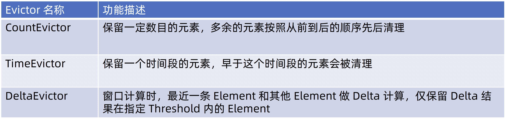
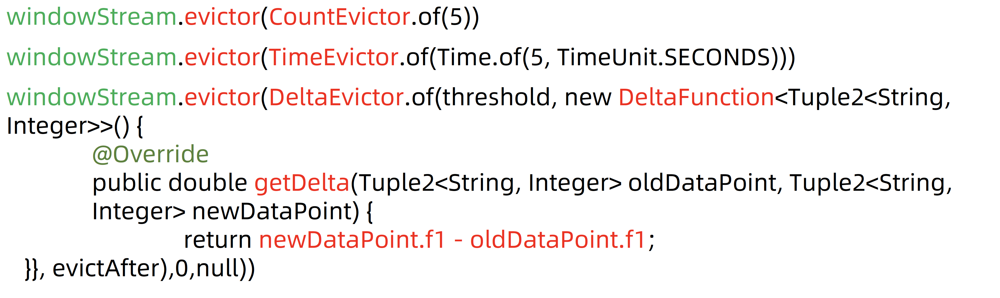

# Window Evictor

窗口驱逐器（Window Evictor）是一个高级组件，用于控制存储在窗口中的数据量。驱逐器可以在窗口触发计算之前从窗口中移除某些元素，这样可以对窗口中的数据进行精细控制，确保只处理最相关的数据。

### 窗口驱逐器的工作原理

窗口驱逐器在窗口函数（如`reduce`或`apply`等）执行之前运行，它根据定义好的逻辑决定哪些数据应该保留，哪些应该被移除。驱逐器通常与触发器（Triggers）和窗口函数一起使用，形成完整的窗口操作流程：

1. 数据进入窗口。
2. 触发器根据设定的条件触发窗口操作。
3. 驱逐器在窗口函数执行前移除不符合条件的数据。
4. 窗口函数对剩下的数据进行处理。
5. 窗口结果被输出。

### 使用场景

窗口驱逐器特别适用于以下场景：

- **内存管理**：当窗口中数据量过大时，驱逐器可以帮助移除不需要的数据，从而降低内存压力。
- **数据过滤**：在窗口触发之前，根据特定规则（如数据的时效性或质量）筛选数据。
- **保留最新数据**：例如，只保留最新的N条数据进行计算。

### 内置驱逐器

Flink 目前内置的驱逐器类型相对较少，最常见的是基于数量的驱逐器，例如：

- **Count Evictor**：保留窗口中的最后N个元素，超出部分的旧数据将被移除。

### 自定义驱逐器

Flink 允许开发者自定义驱逐器来满足特定需求。自定义驱逐器需要实现`Evictor`接口，并实现以下方法：

- `evictBefore()`：在窗口函数执行之前调用，用于决定在窗口计算前移除哪些数据。
- `evictAfter()`：在窗口函数执行之后调用，用于在窗口计算后清理数据。

## 功能

## 例子

