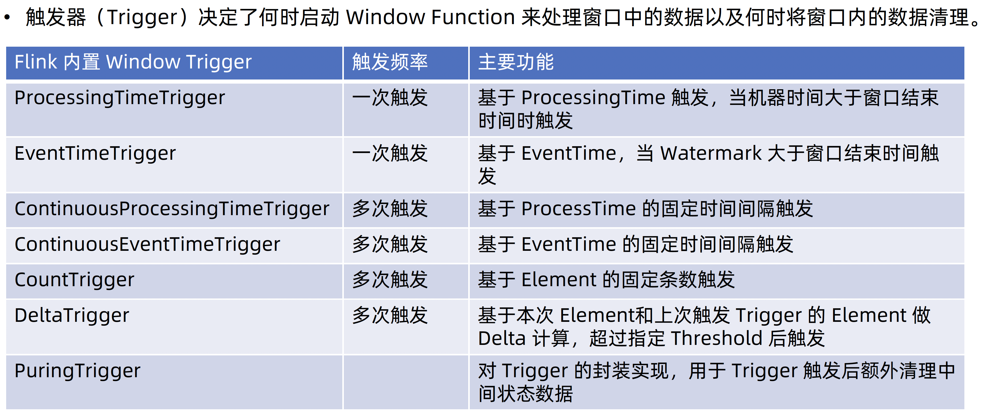

# Window Trigger

## 触发器的类型

Flink 提供了几种内置的触发器类型：

1. **事件时间触发器 (Event Time Trigger)**:
   - 这是最常用的触发器，特别是在处理有明确时间戳的数据时。
   - 它通常与水印（Watermarks）一起使用，确保所有时间戳小于当前水印的数据都已到达。
   - 当水印超过窗口的结束时间时，触发器触发窗口的执行。
2. **处理时间触发器 (Processing Time Trigger)**:
   - 基于处理时间来触发窗口。处理时间指的是事件在系统中被处理的实际时间。
   - 当系统时钟达到窗口结束时间时，窗口被触发。
3. **连续触发器 (Continuous Trigger)**:
   - 每到达一个特定的间隔（基于时间或者数据条数），就会触发一次窗口操作，但不会关闭窗口。
   - 这种类型的触发器适合于需要频繁更新结果的情况，比如实时监控仪表盘。
4. **计数触发器 (Count Trigger)**:
   - 当窗口中的数据条数达到设定的阈值时触发窗口。
   - 适用于数据量驱动的处理逻辑。

## 自定义触发器

除了内置触发器，Flink 也支持自定义触发器。开发者可以根据特定的业务需求来定义何时触发窗口。自定义触发器需要实现 `Trigger` 接口，并实现以下方法：

- `onElement()`: 当一个元素被添加到窗口时调用。
- `onEventTime()`: 当相关的事件时间计时器触发时调用。
- `onProcessingTime()`: 当相关的处理时间计时器触发时调用。
- `onMerge()`: 在两个窗口合并时调用，这在使用会话窗口时特别重要。
- `clear()`: 当窗口被清理前调