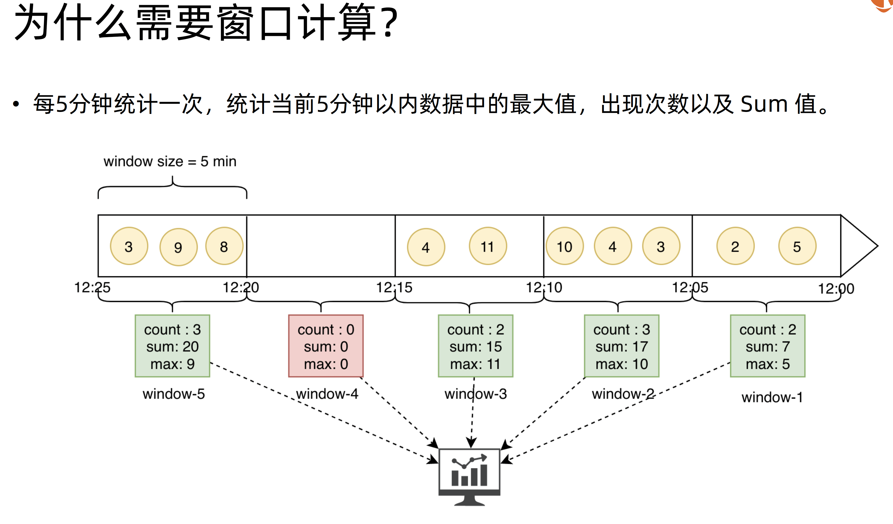
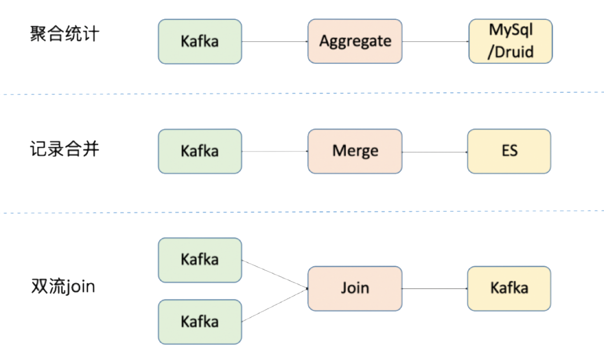
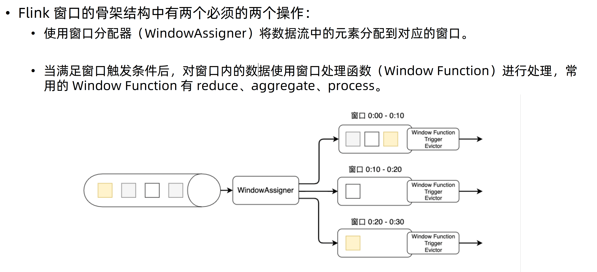
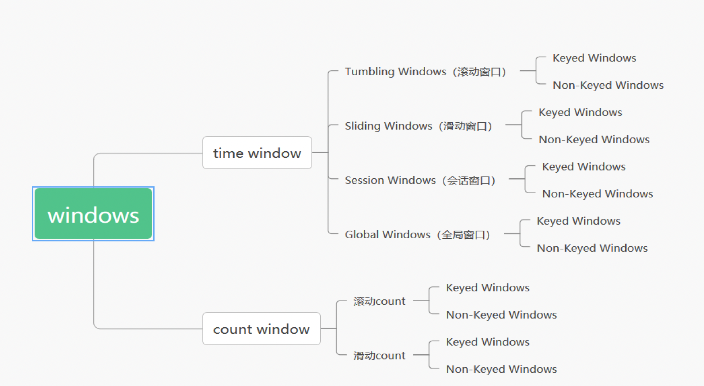
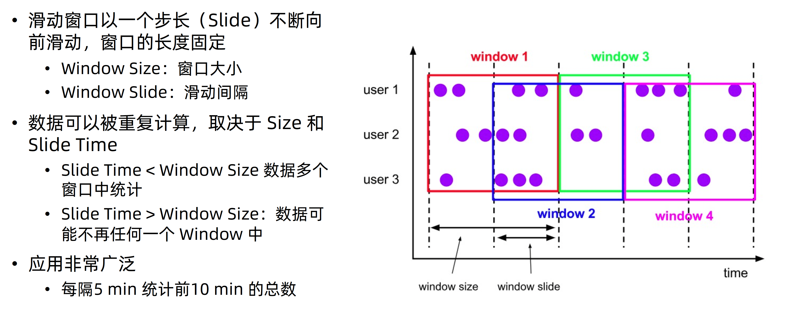
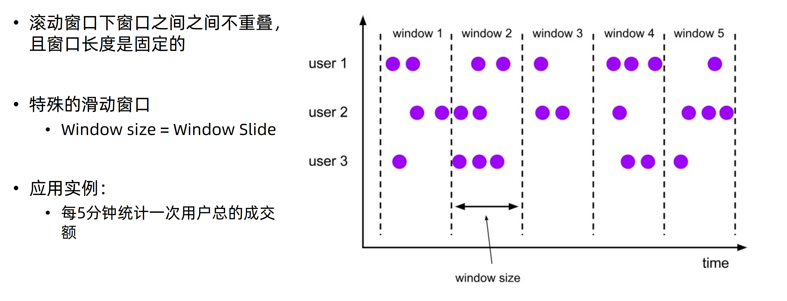
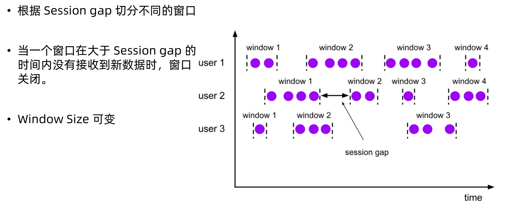
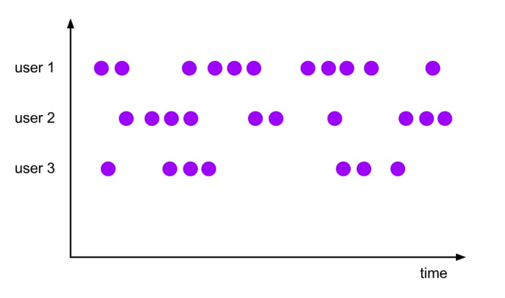
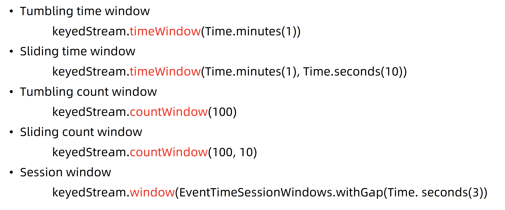

# *Windows 窗口计算* 实践

## 背景

## 适合场景

## Window Assigner

## 窗口类型

## *Sliding Window（滑动窗口)*

**数据可以被重复计算**

## *Tumbliing Window（滚动窗口）*

**窗口不重叠**

## *Session Window*

## *Global Window*

Global Window是一种特殊类型的窗口，它不像时间窗口（如滚动窗口或滑动窗口）那样基于时间划分，而是将所有收到的数据元素收集到单个窗口中进行处理。使用全局窗口通常需要结合触发器（Trigger）来决定何时进行数据的处理和输出，因为没有自然的窗口结束条件，如时间边界。

## 用法

