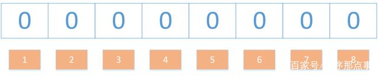
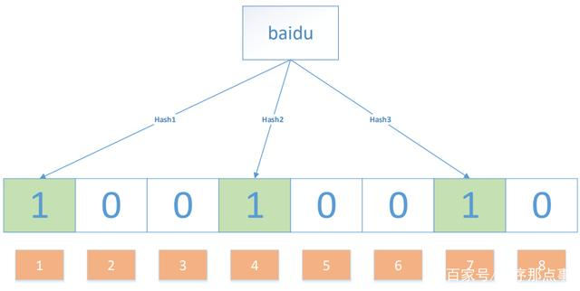
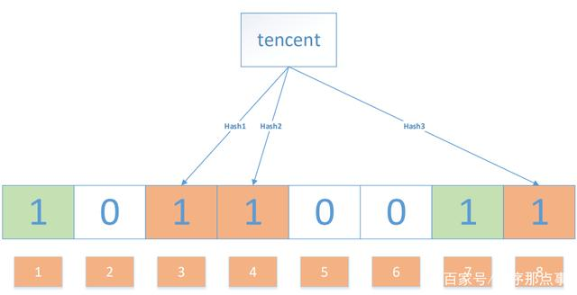
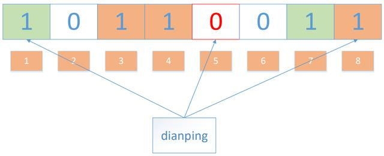

# 布隆过滤器

## 什么是布隆过滤器？

布隆过滤器（Bloom Filter）是1970年由布隆提出的。它实际上是一个很长的二进制向量和一系列随机映射函数。布隆过滤器可以用于检索一个元素是否在一个集合中。

布隆过滤器的优点：

* 时间复杂度低，增加和查询元素的时间复杂为O(N)，（N为哈希函数的个数，通常情况比较小）
* 保密性强，布隆过滤器不存储元素本身
* 存储空间小，如果允许存在一定的误判，布隆过滤器是非常节省空间的（相比其他数据结构如Set集合）

布隆过滤器的缺点：

* 有点一定的误判率，但是可以通过调整参数来降低
* 无法获取元素本身
* 很难删除元素

## 布隆过滤器的使用场景

* 解决Redis缓存穿透问题（面试重点）
* 邮件过滤，使用布隆过滤器来做邮件黑名单过滤
* 对爬虫网址进行过滤，爬过的不再爬
* 解决新闻推荐过的不再推荐(类似抖音刷过的往下滑动不再刷到)
* HBase\RocksDB\LevelDB等数据库内置布隆过滤器，用于判断数据是否存在，可以减少数据库的IO请求

## 面试一般问

1、 比如中国现在接种第3针加强针新冠疫苗的人数已超过10亿，怎样快速判断出一位持有中国身份证的居民没有接种第3针疫苗？

2、 因为你和领导喜欢公司同一个妹子，你的领导想辞退你，但你平时的工作和考勤表现都无可挑剔。于是他给你一台内存是2G的笔记本电脑和A,B两个文件，每个文件各存放50亿条URL，每条URL占用64字节，让你找出A,B文件所有共同的URL，你咋办？

3、 之前被你领导排挤走的程序员非常气愤，于是写了个程序大批量频繁调用公司的http接口目的是攻击公司的数据库。虽然公司用了redis缓存，但由于他之前在公司干过，他的接口入参全都是缓存中不存在的，全都击穿了redis去访问数据库，领导眼看数据库每天都蹦，正好把锅甩给你，让你解决这个redis被击穿的问题，你咋处理？

## 布隆过滤器的原理

果想判断一个元素是不是在一个集合里，一般是将集合中所有元素保存起来，然后通过比较确定。链表、树、哈希表等数据结构都是这种思路。但是随着集合元素的增加需要的存储空间越大，检索速度也越慢。

应该蛮多人会说用 HashMap 吧，确实可以将值映射到 HashMap 的 Key，然后可以在 O(1) 的时间复杂度内返回结果，效率奇高。但是 HashMap 的实现也有缺点，例如存储容量占比高。还比如说你的数据集存储在远程服务器上，本地服务接受输入，而数据集非常大不可能一次性读进内存构建 HashMap 的时候，也会存在问题

布隆过滤器是一个 bit 向量或者说 bit 数组（超长超长，记住一定要足够长），长这样：

我们要映射一个值到布隆过滤器中，我们需要使用多个不同的哈希函数生成多个哈希值，并对每个生成的哈希值指向的 bit 位置 1，例如针对值 “baidu” 和三个不同的哈希函数分别生成了哈希值 1、4、7，则上图转变为：

Ok，我们现在再存一个值 “tencent”，如果哈希函数返回 3、4、8 的话，图继续变为：

值得注意的是，4 这个 bit 位由于两个值的哈希函数都返回了这个 bit 位，因此它被覆盖了。现在我们如果想查询 “dianping” 这个值是否存在，哈希函数返回了 1、5、8三个值，结果我们发现 5 这个 bit 位上的值为 0，说明没有任何一个值映射到这个 bit 位上，因此我们可以很确定地说 “dianping” 这个值不存在。

## 布隆过滤器的算法总结：

1. 初始化时，需要一个长度为n比特的数组，每个比特位初始化为0；

2. 然后需要准备k个hash函数，每个函数可以把key散列成为1个整数；

3. 某个key加入集合时，用k个hash函数计算出k个散列值，并把bit数组中对应的比特位置为1；

4. 判断某个key是否在集合时，用k个hash函数计算出k个散列值，并查询数组中对应的比特位，如果有比特位是0，则该key一定不在集合中。

## 布隆过滤器的典型应用

（1）检查单词拼写正确性

（2）检测海量名单嫌疑人

（3）垃圾邮件过滤

（4）搜索爬虫URL去重

（5）缓存穿透过滤