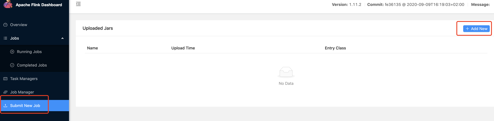
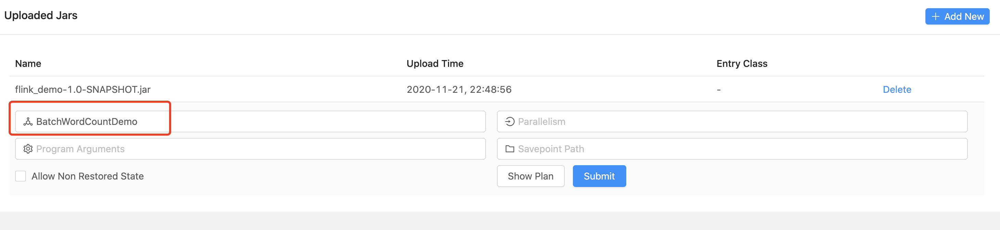

# 提交任务到Flink

## 查看资源

## 上传Jar包

## 创建测试文档（非必须）
以word count为例，如果是容器启动的Flink，进入flink_taskmanager_1，创建测试文档

	[root@wangzheyi flink]# docker exec -it 2f023d15a7eb bash

vi /input.txt

	I love Beijing 
	I love China
	
	
## 运行程序

输入执行main函数

## 代码

### BatchWordCountDemo

	package com.wzy
	
	import org.apache.flink.api.scala.ExecutionEnvironment
	
	object BatchWordCountDemo {
	
	  def main(args: Array[String]): Unit = {
	
	    //设置环境(Batch是ExecutionEnviroment)
	    val env = ExecutionEnvironment.getExecutionEnvironment
	
	    //定义变量
	    //val inputPath = "/Users/zheyiwang/Downloads/input"
	    //val outputPath = "/Users/zheyiwang/Downloads/output"
	    val inputPath = "/input.txt"
	    val outputPath = "/output.txt"
	
	    //读取文件
	    val text = env.readTextFile(inputPath)
	
	    val counts = text.flatMap(_.split(" "))
	      .filter(_.nonEmpty)
	      .map((_, 1))
	      .groupBy(0)
	      .sum(1)
	      .setParallelism(1)
	
	    //输出到文档
	    counts.writeAsCsv(outputPath, "\n", " ")
	
	    //启动任务
	    env.execute("batch word count")
	
	  }
	
	}

### pom.xml

	<?xml version="1.0" encoding="UTF-8"?>
	<project xmlns="http://maven.apache.org/POM/4.0.0"
	         xmlns:xsi="http://www.w3.org/2001/XMLSchema-instance"
	         xsi:schemaLocation="http://maven.apache.org/POM/4.0.0 http://maven.apache.org/xsd/maven-4.0.0.xsd">
	    <modelVersion>4.0.0</modelVersion>
	
	    <groupId>org.example</groupId>
	    <artifactId>flink_demo</artifactId>
	    <version>1.0-SNAPSHOT</version>
	
	
	    <dependencies>
	        <dependency>
	            <groupId>org.apache.flink</groupId>
	            <artifactId>flink-core</artifactId>
	            <version>1.11.2</version>
	        </dependency>
	        <dependency>
	            <groupId>org.apache.flink</groupId>
	            <artifactId>flink-scala_2.12</artifactId>
	            <version>1.11.2</version>
	        </dependency>
	        <dependency>
	            <groupId>org.apache.flink</groupId>
	            <artifactId>flink-streaming-scala_2.12</artifactId>
	            <version>1.11.2</version>
	        </dependency>
	        <dependency>
	            <groupId>org.apache.flink</groupId>
	            <artifactId>flink-clients_2.12</artifactId>
	            <version>1.11.2</version>
	        </dependency>
	    </dependencies>
	
	    <build>
	        <plugins>
	            <plugin>
	                <groupId>net.alchim31.maven</groupId>
	                <artifactId>scala-maven-plugin</artifactId>
	                <executions>
	                    <execution>
	                        <id>scala-compile</id>
	                        <phase>compile</phase>
	                        <goals>
	                            <goal>add-source</goal>
	                            <goal>compile</goal>
	                        </goals>
	                    </execution>
	                    <execution>
	                        <id>scala-test-compile</id>
	                        <phase>test-compile</phase>
	                        <goals>
	                            <goal>testCompile</goal>
	                        </goals>
	                    </execution>
	                </executions>
	            </plugin>
	            <plugin>
	                <artifactId>maven-compiler-plugin</artifactId>
	                <executions>
	                    <execution>
	                        <id>default-compile</id>
	                        <phase>none</phase>
	                    </execution>
	                    <execution>
	                        <id>default-testCompile</id>
	                        <phase>none</phase>
	                    </execution>
	                </executions>
	            </plugin>
	
	            <plugin>
	                <groupId>org.apache.maven.plugins</groupId>
	                <artifactId>maven-eclipse-plugin</artifactId>
	                <version>2.8</version>
	                <configuration>
	                    <downloadSources>true</downloadSources>
	                    <projectnatures>
	                        <projectnature>org.scala-ide.sdt.core.scalanature</projectnature>
	                        <projectnature>org.eclipse.jdt.core.javanature</projectnature>
	                    </projectnatures>
	                    <buildcommands>
	                        <buildcommand>org.scala-ide.sdt.core.scalabuilder</buildcommand>
	                    </buildcommands>
	                    <classpathContainers>
	                        <classpathContainer>org.scala-ide.sdt.launching.SCALA_CONTAINER</classpathContainer>
	                        <classpathContainer>org.eclipse.jdt.launching.JRE_CONTAINER</classpathContainer>
	                    </classpathContainers>
	                    <excludes>
	                        <exclude>org.scala-lang:scala-library</exclude>
	                        <exclude>org.scala-lang:scala-compiler</exclude>
	                    </excludes>
	                    <sourceIncludes>
	                        <sourceInclude>**/*.scala</sourceInclude>
	                        <sourceInclude>**/*.java</sourceInclude>
	                    </sourceIncludes>
	                </configuration>
	            </plugin>
	            <plugin>
	                <groupId>org.codehaus.mojo</groupId>
	                <artifactId>build-helper-maven-plugin</artifactId>
	                <version>1.7</version>
	                <executions>
	                    <execution>
	                        <id>add-source</id>
	                        <phase>generate-sources</phase>
	                        <goals>
	                            <goal>add-source</goal>
	                        </goals>
	                        <configuration>
	                            <sources>
	                                <source>src/main/scala</source>
	                            </sources>
	                        </configuration>
	                    </execution>
	                </executions>
	            </plugin>
	            <plugin>
	                <groupId>org.apache.maven.plugins</groupId>
	                <artifactId>maven-compiler-plugin</artifactId>
	                <configuration>
	                    <source>8</source>
	                    <target>8</target>
	                </configuration>
	            </plugin>
	            <plugin>
	                <artifactId>maven-assembly-plugin</artifactId>
	                <configuration>
	                    <appendAssemblyId>false</appendAssemblyId>
	                    <descriptorRefs>
	                        <descriptorRef>jar-with-dependencies</descriptorRef>
	                    </descriptorRefs>
	                    <archive>
	                        <manifest>
	                            <!--运行主类，全类名-->
	                            <mainClass>xxxxxxxxxxxxxxx</mainClass>
	                        </manifest>
	                    </archive>
	                </configuration>
	                <executions>
	                    <execution>
	                        <id>make-assembly</id>
	                        <phase>package</phase>
	                        <goals>
	                            <goal>single</goal>
	                        </goals>
	                    </execution>
	                </executions>
	            </plugin>
	        </plugins>
	    </build>
	</project>