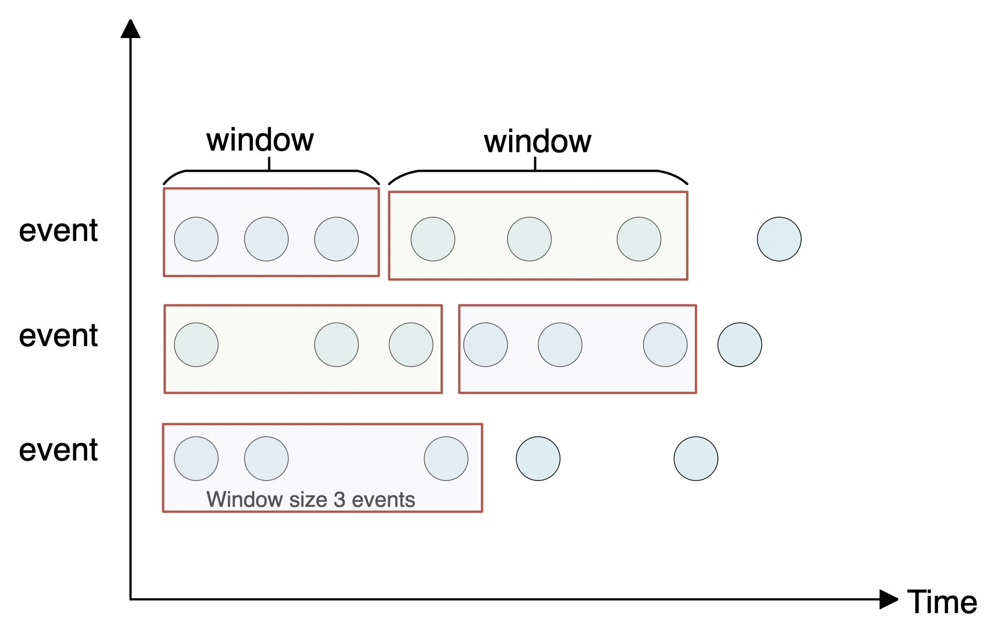
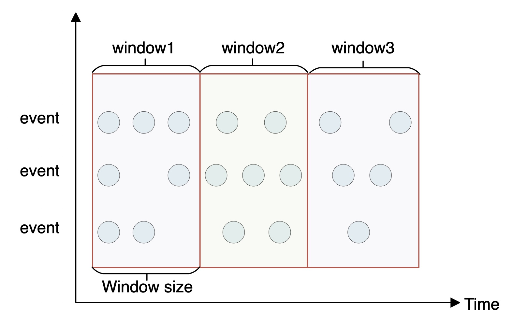
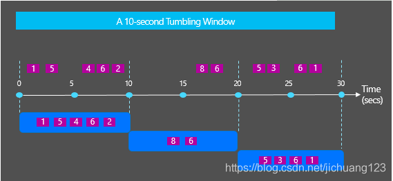
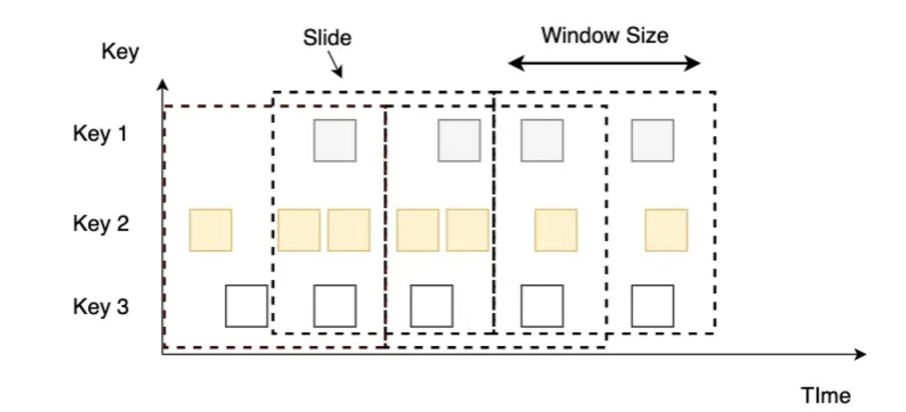
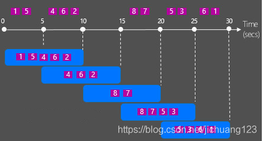
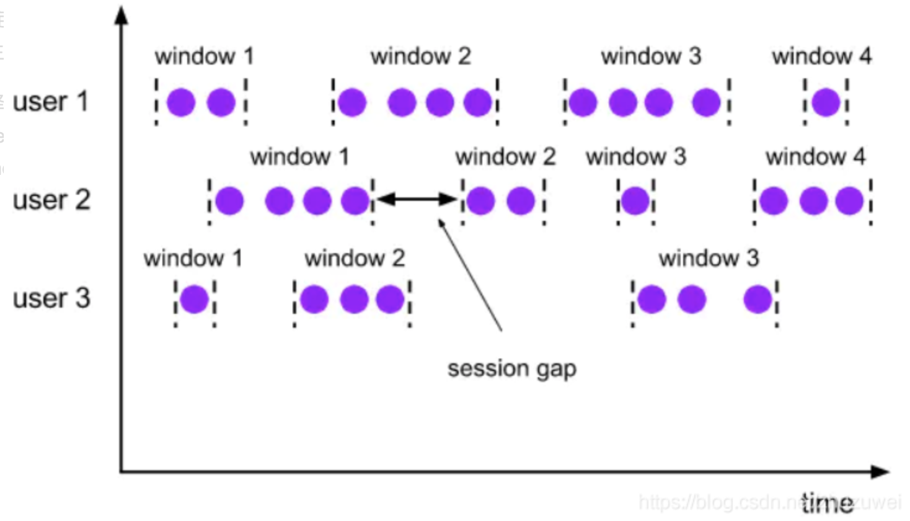
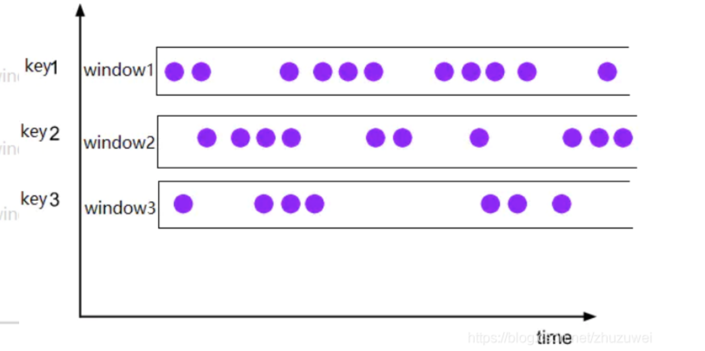
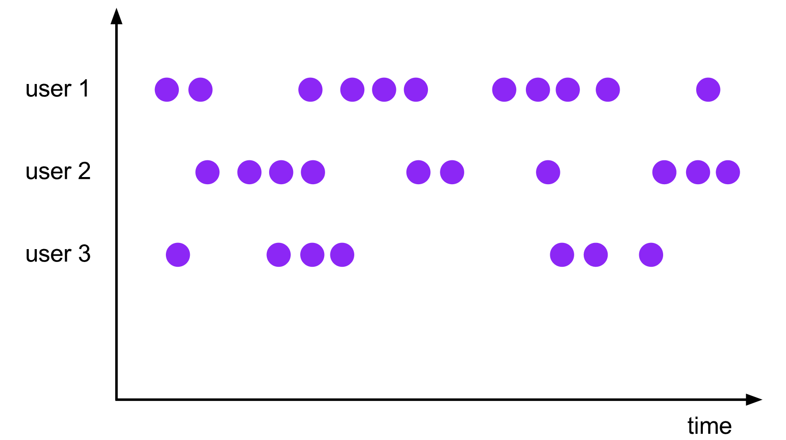

#10. 窗口Demo

## countWindowAll

### 定义

全局window，按数据数量进行窗口划分

### 代码

	package wzy
	
	import org.apache.flink.streaming.api.scala._
	
	//不分组划分窗口
	//按照数据的条数划分，CountWindow属于Global window
	object countwindowdemo {
	1
	  def main(args: Array[String]): Unit = {
	
	    val env = StreamExecutionEnvironment.getExecutionEnvironment
	    val lines = env.socketTextStream("47.112.142.231",9999)
	
	    //将读数转化为int，然后每3个数做一次窗口，然后求和
	    val window =lines.map(_.toInt).countWindowAll(3).sum(0).print()
	
	    env.execute("countwindowdemo")
	
	  }
	
	}

### 验证

监听服务器

	[root@iZwz930tnxht4q6f3yxum6Z ~]# nc -l 9999
	1
	2
	3
	4
	5
	6

flink侧

	1> 6
	2> 15

##  滚动时间窗口 (Tumbling Time Window)

* 将数据依据固定的窗口长度对数据进行切分
* 时间对齐，窗口长度固定，没有重叠
* 每条数据只会被划分到一个窗口中

### 代码

	package wzy
	
	import org.apache.flink.streaming.api.scala._
	import org.apache.flink.streaming.api.windowing.assigners.TumblingProcessingTimeWindows
	import org.apache.flink.streaming.api.windowing.time.Time
	
	
	object TumblingTimeWindow {
	
	  def main(args: Array[String]): Unit = {
	
	    val env = StreamExecutionEnvironment.getExecutionEnvironment
	
	    val text = env.socketTextStream("47.112.142.231", 9999)
	
	    val counts = text.flatMap { _.toLowerCase.split("\\W+") filter { _.nonEmpty } }
	      .map { (_, 1) }
	      .keyBy(_._1)
	      .window(TumblingProcessingTimeWindows.of(Time.seconds(5)))
	      .sum(1)
	
	    counts.print()
	
	    env.execute("TumblingTimeWindow")
	
	  }

	}

### 验证

示例为单位时间5秒为一个窗口。

第一个5秒输入：

	[root@iZwz930tnxht4q6f3yxum6Z ~]# nc -l 9999
	1
	1
	1
	2
	1
	2

flink程序：
	
	3> (2,2)
	6> (1,4)
	

第二个5秒输入：

	1
	2
	
flink程序：
	6> (1,1)
	3> (2,1)	
	
	
##  滑动时间窗口 (Sliding Time Window)

### 代码

	package wzy
	
	import org.apache.flink.streaming.api.scala._
	import org.apache.flink.streaming.api.windowing.assigners.{ SlidingProcessingTimeWindows}
	import org.apache.flink.streaming.api.windowing.time.Time
	
	
	object SlidingWindow {
	
	  def main(args: Array[String]): Unit = {
	
	    val env = StreamExecutionEnvironment.getExecutionEnvironment
	
	    val text = env.socketTextStream("47.112.142.231", 9999)
	
	    val counts = text.flatMap { _.toLowerCase.split("\\W+") filter { _.nonEmpty } }
	      .map { (_, 1) }
	      .keyBy(_._1)
	      .window(SlidingProcessingTimeWindows.of(Time.seconds(5),Time.seconds(5)))  //(size: Time, slide: Time)
	      .sum(1)
	
	    counts.print()
	
	    env.execute("SlidingWindow")
	
	  }
	}

当Sliding Windows的滑动时间和窗口时间是一样的时候，这时候Sliding Windows窗口之间就不会重叠，这就是Tumbling Windows。

滑动窗口以一个步长（Slide）不断向前滑动，窗口的长度固定。使用时，我们要设置Slide和Size。Slide的大小决定了Flink以多大的频率来创建新的窗口，Slide较小，窗口的个数会很多。Slide小于窗口的Size时，相邻窗口会重叠，一个事件会被分配到多个窗口；Slide大于Size，有些事件可能被丢掉。
。

### 验证

第一个5秒输入：

	1 2 3 4 5

flink程序：

	6> (1,1)
	3> (2,1)
	1> (4,1)
	4> (3,1)
	8> (5,1)

第二个5秒输入：

	1 2 3 4 5
	
flink程序：

	6> (1,2)
	3> (2,2)
	1> (4,2)
	4> (3,2)
	8> (5,2)	
	
	
第三个5秒什么都不输入

flink程序：

	6> (1,1)
	3> (2,1)
	1> (4,1)
	4> (3,1)
	8> (5,1)
	
以上的案例中，两个窗口分别做了计算。

## Session Window

	
	

Session Windows(会话窗口)主要是将某段时间内活跃度较高的数据聚合成一个窗口进行计算，窗口的触发的条件是Session Gap，是指在规定的时间内如果没有数据活跃接入，则认为窗口结束，然后触发窗口计算结果。需要注意的是如果数据一直不间断地进入窗口，也会导致窗口始终不触发的情况。与滑动窗口、滚动窗口不同的是，Session Windows不需要有固定窗口大小(window size)和滑动时间(slide time)，只需要定义session gap，来规定不活跃数据的时间上限即可。

	// 使用EventTime
	datastream
	           .keyBy(id)
	           .window((EventTimeSessionWindows.withGap(Time.minutes(15)))
	           .process(new MyProcessFunction())
	// 使用processing-time
	datastream
	           .keyBy(id)
	           .window(ProcessingTimeSessionWindows.withGap(Time.minutes(15)))
	           .process(new MyProcessFunction())
	           
### 代码

	package wzy
	
	import org.apache.flink.streaming.api.scala._
	import org.apache.flink.streaming.api.windowing.assigners.{ProcessingTimeSessionWindows, SlidingProcessingTimeWindows}
	import org.apache.flink.streaming.api.windowing.time.Time
	
	
	object sessionWindow {
	
	  def main(args: Array[String]): Unit = {
	
	    val env = StreamExecutionEnvironment.getExecutionEnvironment
	
	    val text = env.socketTextStream("47.112.142.231", 9999)
	
	    val counts = text.flatMap { _.toLowerCase.split("\\W+") filter { _.nonEmpty } }
	      .map { (_, 1) }
	      .keyBy(_._1)
	      .window(ProcessingTimeSessionWindows.withGap(Time.seconds(5)))
	      .sum(1)
	
	    counts.print()
	
	    env.execute("session window")
	
	  }
	}

### 验证

每隔两秒输入一个数字

	[root@iZwz930tnxht4q6f3yxum6Z ~]# nc -l 9999
	1
	2
	1
	1
	1
	1
	1
	1
	1

flink程序：

	#5秒后输出
	3> (2,1)
	
	# 停止输入数字后5秒输出
	6> (1,8)

## Global window

Global window 表示所有相同key的元素被分配到一个global window。除非使用在triger功能下，否则没有作用。

	

	val input: DataStream[T] = ...
	
	input
	    .keyBy(<key selector>)
	    .window(GlobalWindows.create())
	    .<windowed transformation>(<window function>)