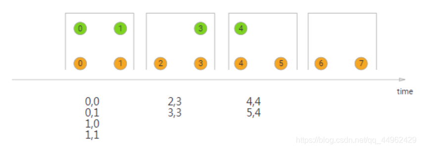

# 11. 窗口Join Demo

## 定义

窗口联接将共享相同key并位于同一窗口中的两个流的元素联接在一起，可以使用窗口分配器定义这些窗口，并根据两个流中的元素对其进行评估，然后将双方的元素传递到用户定义的位置，使用JoinFunction或者FlatJoinFunction可以在其中发出符合联接条件的结果。

## 基本语法

	stream.join(otherStream)
	    .where(<KeySelector>)
	    .equalTo(<KeySelector>)
	    .window(<WindowAssigner>)
	    .apply(<JoinFunction>)

## Global Window Join

### 代码

	package wzy
	
	import org.apache.flink.streaming.api.scala._
	import org.apache.flink.streaming.api.windowing.assigners.GlobalWindows
	import org.apache.flink.streaming.api.windowing.triggers.CountTrigger
	
	object windowjoinDemo {
	
	  def main(args: Array[String]): Unit = {
	
	    val env = StreamExecutionEnvironment.getExecutionEnvironment
	    env.setParallelism(1) //为了方便查看join的效果
	
	    val person = env.fromElements(("1","小张"),("2","小刘"),("3","小力"),("4","小心"))
	    val money = env.fromElements(("1",100),("2",200),("3",300))
	
	    person.join(money)
	      .where(_._1).equalTo(_._1)
	      .window(GlobalWindows.create())
	      .trigger(CountTrigger.of(2))
	      .apply((x,y)=>(x._1,x._2,y._2))
	      .print()
	
	    env.execute("window join demo")
	
	  }
	
	}

### 验证

	(1,小张,100)
	(2,小刘,200)
	(3,小力,300)
	
可以看到第四项没有展示出来

	    
	    
## Tumbling Window Join

在执行滚动窗口join时，所有具有公共key和公共滚动窗口的元素将以成对组合的形式联接并传递到JoinFunction或FlatJoinFunction。因为它的行为就像一个内部联接，所以在其滚动窗口中不发出一个流中没有其他流元素的元素。

