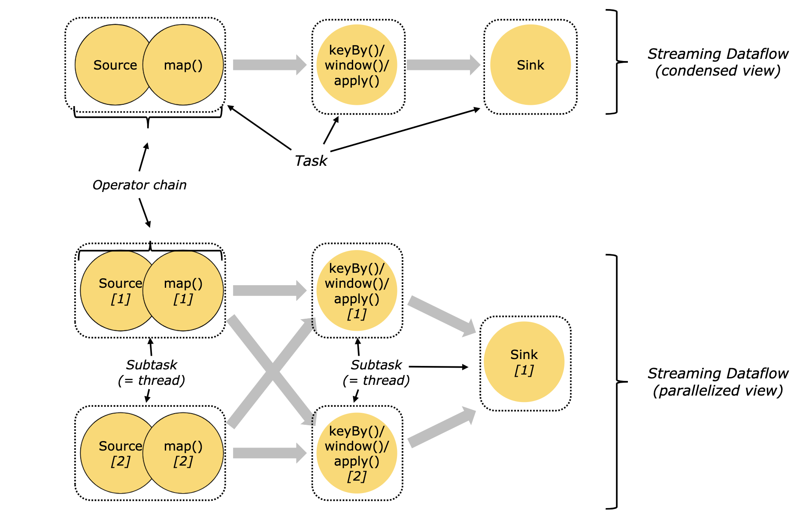

# 14. Flink 集群剖析

## 进程组成

一个 JobManager 和一个或者多个 TaskManager

## 任务提交流程

## 任务提交到Yarn流程

## JobManager 

JobManager 具有许多与协调 Flink 应用程序的分布式执行有关的职责：它决定何时调度下一个 task（或一组 task）、对完成的 task 或执行失败做出反应、协调 checkpoint、并且协调从失败中恢复等等。这个进程由三个不同的组件组成：

### ResourceManager

ResourceManager 负责 Flink 集群中的资源提供、回收、分配 - 它管理 task slots，这是 Flink 集群中资源调度的单位（请参考TaskManagers）。Flink 为不同的环境和资源提供者（例如 YARN、Mesos、Kubernetes 和 standalone 部署）实现了对应的 ResourceManager。在 standalone 设置中，ResourceManager 只能分配可用 TaskManager 的 slots，而不能自行启动新的 TaskManager。

### Dispatcher

Dispatcher 提供了一个 REST 接口，用来提交 Flink 应用程序执行，并为每个提交的作业启动一个新的 JobMaster。它还运行 Flink WebUI 用来提供作业执行信息。

### JobMaster

JobMaster 负责管理单个JobGraph的执行。Flink 集群中可以同时运行多个作业，每个作业都有自己的 JobMaster。

## TaskManagers

TaskManager（也称为 worker）执行作业流的 task，并且缓存和交换数据流。

## Tasks 和算子链

对于分布式执行，Flink 将算子的 subtasks 链接成 tasks。每个 task 由一个线程执行。将算子链接成 task 是个有用的优化：它减少线程间切换、缓冲的开销，并且减少延迟的同时增加整体吞吐量。

下图中样例数据流用 5 个 subtask 执行，因此有 5 个并行线程。

**注意：途中下标数字为并行度**

图中，source、map、[keyBy|window|apply]、sink算子的并行度分别是2、2、2、2、1，经过Flink优化后，source和map算子组成一个算子链，作为一个task运行在一个线程上，

### 算子链的好处

在 task 执行过程中，连续执行的几个算子往往会随机分配到不同的线程处理，这增加了线程间交换与缓冲的开销，通过调用链接接口，可以把连续的算子强行安排到同一个线程上处理以提高 task 的执行性能。

所有chain在一起的sub-task都会在同一个线程（即TaskManager的slot）中执行，能够减少不必要的数据交换、序列化和上下文切换，从而提高作业的执行效率。

### Flink Runtime 

三层图结构：

* StreamGraph——原始逻辑执行计划
* JobGraph——优化的逻辑执行计划（Web UI中看到的就是这个）
* ExecutionGraph——物理执行计划

算子链是在由StreamGraph生成JobGraph的过程中。

### 代码

#### 开启新链
	接口：startNewChain()
	用例：someStream.filter(...).map(...).startNewChain().map(...);
	解释：开启一个新的链，将接口前后的算子分派到一个独立的 slot 上，这不包括 filter 这个算子，因为他未与 startNewChain()直接相连。

####关闭链接
	接口：disableChaining()
	用例：someStream.map(...).disableChaining();
	解释：由于 Flink 会尽可能将多个 Operator 链接起来，即分配到同个 slot 上处理，如果你想关闭这个机制，除了前面提到的调用StreamExecutionEnvironment.disableOperatorChaining()关闭整个 job 的链接机制之外，还可以在该算子之后调用接口disableChaining()来仅取消链接这个算子。

####设置 slot sharing group
	接口：slotSharingGroup()
	用例：someStream.filter(...).slotSharingGroup("name");
	解释：在 Operator 后调用此接口，可该 Operator 进行分组，同分组内的 Operator 执行时会被 Flink 安排到同一个 slot 中，非本分组内的其他 Operators 将会被分配到其他 slots 中。默认的 slot sharing group 叫“deafult”。

### Demo

#### 代码

	package wzy
	
	import org.apache.flink.streaming.api.scala._
	
	object ChainDemo {
	
	  def main(args: Array[String]): Unit = {
	
	    val env = StreamExecutionEnvironment.getExecutionEnvironment
	    env.disableOperatorChaining() //不合并任务链
	
	    val text = env.socketTextStream("47.112.142.231",9999)
	
	    //开启一个新链
	    text.map{(_,1)}
	      .startNewChain()
	      .filter(_ != 0)
	      .print()
	
	    env.execute("chain demo")
	
	  }
	
	}

#### 验证

可以看到，任务被分为了两个subtask。

## Task Slots 和 资源

每个 worker（TaskManager）都是一个 JVM 进程，可以在单独的线程中执行一个或多个 subtask。为了控制一个 TaskManager 中接受多少个 task，就有了所谓的 task slots（至少一个）

每个 task slot 代表 TaskManager 中资源的固定子集。例如，具有 3 个 slot 的 TaskManager，会将其托管内存 1/3 用于每个 slot。分配资源意味着 subtask 不会与其他作业的 subtasxk 竞争托管内存，而是具有一定数量的保留托管内存。注意此处没有 CPU 隔离；当前 slot 仅分离 task 的托管内存。

通过调整 task slot 的数量，用户可以定义 subtask 如何互相隔离。每个 TaskManager 有一个 slot，这意味着每个 task 组都在单独的 JVM 中运行（例如，可以在单独的容器中启动）。具有多个 slot 意味着更多 subtask 共享同一 JVM。同一 JVM 中的 task 共享 TCP 连接（通过多路复用）和心跳信息。它们还可以共享数据集和数据结构，从而减少了每个 task 的开销。

默认情况下，Flink 允许 subtask 共享 slot，即便它们是不同的 task 的 subtask，只要是来自于同一作业即可。结果就是一个 slot 可以持有整个作业管道。允许 slot 共享有两个主要优点：

* Flink 集群所需的 task slot 和作业中使用的最大并行度恰好一样。无需计算程序总共包含多少个 task（具有不同并行度）。
* 容易获得更好的资源利用。如果没有 slot 共享，非密集 subtask（source/map()）将阻塞和密集型 subtask（window） 一样多的资源。通过 slot 共享，我们示例中的基本并行度从 2 增加到 6，可以充分利用分配的资源，同时确保繁重的 subtask 在 TaskManager 之间公平分配。

## slot和parallelism区别

1.slot是静态的概念，是指taskmanager具有的并发执行能力

2.parallelism是动态的概念，是指程序运行时实际使用的并发能力

3.设置合适的parallelism能提高运算效率，太多了和太少了都不行

4.设置parallelism有多种方式，优先级为api>env>p>file

## Slot设置demo

