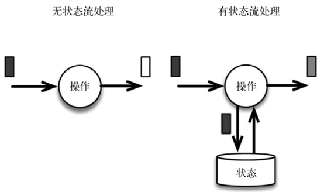

# 15.State

## 概念

流式计算分为无状态和有状态两种情况。无状态的计算观察每个独立事件，并根据最后一个事件输出结果。有状态的计算则会基于多个事件输出结果。Flink内置的很多算子，数据源Source，数据存储Sink都是有状态的。

## 状态类型

Flink有两种基本类型的状态：托管状态（Managed State）和原生状态（Raw State）

两者的区别：Managed State是由Flink管理的，Flink帮忙存储、恢复和优化，Raw State是开发者自己管理的，需要自己序列化。