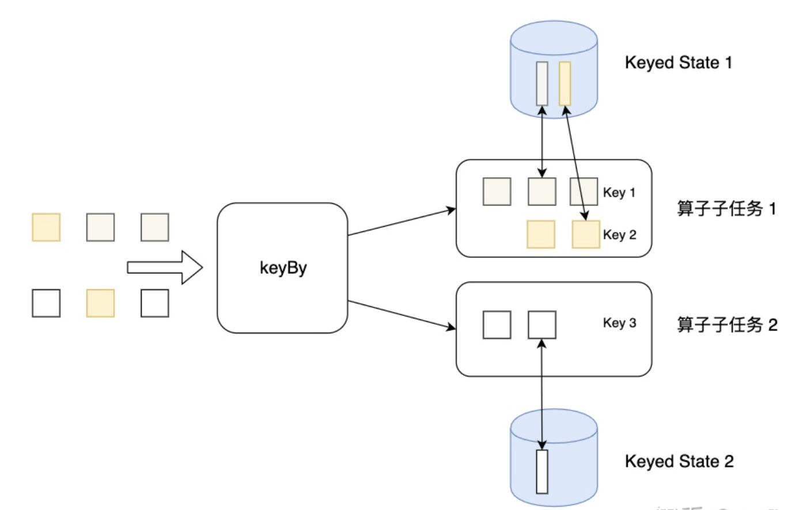
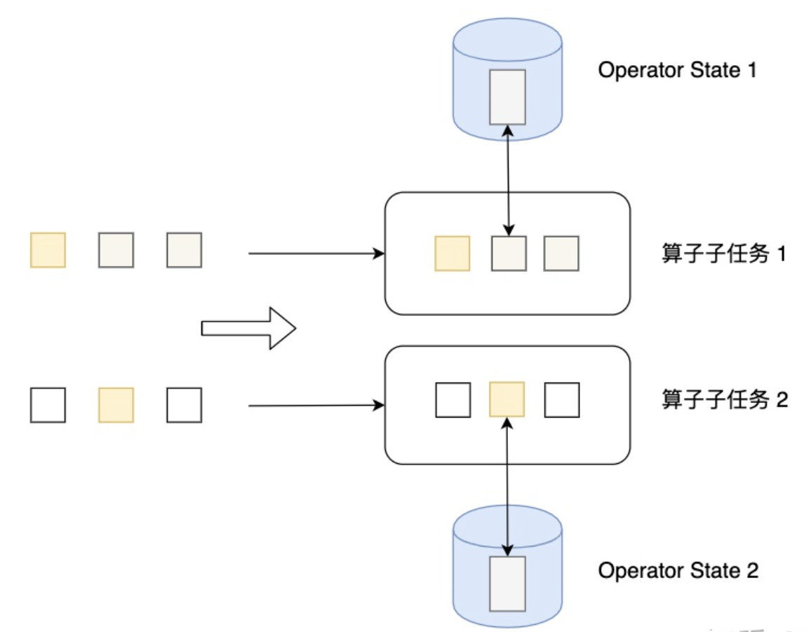

# 15.State

## 概念

计算过程中的数据，叫做状态。

流式计算分为无状态和有状态两种情况。无状态的计算观察每个独立事件，并根据最后一个事件输出结果。有状态的计算则会基于多个事件输出结果。Flink内置的很多算子，数据源Source，数据存储Sink都是有状态的。

## 状态类型

Flink有两种基本类型的状态：托管状态（Managed State）和原生状态（Raw State）

两者的区别：Managed State是由Flink管理的，Flink帮忙存储、恢复和优化，Raw State是开发者自己管理的，需要自己序列化。

## 重启策略

* 固定间隔 (Fixed delay)     RestartStrategies.fixedDelayRestart(次数，重试间隔)
* 失败率 (Failure rate)    RestartStrategies.failureRateRestart (一个时间段内的最大失败次数,衡量失败次数的是时间段, 重试间隔 )
* 无重启 (No restart)  RestartStrategies.noRestart()
* Fallback(备用重启策略)

### 固定间隔 (Fixed delay)

	package wzy
	
	import org.apache.flink.api.common.restartstrategy.RestartStrategies
	import org.apache.flink.api.common.time.Time
	import org.apache.flink.streaming.api.scala._
	
	object RestartStrategyDemo {
	
	  def main(args: Array[String]): Unit = {
	
	
	    // set up the streaming execution environment
	    val env = StreamExecutionEnvironment.getExecutionEnvironment
	
	    //固定延时重启
	    env.setRestartStrategy(RestartStrategies.fixedDelayRestart(5,Time.seconds(3)))
	
	    val text = env.socketTextStream("47.112.142.231",9999)
	
	    text.map(_.toInt).countWindowAll(3).sum(0).print()
	
	    env.execute("restart job")
	
	  }
	
	}

## checkpointing

### 策略设置

	// start a checkpoint every 1000 ms
	env.enableCheckpointing(1000);
	// advanced options:
	// set mode to exactly-once (this is the default)
	env.getCheckpointConfig().setCheckpointingMode(CheckpointingMode.EXACTLY_ONCE);
	// checkpoints have to complete within one minute, or are discarded
	env.getCheckpointConfig().setCheckpointTimeout(60000);
	// make sure 500 ms of progress happen between checkpoints
	env.getCheckpointConfig().setMinPauseBetweenCheckpoints(500);
	// allow only one checkpoint to be in progress at the same time
	env.getCheckpointConfig().setMaxConcurrentCheckpoints(1);
	// enable externalized checkpoints which are retained after job cancellation
	env.getCheckpointConfig().enableExternalizedCheckpoints(ExternalizedCheckpointCleanup.RETAIN_ON_CANCELLATION);
	// This determines if a task will be failed if an error occurs in the execution of the task’s checkpoint procedure.
	env.getCheckpointConfig().setFailOnCheckpointingErrors(true);

### 保存方法

	env.setStateBackend(new FsStateBackend("file:/Users/zheyiwang/Downloads/1/checkpoints"))
	
	

## keyedState

Keyed State是KeyedStream上的状态。假如输入流按照id为Key进行了keyBy分组，形成一个KeyedStream，数据流中所有id为1的数据共享一个状态，可以访问和更新这个状态，以此类推，每个Key对应一个自己的状态。下图展示了Keyed State，因为一个算子子任务可以处理一到多个Key，算子子任务1处理了两种Key，两种Key分别对应自己的状态。

### 业务场景举例

* 计算每个手机号在某个区域的驻留时长，一旦位置切换了，就重新开始计算驻留时长。
* 合并订单

### 代码demo

参考：https://blog.csdn.net/gym02/article/details/105755814

#### ValueKeyedState

	package wzy
	
	import org.apache.flink.api.common.functions.RichMapFunction
	import org.apache.flink.api.common.state.{ValueState, ValueStateDescriptor}
	import org.apache.flink.configuration.Configuration
	import org.apache.flink.streaming.api.scala._
	
	object keyedStateDemo {
	
	  def main(args: Array[String]): Unit = {
	
	    val env = StreamExecutionEnvironment.getExecutionEnvironment
	
	    env.socketTextStream("47.112.142.231", 9999)
	      .flatMap(line=>line.split("\\s+"))
	      .map(word=>(word,1))
	      .keyBy("_1")
	      .map(new ValueStateMapFunction)
	      .print("输出")
	
	    env.execute("FlinkKeyedStateValueState")
	
	  }
	}
	
	
	class ValueStateMapFunction extends RichMapFunction[(String,Int),(String,Int)]{
	  var valueState:ValueState[Int]=_
	
	  override def open(parameters: Configuration): Unit = {
	
	    val vsd = new ValueStateDescriptor[Int]("wordcount", createTypeInformation[Int])
	    val runtimeContext= getRuntimeContext
	    valueState=runtimeContext.getState(vsd)
	
	  }
	
	  override def map(value: (String, Int)): (String, Int) = {
	    //获取历史值
	    var historyCount = valueState.value()
	    //更新历史值
	    valueState.update(historyCount+value._2)
	
	    (value._1,valueState.value())
	  }
	}

### 代码解读

以上demo表现了所有算子任务共享一个state的情况。

数据源侧：

	[root@izwz930tnxht4q6f3yxum6z ~]# nc -l 9999
	haha
	test
	haha
	haha
	test
	haha
	test
	haha

flink程序侧:

	输出:2> (haha,1)
	输出:7> (test,1)
	输出:2> (haha,2)
	输出:2> (haha,3)
	输出:7> (test,2)
	输出:2> (haha,4)
	输出:7> (test,3)
	输出:2> (haha,5)

## Operator State

Operator State可以用在所有算子上，每个算子子任务或者说每个算子实例共享一个状态，流入这个算子子任务的数据可以访问和更新这个状态。下图展示了Operator State，算子子任务1上的所有数据可以共享第一个Operator State，以此类推，每个算子子任务上的数据共享自己的状态。

