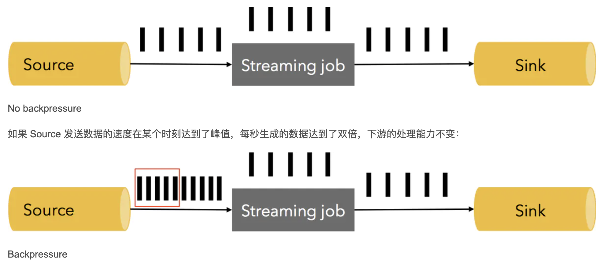

# 17. 背压

参考：https://blog.csdn.net/zc19921215/article/details/109246591

## 概念

在流式处理系统中，如果出现下游消费的速度跟不上上游生产数据的速度，就种现象就叫做背压。出现背压时，理所应当限制上游生产者的速度，使得下游的速度跟得上上游的速度。

背压会导致流处理作业数据延迟的增加，同时还会影响到Checkpoint。由于Flink的Checkpoint机制需要进行Barrier对齐，如果此时某个Task出现了背压，Barrier流动的速度就会变慢，导致Checkpoint整体时间变长，如果背压很严重，还有可能导致Checkpoint超时失败。这部分内容在《Flink中的状态一致性(再细说下Checkpoint)》里面有详细的说明，同时里面还分析了Flink1.11版本中新提供的Unaligned Checkpoints机制来解耦背压和 Checkpoint）。

## 定位背压

可以在Web界面，从Sink到Source这样反向逐个Task排查，找到第一个出现背压的Task，一般上Task出现背压会出现如下现象：

当 Web 页面切换到某个 Task 的 BackPressure 页面时，才会对这个Task触发背压检测。BackPressure界面会周期性的对Task线程栈信息采样，通过线程被阻塞在请求Buffer的频率来判断节点是否处于背压状态(背压就是因为Buffer不够用了，大白话就是内存不够用了，所以Task暂时性的阻塞住了)。默认情况下，这个频率在 0.1 以下显示为 OK，0.1 至 0.5 显示 LOW，而超过 0.5 显示为 HIGH。

通过背压状态可以大致锁定背压可能存在的算子，但具体背压是由于当前Task自身处理速度慢还是由于下游Task处理慢导致的，需要通过metric监控进一步判断。因为背压存在两种可能性：

1. 当前Task发送的速度跟不上它产生数据的速度。一般发生在一条输入多条输出这种情况，导致当前Task发送端申请不到足够的内存，例如flatmap或者collect多次。
1. 当前Task处理数据的速度比较慢，比如每条数据都要进行算法调用之类的，而上游Task处理数据较快，从而导致上游发送端申请不到足够的内存。

## 背压如何解决

定位到背压的Task之后，可以根据Task中具体执行的内容来进行相应的处理。大部分情况背压是由于用户代码的执行效率问题(用户代码对一条数据的处理太慢了，例如每条数据都要调用算法，而调用算法运算耗时又很长) 或者数据倾斜引起的。如果是用户代码的执行效率引起的，可以通过增加并发度或者其他资源的方式来缓解背压。如果是数据倾斜引起的，可以对数据进行一次KeyBy之类的操作来解决。

