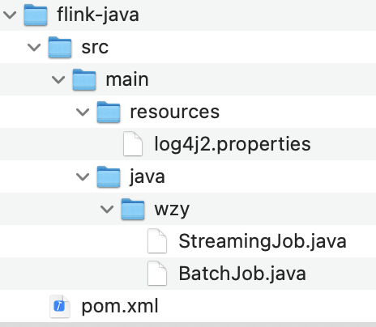

# 2.编程模版

## Java 模版

	mvn archetype:generate  -DarchetypeGroupId=org.apache.flink -DarchetypeArtifactId=flink-quickstart-java -DarchetypeVersion=1.12.0 -DgroupId=wzy -DartifactId=flink-java -Dversion=1.0 -Dpackage=wzy -DinteractiveMode=false

## Scala 模版

	mvn archetype:generate -DarchetypeGroupId=org.apache.flink -DarchetypeArtifactId=flink-quickstart-scala -DarchetypeVersion=1.12.0 -DgroupId=wzy -DartifactId=flink-scala -Dversion=1.0 -Dpackage=wzy  -DinteractiveMode=false

