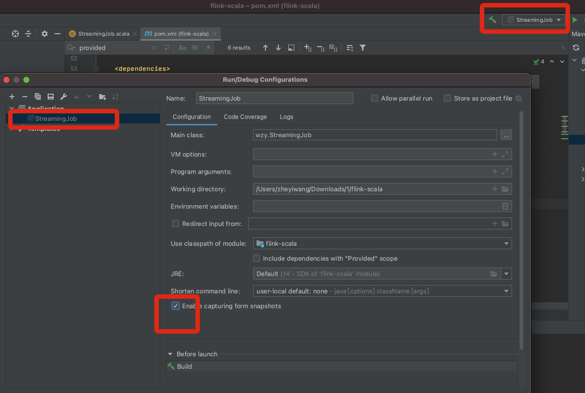

# 3. 入门程序

分为java和scala两种

## 本地环境配置

## Scala版本

### pom

	<project xmlns="http://maven.apache.org/POM/4.0.0"
	         xmlns:xsi="http://www.w3.org/2001/XMLSchema-instance"
	         xsi:schemaLocation="http://maven.apache.org/POM/4.0.0 http://maven.apache.org/xsd/maven-4.0.0.xsd">
		<modelVersion>4.0.0</modelVersion>
	
		<groupId>wzy</groupId>
		<artifactId>flink-scala</artifactId>
		<version>1.0</version>
		<packaging>jar</packaging>
	
		<name>Flink Quickstart Job</name>
	
		<repositories>
			<repository>
				<id>apache.snapshots</id>
				<name>Apache Development Snapshot Repository</name>
				<url>https://repository.apache.org/content/repositories/snapshots/</url>
				<releases>
					<enabled>false</enabled>
				</releases>
				<snapshots>
					<enabled>true</enabled>
				</snapshots>
			</repository>
		</repositories>
	
		<properties>
			<project.build.sourceEncoding>UTF-8</project.build.sourceEncoding>
			<flink.version>1.12.0</flink.version>
			<scala.binary.version>2.12</scala.binary.version>
			<scala.version>2.12.12</scala.version>
			<log4j.version>2.12.1</log4j.version>
		</properties>
	
		<dependencies>
			<!-- Apache Flink dependencies -->
			<!-- These dependencies are provided, because they should not be packaged into the JAR file. -->
			<dependency>
				<groupId>org.apache.flink</groupId>
				<artifactId>flink-scala_${scala.binary.version}</artifactId>
				<version>${flink.version}</version>
			</dependency>
			<dependency>
				<groupId>org.apache.flink</groupId>
				<artifactId>flink-streaming-scala_${scala.binary.version}</artifactId>
				<version>${flink.version}</version>
			</dependency>
			<dependency>
				<groupId>org.apache.flink</groupId>
				<artifactId>flink-clients_${scala.binary.version}</artifactId>
				<version>${flink.version}</version>
			</dependency>
	
			<!-- Scala Library, provided by Flink as well. -->
			<dependency>
				<groupId>org.scala-lang</groupId>
				<artifactId>scala-library</artifactId>
				<version>${scala.version}</version>
			</dependency>
	
			<!-- Add connector dependencies here. They must be in the default scope (compile). -->
	
			<!-- Add logging framework, to produce console output when running in the IDE. -->
			<!-- These dependencies are excluded from the application JAR by default. -->
			<dependency>
				<groupId>org.apache.logging.log4j</groupId>
				<artifactId>log4j-slf4j-impl</artifactId>
				<version>${log4j.version}</version>
				<scope>runtime</scope>
			</dependency>
			<dependency>
				<groupId>org.apache.logging.log4j</groupId>
				<artifactId>log4j-api</artifactId>
				<version>${log4j.version}</version>
				<scope>runtime</scope>
			</dependency>
			<dependency>
				<groupId>org.apache.logging.log4j</groupId>
				<artifactId>log4j-core</artifactId>
				<version>${log4j.version}</version>
				<scope>runtime</scope>
			</dependency>
		</dependencies>
	
		<build>
			<plugins>
				<!-- We use the maven-shade plugin to create a fat jar that contains all necessary dependencies. -->
				<!-- Change the value of <mainClass>...</mainClass> if your program entry point changes. -->
				<plugin>
					<groupId>org.apache.maven.plugins</groupId>
					<artifactId>maven-shade-plugin</artifactId>
					<version>3.1.1</version>
					<executions>
						<!-- Run shade goal on package phase -->
						<execution>
							<phase>package</phase>
							<goals>
								<goal>shade</goal>
							</goals>
							<configuration>
								<artifactSet>
									<excludes>
										<exclude>org.apache.flink:force-shading</exclude>
										<exclude>com.google.code.findbugs:jsr305</exclude>
										<exclude>org.slf4j:*</exclude>
										<exclude>org.apache.logging.log4j:*</exclude>
									</excludes>
								</artifactSet>
								<filters>
									<filter>
										<!-- Do not copy the signatures in the META-INF folder.
										Otherwise, this might cause SecurityExceptions when using the JAR. -->
										<artifact>*:*</artifact>
										<excludes>
											<exclude>META-INF/*.SF</exclude>
											<exclude>META-INF/*.DSA</exclude>
											<exclude>META-INF/*.RSA</exclude>
										</excludes>
									</filter>
								</filters>
								<transformers>
									<transformer implementation="org.apache.maven.plugins.shade.resource.ManifestResourceTransformer">
										<mainClass>wzy.StreamingJob</mainClass>
									</transformer>
								</transformers>
							</configuration>
						</execution>
					</executions>
				</plugin>
	
				<!-- Java Compiler -->
				<plugin>
					<groupId>org.apache.maven.plugins</groupId>
					<artifactId>maven-compiler-plugin</artifactId>
					<version>3.1</version>
					<configuration>
						<source>1.8</source>
						<target>1.8</target>
					</configuration>
				</plugin>
	
				<!-- Scala Compiler -->
				<plugin>
					<groupId>net.alchim31.maven</groupId>
					<artifactId>scala-maven-plugin</artifactId>
					<version>3.2.2</version>
					<executions>
						<execution>
							<goals>
								<goal>compile</goal>
								<goal>testCompile</goal>
							</goals>
						</execution>
					</executions>
					<configuration>
						<args>
							<arg>-nobootcp</arg>
						</args>
					</configuration>
				</plugin>
	
				<!-- Eclipse Scala Integration -->
				<plugin>
					<groupId>org.apache.maven.plugins</groupId>
					<artifactId>maven-eclipse-plugin</artifactId>
					<version>2.8</version>
					<configuration>
						<downloadSources>true</downloadSources>
						<projectnatures>
							<projectnature>org.scala-ide.sdt.core.scalanature</projectnature>
							<projectnature>org.eclipse.jdt.core.javanature</projectnature>
						</projectnatures>
						<buildcommands>
							<buildcommand>org.scala-ide.sdt.core.scalabuilder</buildcommand>
						</buildcommands>
						<classpathContainers>
							<classpathContainer>org.scala-ide.sdt.launching.SCALA_CONTAINER</classpathContainer>
							<classpathContainer>org.eclipse.jdt.launching.JRE_CONTAINER</classpathContainer>
						</classpathContainers>
						<excludes>
							<exclude>org.scala-lang:scala-library</exclude>
							<exclude>org.scala-lang:scala-compiler</exclude>
						</excludes>
						<sourceIncludes>
							<sourceInclude>**/*.scala</sourceInclude>
							<sourceInclude>**/*.java</sourceInclude>
						</sourceIncludes>
					</configuration>
				</plugin>
				<plugin>
					<groupId>org.codehaus.mojo</groupId>
					<artifactId>build-helper-maven-plugin</artifactId>
					<version>1.7</version>
					<executions>
						<!-- Add src/main/scala to eclipse build path -->
						<execution>
							<id>add-source</id>
							<phase>generate-sources</phase>
							<goals>
								<goal>add-source</goal>
							</goals>
							<configuration>
								<sources>
									<source>src/main/scala</source>
								</sources>
							</configuration>
						</execution>
						<!-- Add src/test/scala to eclipse build path -->
						<execution>
							<id>add-test-source</id>
							<phase>generate-test-sources</phase>
							<goals>
								<goal>add-test-source</goal>
							</goals>
							<configuration>
								<sources>
									<source>src/test/scala</source>
								</sources>
							</configuration>
						</execution>
					</executions>
				</plugin>
			</plugins>
		</build>
	</project>

### StreamingJob

	package wzy
	
	import org.apache.flink.streaming.api.scala._
	
	object StreamingJob {
	  def main(args: Array[String]) {
	    // set up the streaming execution environment
	    val env = StreamExecutionEnvironment.getExecutionEnvironment
	    // data stream
	    val lins = env.socketTextStream("192.168.3.110",8888)
	    //flatmap 及 map
	    val wordAndOne = lins.flatMap(_.split(" ") ).map( (_,1) )
	    //分组
	    val result = wordAndOne.keyBy(_._1).sum(1)
	
	    result.print()
	
	    env.execute("Flink Streaming Scala API Skeleton")
	  }
	}

## Java版本

### 版本一

易于理解

#### pom

	<project xmlns="http://maven.apache.org/POM/4.0.0" xmlns:xsi="http://www.w3.org/2001/XMLSchema-instance"
		xsi:schemaLocation="http://maven.apache.org/POM/4.0.0 http://maven.apache.org/xsd/maven-4.0.0.xsd">
		<modelVersion>4.0.0</modelVersion>
	
		<groupId>wzy</groupId>
		<artifactId>flink-java</artifactId>
		<version>1.0</version>
		<packaging>jar</packaging>
	
		<name>Flink Quickstart Job</name>
	
		<properties>
			<project.build.sourceEncoding>UTF-8</project.build.sourceEncoding>
			<flink.version>1.12.0</flink.version>
			<target.java.version>1.8</target.java.version>
			<scala.binary.version>2.12</scala.binary.version>
			<maven.compiler.source>${target.java.version}</maven.compiler.source>
			<maven.compiler.target>${target.java.version}</maven.compiler.target>
			<log4j.version>2.12.1</log4j.version>
		</properties>
	
		<repositories>
			<repository>
				<id>apache.snapshots</id>
				<name>Apache Development Snapshot Repository</name>
				<url>https://repository.apache.org/content/repositories/snapshots/</url>
				<releases>
					<enabled>false</enabled>
				</releases>
				<snapshots>
					<enabled>true</enabled>
				</snapshots>
			</repository>
		</repositories>
	
		<dependencies>
			<!-- Apache Flink dependencies -->
			<!-- These dependencies are provided, because they should not be packaged into the JAR file. -->
			<dependency>
				<groupId>org.apache.flink</groupId>
				<artifactId>flink-java</artifactId>
				<version>${flink.version}</version>
				<scope>provided</scope>
			</dependency>
			<dependency>
				<groupId>org.apache.flink</groupId>
				<artifactId>flink-streaming-java_${scala.binary.version}</artifactId>
				<version>${flink.version}</version>
				<scope>provided</scope>
			</dependency>
			<dependency>
				<groupId>org.apache.flink</groupId>
				<artifactId>flink-clients_${scala.binary.version}</artifactId>
				<version>${flink.version}</version>
				<scope>provided</scope>
			</dependency>
	
			<!-- Add connector dependencies here. They must be in the default scope (compile). -->
	
	
			<!-- Add logging framework, to produce console output when running in the IDE. -->
			<!-- These dependencies are excluded from the application JAR by default. -->
			<dependency>
				<groupId>org.apache.logging.log4j</groupId>
				<artifactId>log4j-slf4j-impl</artifactId>
				<version>${log4j.version}</version>
				<scope>runtime</scope>
			</dependency>
			<dependency>
				<groupId>org.apache.logging.log4j</groupId>
				<artifactId>log4j-api</artifactId>
				<version>${log4j.version}</version>
				<scope>runtime</scope>
			</dependency>
			<dependency>
				<groupId>org.apache.logging.log4j</groupId>
				<artifactId>log4j-core</artifactId>
				<version>${log4j.version}</version>
				<scope>runtime</scope>
			</dependency>
		</dependencies>
	
		<build>
			<plugins>
	
				<!-- Java Compiler -->
				<plugin>
					<groupId>org.apache.maven.plugins</groupId>
					<artifactId>maven-compiler-plugin</artifactId>
					<version>3.1</version>
					<configuration>
						<source>${target.java.version}</source>
						<target>${target.java.version}</target>
					</configuration>
				</plugin>
	
				<!-- We use the maven-shade plugin to create a fat jar that contains all necessary dependencies. -->
				<!-- Change the value of <mainClass>...</mainClass> if your program entry point changes. -->
				<plugin>
					<groupId>org.apache.maven.plugins</groupId>
					<artifactId>maven-shade-plugin</artifactId>
					<version>3.1.1</version>
					<executions>
						<!-- Run shade goal on package phase -->
						<execution>
							<phase>package</phase>
							<goals>
								<goal>shade</goal>
							</goals>
							<configuration>
								<artifactSet>
									<excludes>
										<exclude>org.apache.flink:force-shading</exclude>
										<exclude>com.google.code.findbugs:jsr305</exclude>
										<exclude>org.slf4j:*</exclude>
										<exclude>org.apache.logging.log4j:*</exclude>
									</excludes>
								</artifactSet>
								<filters>
									<filter>
										<!-- Do not copy the signatures in the META-INF folder.
										Otherwise, this might cause SecurityExceptions when using the JAR. -->
										<artifact>*:*</artifact>
										<excludes>
											<exclude>META-INF/*.SF</exclude>
											<exclude>META-INF/*.DSA</exclude>
											<exclude>META-INF/*.RSA</exclude>
										</excludes>
									</filter>
								</filters>
								<transformers>
									<transformer implementation="org.apache.maven.plugins.shade.resource.ManifestResourceTransformer">
										<mainClass>wzy.StreamingJob</mainClass>
									</transformer>
								</transformers>
							</configuration>
						</execution>
					</executions>
				</plugin>
			</plugins>
	
			<pluginManagement>
				<plugins>
	
					<!-- This improves the out-of-the-box experience in Eclipse by resolving some warnings. -->
					<plugin>
						<groupId>org.eclipse.m2e</groupId>
						<artifactId>lifecycle-mapping</artifactId>
						<version>1.0.0</version>
						<configuration>
							<lifecycleMappingMetadata>
								<pluginExecutions>
									<pluginExecution>
										<pluginExecutionFilter>
											<groupId>org.apache.maven.plugins</groupId>
											<artifactId>maven-shade-plugin</artifactId>
											<versionRange>[3.1.1,)</versionRange>
											<goals>
												<goal>shade</goal>
											</goals>
										</pluginExecutionFilter>
										<action>
											<ignore/>
										</action>
									</pluginExecution>
									<pluginExecution>
										<pluginExecutionFilter>
											<groupId>org.apache.maven.plugins</groupId>
											<artifactId>maven-compiler-plugin</artifactId>
											<versionRange>[3.1,)</versionRange>
											<goals>
												<goal>testCompile</goal>
												<goal>compile</goal>
											</goals>
										</pluginExecutionFilter>
										<action>
											<ignore/>
										</action>
									</pluginExecution>
								</pluginExecutions>
							</lifecycleMappingMetadata>
						</configuration>
					</plugin>
				</plugins>
			</pluginManagement>
		</build>
	</project>

#### StreamingJob

	package wzy;
	
	import org.apache.flink.api.common.functions.FlatMapFunction;
	import org.apache.flink.api.common.functions.MapFunction;
	import org.apache.flink.api.java.functions.KeySelector;
	import org.apache.flink.api.java.tuple.Tuple2;
	import org.apache.flink.streaming.api.datastream.DataStream;
	import org.apache.flink.streaming.api.datastream.KeyedStream;
	import org.apache.flink.streaming.api.datastream.SingleOutputStreamOperator;
	import org.apache.flink.streaming.api.environment.StreamExecutionEnvironment;
	import org.apache.flink.util.Collector;
	
	public class StreamingJob {
	
		public static void main(String[] args) throws Exception {
			// set up the streaming execution environment
			final StreamExecutionEnvironment env = StreamExecutionEnvironment.getExecutionEnvironment();
	
			// 创建datastream，调用source，指定socket地址和端口
			DataStream<String> lines = env.socketTextStream("192.168.3.110",8888);
	
			//调用Transformation
			SingleOutputStreamOperator<String> wordDataStream =lines.flatMap(new FlatMapFunction<String, String>() {
	
				@Override
				public void flatMap(String line, Collector<String> collector) throws Exception {
					String[] words = line.split(" ");
					for(String word: words){
						collector.collect(word);
					}
	
				}
			});
	
			//将单词和一组合
			SingleOutputStreamOperator<Tuple2<String, Integer>> wordAndOne = wordDataStream.map(new MapFunction<String, Tuple2<String,Integer> >() {
				@Override
				public Tuple2<String, Integer> map(String word) throws Exception {
					return Tuple2.of(word,1);
				}
			});
	
	
			//分组
			KeyedStream<Tuple2<String, Integer>, String> keyed =wordAndOne.keyBy(new KeySelector<Tuple2<String, Integer>, String>() {
				@Override
				public String getKey(Tuple2<String, Integer> tp) throws Exception {
					return tp.f0;
				}
			});
	
			//聚合
			SingleOutputStreamOperator<Tuple2<String,Integer>> summed=keyed.sum(1);
	
			//调用Sink
			summed.print();
	
			//启动执行
			env.execute("Streaming word count");
		}
	}

#### 输出结果

##### 192.168.3.110

	nc -l 8888
	flink flink test hello test hello

##### flink 程序输出

	11> (link,1)
	10> (flink,1)
	4> (hello,1)
	7> (test,1)
	4> (hello,2)
	7> (test,2)

可以看到输出并不是聚合结果

### 版本二

#### Streamjob

	package wzy;
	
	import org.apache.flink.api.common.functions.FlatMapFunction;
	import org.apache.flink.api.java.functions.KeySelector;
	import org.apache.flink.api.java.tuple.Tuple2;
	import org.apache.flink.streaming.api.datastream.DataStream;
	import org.apache.flink.streaming.api.datastream.KeyedStream;
	import org.apache.flink.streaming.api.datastream.SingleOutputStreamOperator;
	import org.apache.flink.streaming.api.environment.StreamExecutionEnvironment;
	import org.apache.flink.util.Collector;
	
	public class StreamingJob {
	
		public static void main(String[] args) throws Exception {
			// set up the streaming execution environment
			final StreamExecutionEnvironment env = StreamExecutionEnvironment.getExecutionEnvironment();
	
			// 创建datastream，调用source，指定socket地址和端口
			DataStream<String> lines = env.socketTextStream("192.168.3.110",8888);
	
			//调用Transformation
			SingleOutputStreamOperator<Tuple2<String, Integer>> wordAndOne = lines.flatMap(new FlatMapFunction<String, Tuple2<String, Integer>>() {
				@Override
				public void flatMap(String line, Collector<Tuple2<String, Integer>> collector) throws Exception {
					String[] words = line.split(" ");
					for (String word : words) {
						//new Tuple2<String, Integer>(word, 1)
						collector.collect(Tuple2.of(word, 1));
					}
				}
			});
	
			//分组
			KeyedStream<Tuple2<String, Integer>, String> keyed = wordAndOne.keyBy(new KeySelector<Tuple2<String, Integer>, String>() {
				@Override
				public String getKey(Tuple2<String, Integer> tp) throws Exception {
					return tp.f0;
				}
			});
	
			//聚合
			SingleOutputStreamOperator<Tuple2<String, Integer>> summed = keyed.sum(1);
	
	
			//调用Sink
			summed.print();
	
			//启动执行
			env.execute("Streaming word count");
		}
	}

### 版本三

lambda 函数，官方不建议

	package wzy;
	
	import org.apache.flink.api.common.functions.FlatMapFunction;
	import org.apache.flink.api.common.typeinfo.Types;
	import org.apache.flink.api.java.functions.KeySelector;
	import org.apache.flink.api.java.tuple.Tuple2;
	import org.apache.flink.streaming.api.datastream.DataStream;
	import org.apache.flink.streaming.api.datastream.KeyedStream;
	import org.apache.flink.streaming.api.datastream.SingleOutputStreamOperator;
	import org.apache.flink.streaming.api.environment.StreamExecutionEnvironment;
	import org.apache.flink.util.Collector;
	
	import java.util.Arrays;
	
	public class StreamingJob {
	
		public static void main(String[] args) throws Exception {
			// set up the streaming execution environment
			final StreamExecutionEnvironment env = StreamExecutionEnvironment.getExecutionEnvironment();
	
			// 创建datastream，调用source，指定socket地址和端口
			DataStream<String> lines = env.socketTextStream("192.168.3.110",8888);
	
			//使用Java8的lambda表达式
			SingleOutputStreamOperator<String> words = lines.flatMap((String line, Collector<String> out) ->
					Arrays.stream(line.split(" ")).forEach(out::collect)
			).returns(Types.STRING); //使用lambda表达式，要用return返回类型信息
	
			SingleOutputStreamOperator<Tuple2<String, Integer>> wordAndOne = words.map(w -> Tuple2.of(w, 1)).returns(Types.TUPLE(Types.STRING, Types.INT));
	
			SingleOutputStreamOperator<Tuple2<String, Integer>> summed = wordAndOne.keyBy(0).sum(1);
	
			summed.print();
	
			//启动执行
			env.execute("Streaming word count");
		}
	}

