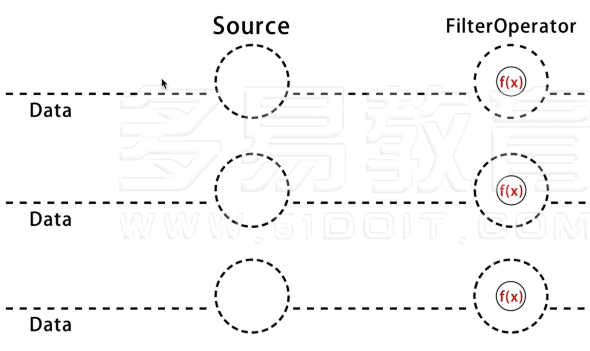
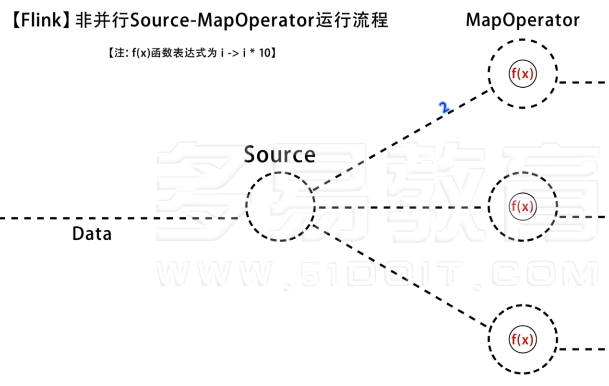

# 5. Source 

##并行度

### 概念

#### 并行Source Filter

比如从kafka读数据

#### 非并行Source Filter

### 单并行source

#### FromCollection 函数 

**可直接从集合中读取数据作为流，由于集合是有界的，所以该数据流有界，读完之后程序会自动退出。** 通常是用来做实验。

#### 代码

	package wzy
	
	import org.apache.flink.streaming.api.scala._
	
	
	object FromCollectionJob {
	
	  def main(args: Array[String]): Unit = {
	
	    val env = StreamExecutionEnvironment.getExecutionEnvironment
	
	    val d = List(1,2,3,4,5)
	    val data = env.fromCollection(d)
	
	    print(data.parallelism)
	
	  }
	
	}

#### 结果

1

并行度为1

### 多并行度source

#### 代码

	package wzy
	
	import org.apache.flink.streaming.api.scala._
	import org.apache.flink.util.NumberSequenceIterator
	
	object FromCollectionJob {
	
	  def main(args: Array[String]): Unit = {
	
	    val env = StreamExecutionEnvironment.getExecutionEnvironment
	
	    val data = env.fromParallelCollection(new NumberSequenceIterator(1l,10l))
	
	    print(data.parallelism)
	
	  }

	}

#### 结果

12

并行度为12

## 数据源

### 从文件中读数据

	package wzy
	
	import org.apache.flink.streaming.api.scala._
	
	object FromCollectionJob {
	
	  def main(args: Array[String]): Unit = {
	
	    val env = StreamExecutionEnvironment.getExecutionEnvironment
	
	    // 从本地读取文件
	    val localLines = env.readTextFile("file:///Users/zheyiwang/Documents/scrapyTest/hot.csv")
	    localLines.print()
	
	    // 从hdfs读取文件，需要写上hdfs的nameService（高可用集群），或者namenode ip及端口号
	    val hdfsLines = env.readTextFile("hdfs://nnHost:nnPort/path/to/my/textfile")
	
	    env.execute("source test job")
	
	  }
	}

### 从kafka中读数据

#### 准备工作

搭好kafka，定位到bin

	cd /opt/kafka_2.13-2.7.0/bin
	./kafka-console-producer.sh --broker-list http://47.112.142.231:9092 --topic sensor

#### 代码

	package wzy
	
	import java.util.Properties
	
	import org.apache.flink.api.common.serialization.SimpleStringSchema
	import org.apache.flink.streaming.api.scala._
	import org.apache.flink.streaming.connectors.kafka.FlinkKafkaConsumer
	
	object FromCollectionJob {
	
	  def main(args: Array[String]): Unit = {
	
	    val env = StreamExecutionEnvironment.getExecutionEnvironment
	
	    // 先创建kafka的相关配置
	    val properties: Properties = new Properties()
	    properties.setProperty("bootstrap.servers", "47.112.142.231:9092")
	    properties.setProperty("group.id", "consumer-group")
	    properties.setProperty("key.deserializer", "org.apache.kafka.common.serialization.StringDeserializer")
	    properties.setProperty("value.deserializer", "org.apache.kafka.common.serialization.StringDeserializer")
	    properties.setProperty("auto.offset.reset", "latest")
	
	    val kafkaDstream:DataStream[String] = env.addSource( new FlinkKafkaConsumer[String]("sensor", new SimpleStringSchema(), properties))
	
	    kafkaDstream.print("source for kafka")
	
	    env.execute("source test job")
	
	  }
	
	}

#### POM

	<project xmlns="http://maven.apache.org/POM/4.0.0"
	         xmlns:xsi="http://www.w3.org/2001/XMLSchema-instance"
	         xsi:schemaLocation="http://maven.apache.org/POM/4.0.0 http://maven.apache.org/xsd/maven-4.0.0.xsd">
		<modelVersion>4.0.0</modelVersion>
	
		<groupId>wzy</groupId>
		<artifactId>flink-scala</artifactId>
		<version>1.0</version>
		<packaging>jar</packaging>
	
		<name>Flink Quickstart Job</name>
	
		<repositories>
			<repository>
				<id>apache.snapshots</id>
				<name>Apache Development Snapshot Repository</name>
				<url>https://repository.apache.org/content/repositories/snapshots/</url>
				<releases>
					<enabled>false</enabled>
				</releases>
				<snapshots>
					<enabled>true</enabled>
				</snapshots>
			</repository>
		</repositories>
	
		<properties>
			<project.build.sourceEncoding>UTF-8</project.build.sourceEncoding>
			<flink.version>1.12.0</flink.version>
			<scala.binary.version>2.12</scala.binary.version>
			<scala.version>2.12.12</scala.version>
			<log4j.version>2.12.1</log4j.version>
		</properties>
	
		<dependencies>
			<!-- Apache Flink dependencies -->
			<!-- These dependencies are provided, because they should not be packaged into the JAR file. -->
			<dependency>
				<groupId>org.apache.flink</groupId>
				<artifactId>flink-scala_${scala.binary.version}</artifactId>
				<version>${flink.version}</version>
			</dependency>
			<dependency>
				<groupId>org.apache.flink</groupId>
				<artifactId>flink-streaming-scala_${scala.binary.version}</artifactId>
				<version>${flink.version}</version>
			</dependency>
			<dependency>
				<groupId>org.apache.flink</groupId>
				<artifactId>flink-clients_${scala.binary.version}</artifactId>
				<version>${flink.version}</version>
			</dependency>
	
			<dependency>
				<groupId>org.apache.flink</groupId>
				<artifactId>flink-connector-kafka_2.12</artifactId>
				<version>1.13.1</version>
			</dependency>
	
			<!-- Scala Library, provided by Flink as well. -->
			<dependency>
				<groupId>org.scala-lang</groupId>
				<artifactId>scala-library</artifactId>
				<version>${scala.version}</version>
			</dependency>
	
			<!-- Add connector dependencies here. They must be in the default scope (compile). -->
	
			<!-- Add logging framework, to produce console output when running in the IDE. -->
			<!-- These dependencies are excluded from the application JAR by default. -->
			<dependency>
				<groupId>org.apache.logging.log4j</groupId>
				<artifactId>log4j-slf4j-impl</artifactId>
				<version>${log4j.version}</version>
				<scope>runtime</scope>
			</dependency>
			<dependency>
				<groupId>org.apache.logging.log4j</groupId>
				<artifactId>log4j-api</artifactId>
				<version>${log4j.version}</version>
				<scope>runtime</scope>
			</dependency>
			<dependency>
				<groupId>org.apache.logging.log4j</groupId>
				<artifactId>log4j-core</artifactId>
				<version>${log4j.version}</version>
				<scope>runtime</scope>
			</dependency>
		</dependencies>
	
		<build>
			<plugins>
				<!-- We use the maven-shade plugin to create a fat jar that contains all necessary dependencies. -->
				<!-- Change the value of <mainClass>...</mainClass> if your program entry point changes. -->
				<plugin>
					<groupId>org.apache.maven.plugins</groupId>
					<artifactId>maven-shade-plugin</artifactId>
					<version>3.1.1</version>
					<executions>
						<!-- Run shade goal on package phase -->
						<execution>
							<phase>package</phase>
							<goals>
								<goal>shade</goal>
							</goals>
							<configuration>
								<artifactSet>
									<excludes>
										<exclude>org.apache.flink:force-shading</exclude>
										<exclude>com.google.code.findbugs:jsr305</exclude>
										<exclude>org.slf4j:*</exclude>
										<exclude>org.apache.logging.log4j:*</exclude>
									</excludes>
								</artifactSet>
								<filters>
									<filter>
										<!-- Do not copy the signatures in the META-INF folder.
										Otherwise, this might cause SecurityExceptions when using the JAR. -->
										<artifact>*:*</artifact>
										<excludes>
											<exclude>META-INF/*.SF</exclude>
											<exclude>META-INF/*.DSA</exclude>
											<exclude>META-INF/*.RSA</exclude>
										</excludes>
									</filter>
								</filters>
								<transformers>
									<transformer implementation="org.apache.maven.plugins.shade.resource.ManifestResourceTransformer">
										<mainClass>wzy.StreamingJob</mainClass>
									</transformer>
								</transformers>
							</configuration>
						</execution>
					</executions>
				</plugin>
	
				<!-- Java Compiler -->
				<plugin>
					<groupId>org.apache.maven.plugins</groupId>
					<artifactId>maven-compiler-plugin</artifactId>
					<version>3.1</version>
					<configuration>
						<source>1.8</source>
						<target>1.8</target>
					</configuration>
				</plugin>
	
				<!-- Scala Compiler -->
				<plugin>
					<groupId>net.alchim31.maven</groupId>
					<artifactId>scala-maven-plugin</artifactId>
					<version>3.2.2</version>
					<executions>
						<execution>
							<goals>
								<goal>compile</goal>
								<goal>testCompile</goal>
							</goals>
						</execution>
					</executions>
					<configuration>
						<args>
							<arg>-nobootcp</arg>
						</args>
					</configuration>
				</plugin>
	
				<!-- Eclipse Scala Integration -->
				<plugin>
					<groupId>org.apache.maven.plugins</groupId>
					<artifactId>maven-eclipse-plugin</artifactId>
					<version>2.8</version>
					<configuration>
						<downloadSources>true</downloadSources>
						<projectnatures>
							<projectnature>org.scala-ide.sdt.core.scalanature</projectnature>
							<projectnature>org.eclipse.jdt.core.javanature</projectnature>
						</projectnatures>
						<buildcommands>
							<buildcommand>org.scala-ide.sdt.core.scalabuilder</buildcommand>
						</buildcommands>
						<classpathContainers>
							<classpathContainer>org.scala-ide.sdt.launching.SCALA_CONTAINER</classpathContainer>
							<classpathContainer>org.eclipse.jdt.launching.JRE_CONTAINER</classpathContainer>
						</classpathContainers>
						<excludes>
							<exclude>org.scala-lang:scala-library</exclude>
							<exclude>org.scala-lang:scala-compiler</exclude>
						</excludes>
						<sourceIncludes>
							<sourceInclude>**/*.scala</sourceInclude>
							<sourceInclude>**/*.java</sourceInclude>
						</sourceIncludes>
					</configuration>
				</plugin>
				<plugin>
					<groupId>org.codehaus.mojo</groupId>
					<artifactId>build-helper-maven-plugin</artifactId>
					<version>1.7</version>
					<executions>
						<!-- Add src/main/scala to eclipse build path -->
						<execution>
							<id>add-source</id>
							<phase>generate-sources</phase>
							<goals>
								<goal>add-source</goal>
							</goals>
							<configuration>
								<sources>
									<source>src/main/scala</source>
								</sources>
							</configuration>
						</execution>
						<!-- Add src/test/scala to eclipse build path -->
						<execution>
							<id>add-test-source</id>
							<phase>generate-test-sources</phase>
							<goals>
								<goal>add-test-source</goal>
							</goals>
							<configuration>
								<sources>
									<source>src/test/scala</source>
								</sources>
							</configuration>
						</execution>
					</executions>
				</plugin>
			</plugins>
		</build>
	</project>

#### 测试

##### kafka侧

	bash-5.1# ./kafka-console-producer.sh --broker-list http://47.112.142.231:9092 --topic sensor
	>haha
	>test
	>中文

##### flink侧

	source for kafka:7> haha
	source for kafka:7> test
	source for kafka:7> 中文

### 自定义source

#### MyNoParallelFunction

自定义function extends SourceFunction，实现两个方法 run 和 cancel

	package wzy
	
	import org.apache.flink.streaming.api.functions.source.SourceFunction
	
	class MyNoParallelFunction extends SourceFunction[Long]{
	
	  var count = 0l
	  var isRunging = true
	
	  override def run(sourceContext: SourceFunction.SourceContext[Long]): Unit = {
	
	    while (isRunging){
	      sourceContext.collect(count)
	      count +=1
	      Thread.sleep(1000)
	    }
	
	  }
	
	  override def cancel(): Unit = {
	    isRunging=false
	  }
	}

#### CustomSource

	package wzy
	
	import org.apache.flink.api.scala.createTypeInformation
	import org.apache.flink.streaming.api.scala.StreamExecutionEnvironment
	
	object CustomSource {
	
	  def main(args: Array[String]): Unit = {
	
	    val env = StreamExecutionEnvironment.getExecutionEnvironment
	    val stream = env.addSource(new MyNoParallelFunction)
	    val mapData = stream.map(line =>{
	      println("received data:" + line)
	      line
	    })
	
	    mapData.setParallelism(1)
	
	    env.execute("custom function")
	  }
	
	
	}

#### 结果

	received data:0
	received data:1
	received data:2
	received data:3
	received data:4