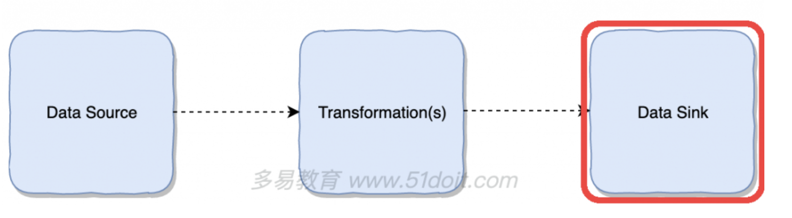

#6. sink

## 概念

## 输出到文件/HDFS

### steamsink

	package wzy
	
	import org.apache.flink.api.common.serialization.SimpleStringEncoder
	import org.apache.flink.core.fs.Path
	import org.apache.flink.streaming.api.functions.sink.filesystem.StreamingFileSink
	import org.apache.flink.streaming.api.scala._
	
	object steamsink {
	
	  def main(args: Array[String]): Unit = {
	
	    val env = StreamExecutionEnvironment.getExecutionEnvironment
	    env.setParallelism(1)
	
	    val dataStream = env.fromCollection(List(1,2,3,4))
	
	
	    val sink=  StreamingFileSink.forRowFormat(
	        new Path("/Users/zheyiwang/Documents/1.txt"),
	        //new Path("hdfs://47.112.142.231:8020/flink/prod"),
	        new SimpleStringEncoder[Int]()
	      ).build()
	
	    dataStream.addSink(sink)
	
	    env.execute("Stream Sink")
	  }
	}
	
#### 验证

	cd /Users/zheyiwang/Documents/1.txt/2021-08-01--21
	
	(base) zheyiwang@ZHEYIdeMacBook-Pro 2021-08-01--21 % cat .part-0-0.inprogress.b02ea9e3-df61-4259-b40b-540128f63866 
	1
	2
	3
	4

注意：

写入hdfs需要注意权限，可以在hadoop resources目录下修改权限

	<property>
		<name>dfs.permissions</name>
	      <value>false</value>
	 </property>

#### pom

#### pom

		<dependency>
			<groupId>org.apache.flink</groupId>
			<artifactId>flink-connector-filesystem_2.11</artifactId>
			<version>1.9.0</version>
		</dependency>
		<dependency>
			<groupId>org.apache.hadoop</groupId>
			<artifactId>hadoop-client</artifactId>
			<version>3.3.0</version>
		</dependency>

### 输出到kafka

#### pom

		<dependency>
			<groupId>org.apache.flink</groupId>
			<artifactId>flink-connector-kafka_2.11</artifactId>
			<version>1.12.0</version>
		</dependency>

#### steamsink

	package wzy
	
	import org.apache.flink.api.common.serialization.SimpleStringEncoder
	import org.apache.flink.api.common.serialization.SimpleStringSchema
	import org.apache.flink.streaming.api.functions.sink.filesystem.StreamingFileSink
	import org.apache.flink.streaming.api.scala._
	import org.apache.flink.streaming.connectors.kafka.FlinkKafkaProducer
	
	object steamsink {
	
	  def main(args: Array[String]): Unit = {
	
	    val env = StreamExecutionEnvironment.getExecutionEnvironment
	    env.setParallelism(1)
	
	    val dataStream = env.fromCollection(List("hello", "flink", "are"))
	
	
	    val sink=  new FlinkKafkaProducer[String](
	      "47.112.142.231:9092",
	      "test-topic",
	      new SimpleStringSchema())
	
	    dataStream.addSink(sink)
	
	    env.execute("Stream Sink")
	  }
	
	}

### 输出到es

	package wzy
	
	import java.util
	import org.apache.flink.api.common.functions.RuntimeContext
	import org.apache.flink.streaming.api.scala._
	import org.apache.flink.streaming.connectors.elasticsearch.{ElasticsearchSinkFunction, RequestIndexer}
	import org.apache.flink.streaming.connectors.elasticsearch6.ElasticsearchSink
	import org.apache.http.HttpHost
	import org.elasticsearch.client.Requests
	
	
	case class student(name: String, age: Int)
	
	object steamsink {
	
	  def main(args: Array[String]): Unit = {
	
	    val env = StreamExecutionEnvironment.getExecutionEnvironment
	    env.setParallelism(1)
	
	    val dataStream = env.fromCollection(List(
	      student("zhang", 27),
	      student("li", 24)
	    ))
	
	    val httpHosts = new util.ArrayList[HttpHost]
	    httpHosts.add(new HttpHost("localhost", 9200, "http"))
	    val esSinkBuilder = new ElasticsearchSink.Builder[student](
	      httpHosts,
	      new ElasticsearchSinkFunction[student]   {
	        override def process(t: student, runtimeContext: RuntimeContext, requestIndexer: RequestIndexer): Unit = {
	          val json = new util.HashMap[String, String]()
	          json.put("name", t.name)
	          json.put("age", t.age.toString)
	          val request = Requests.indexRequest().index("test").`type`("info").source(json)
	          requestIndexer.add(request)
	        }
	      })
	
	
	    dataStream.addSink(esSinkBuilder.build())
	
	    env.execute("Stream Sink")
	  }
	}

#### pom

		<dependency>
			<groupId>org.apache.flink</groupId>
			<artifactId>flink-connector-elasticsearch6_2.11</artifactId>
			<version>1.12.0</version>
		</dependency>