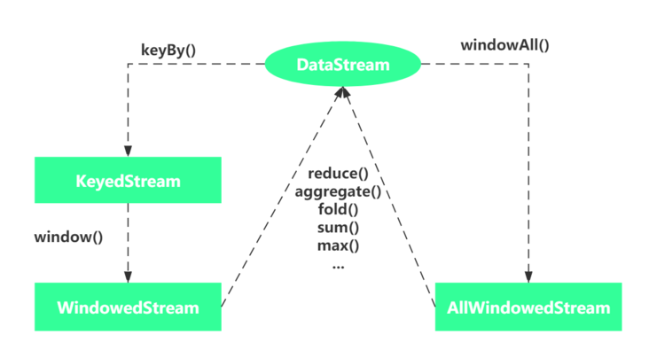

#7. 常见Transformation算子

## 相互关系

##  算子图示

### keyby

keyBy算子根据事件的某种属性或数据的某个字段做为Key进行分组，相同Key的元素被分到了一起，进行后续算子统一处理。

### 基本算子demo

	package wzy
		
	import org.apache.flink.streaming.api.scala._
	
	object steamsink {
	
	  def main(args: Array[String]): Unit = {
	
	    val env = StreamExecutionEnvironment.getExecutionEnvironment
	    env.setParallelism(10)
	
	   // map demo
	    val dataStream = env.fromCollection(List(1,2,3))
	    val map_value = dataStream.map( x => x*2)
	    map_value.print() //2,4,6
	
	    // flatmap demo
	    val dataStream2 = env.fromElements(
	      "You jump I jump",
	      "Life was like a box of chocolates"
	    );
	
	    val flatmap_value = dataStream2.flatMap( str => str.split(" "))
	    flatmap_value.print()  //You jump I jump Life was like a box of chocolates
	
	    // filter demo
	    val dataStream3 = env.fromCollection( List(1,2,3,0,4) )
	    val fliter_value =dataStream3.filter( _ !=0)
	    fliter_value.print() //1,2,3,4
	
	    // keyBy demo （相同Key的元素被分到了一起，进行后续算子统一处理）
	    val dataStream4 = env.fromElements((1, 1.0), (2, 3.2), (1, 5.5), (3, 10.0), (3, 12.5))
	
	    val keyby_value = dataStream4.keyBy(0)
	    keyby_value.print()
	    //7> (1,1.0)
	    //7> (1,5.5)
	    //9> (3,10.0)
	    //9> (3,12.5)
	    //10> (2,3.2)
	
	    // reduce demo (KeyedStream → DataStream #)
	    val dataStream5 = env.fromElements((1, 1.0), (2, 3.2), (1, 5.5), (3, 10.0), (3, 12.5))
	    val reduce_value = dataStream5.keyBy(0).reduce((x,y) => (x._1, x._2 + y._2))
	    reduce_value.print()
	    //7> (1,1.0)
	    //10> (2,3.2)
	    //7> (1,6.5)
	    //9> (3,10.0)
	    //9> (3,22.5)
	
	    //max demo (一直往上找max)
	    val dataStream6 = env.fromElements(("重庆","渝北", 1.0), ("重庆","渝北", 2.0), ("北京","海淀", 3.0), ("北京","海淀", 4.0), ("重庆","渝中", 15.0))
	    val max_value =  dataStream6.keyBy(1).maxBy(1)
	    max_value.print()
	
	    //10> (重庆,渝北,1.0)
	    //3> (重庆,渝中,15.0)
	    //2> (北京,海淀,3.0)
	    //10> (重庆,渝北,1.0)
	    //2> (北京,海淀,3.0)
	
	   //min demo (一直往下找min)
	    val dataStream7 = env.fromElements(("重庆","渝北", 1.0), ("重庆","渝北", 2.0), ("北京","海淀", 3.0), ("北京","海淀", 4.0), ("重庆","渝中", 15.0))
	    val min_value =  dataStream7.keyBy(1).min(1)
	    min_value.print()
	
	    //2> (北京,海淀,3.0)
	    //2> (北京,海淀,3.0)
	    //10> (重庆,渝北,1.0)
	    //3> (重庆,渝中,15.0)
	    //10> (重庆,渝北,1.0)
	
	    //maxby demo (跟max方法比，直接出结果)
	    val dataStream8 = env.fromElements(("重庆","渝北", 1.0), ("重庆","渝北", 2.0), ("北京","海淀", 3.0), ("北京","海淀", 4.0), ("重庆","渝中", 15.0))
	    val maxby_value = dataStream8.keyBy(1).maxBy(1)
	    maxby_value.print()
	
	    //2> (北京,海淀,3.0)
	    //10> (重庆,渝北,1.0)
	    //3> (重庆,渝中,15.0)
	    //2> (北京,海淀,3.0)
	    //10> (重庆,渝北,1.0)
	
	    env.execute("transformation")
	
	  }
	}