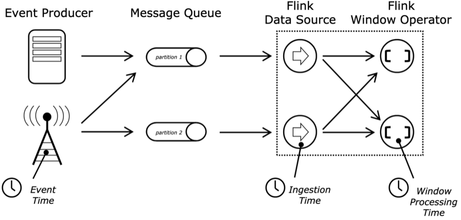
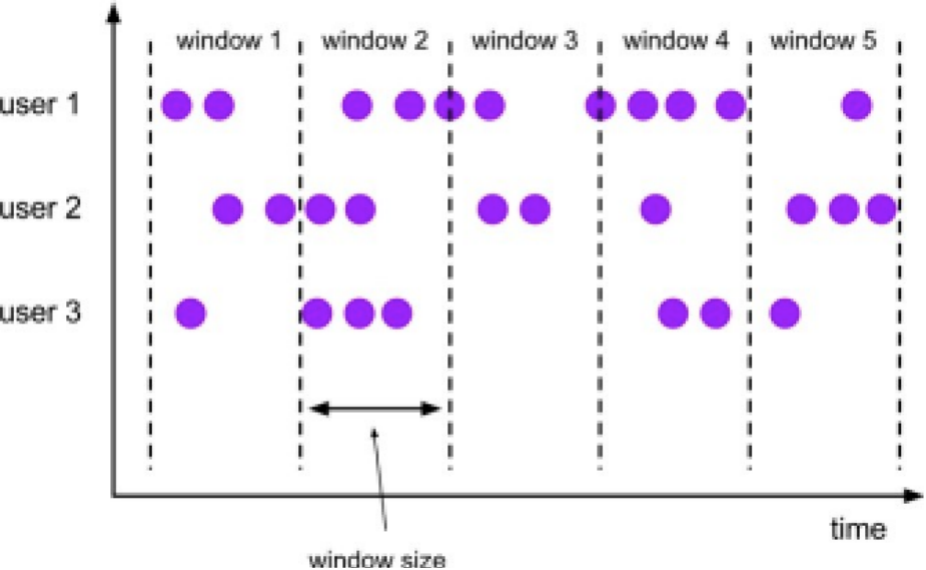
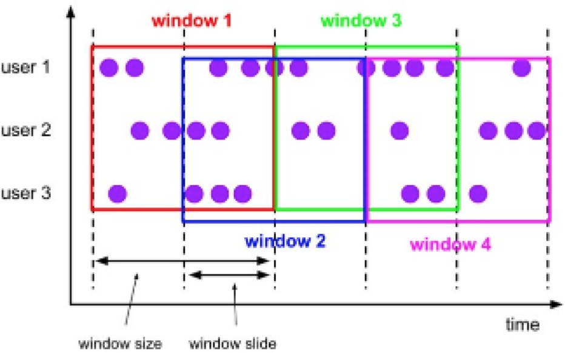
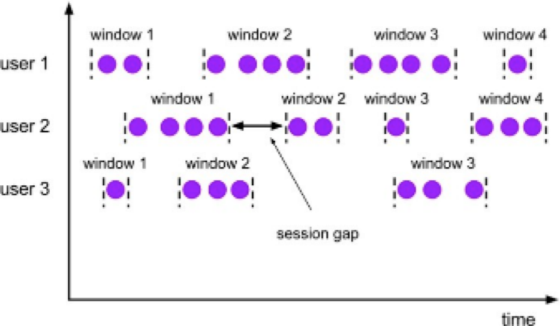

# 9.窗口和时间

## 窗口的定义

流式计算是一种被设计用于处理无限数据集的数据计算引擎，所谓无限数据集是指一种源源不断的数据流抽象成的集合。而Window就是一种将无限数据集切分成多个有限数据集并对每一个有限数据集分别进行处理的手段。Window本质上是将数据流按照一定的规则，逻辑地切分成很多个有限大小的“bucket”桶，这样就可以对每一个在“桶里面”的有限的数据依次地进行计算了。

流式计算引擎的特点是每输入一条数据就立即处理，延迟低。然而在一些场景下偏偏希望将数据先攒成一个个小批次，然后对每一个小批次再进行运算。例如用FlinkDataStream API将数据进行实时的聚合后，再将结果实时的写入到数据库，每输入一条数据都会输出一个聚合后的结果，如果数据量非常大，那么对外部的数据库的写入压力就比较大。而划分成Window，即将每一个Window中的有限的数据先聚合成一条或几条，再写入到数据库中，虽然延迟变高了，但是对数据库的写入压力变小了。Window操作可以认为是微批次准实时的计算，这样Flink DataStream API 既可以实现高效的实时运算，又可以实现微批次的准实时运算，让Flink在实时计算领域更加强大和灵活。

## 时间类型

### Event Time 事件时间
数据产生的时候对应的时间。

### Ingestion Time 进入时间
数据进入Flink Source的时间。不常用。

### Processing Time 处理时间
数据被window算子处理的时间。 Flink的默认时间。

### 设定时间demo

	StreamExecutionEnvironment env = StreamExecutionEnvironment.getExecutionEnvironment();//设置EventTime作为时间标准
	env.setStreamTimeCharacteristic(TimeCharacteristic.EventTime);
	//设置IngestionTime作为时间标准
	//env.setStreamTimeCharacteristic(TimeCharacteristic.IngestionTime);
	//设置ProcessingTime作为时间标准
	//env.setStreamTimeCharacteristic(TimeCharacteristic.ProcessingTime);

## 窗口分类

### GlobalWindow

按照指定的数据条数生成一个Window，与时间无关，比如countwindow。

### TimeWindow

按照时间生成Window，可以根据窗口实现原理的不同分成三类：滚动窗口（Tumbling Window）、滑动窗口（Sliding Window）和会话窗口（Session Window）。

#### 滚动窗口（Tumbling Windows）

时间对齐，窗口长度固定，没有重叠。

#### 滑动窗口（Sliding Windows）

时间对齐，窗口长度规定，有重叠。

#### 会话窗口（Session Windows）

由一系列事件组合一个指定时间长度的timeout间隙组成，一段时间没有收到新的数据就会生成新的窗口。

### Non-keyed windows  /  Keyed windows

在划分Window之前，首先要确定该DataStream是否调用了key算子将数据按照key进行分组了。如果没有调用keyBy算子，可以调用windowAll方法的返回一个AllWindowedStream，这种window叫做Non-Keyed Windows（未分组的Widnows）；如果事先已经调用了keyBy算子，即对KeyedStream可以调用window方法返回一个WindowedStream，这种window叫做Keyed Windows（分组的Widnows）。由于调用windowAll/window算子后会生成会生成新WindowedStream/WindowedStream，所以窗口算也是属于Transformation。

