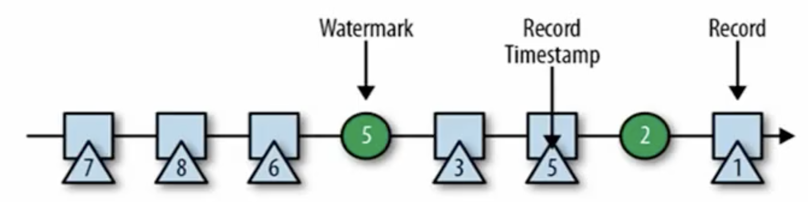

# 程序与数据流（DataFlow）

## DataFlow组成

Flink由三部分组成： Source、Transformation、Sink。

### Source
负责读取数据源

### Transformation
利用各种算子进行处理加工

### Sink
负责输出

## 执行图 （Execution Graph）

执行图分为四层： Stream Graph -> JobGraph -> ExecutionGraph -> 物理执行图

### Stream Graph
根据用户通过Stream API编写的代码生成的图，表示程序的拓扑结构

### Job Grapth
Stream Graph警告优化后生成了Job Graph，提交给JobManager的数据结构。主要优化为将多个符合条件的节点chain在一起作为一个节点

### Execution Graph
JobManager根据JobGraph生成Execution Graph。Exectution Graph是JobGraph的并行化版本，是调度层最核心的数据结构。

### 物理执行图
Job Manager根据Execution Graph对Job进行调度后，在各个Task Manager上部署Task后形成的图，并不是一个数据结构。

##  数据传输形式

### One-to-One
 stream维护者分区以及元素的顺序（比如source和map之间）。这意味着map算子的字任务看到的元素个数以及顺序跟source算子的子任务生产的元素个数、顺序相同。map，fliter，flatMap等算子是One-to-One。
 
### Redistributing
 
 stream的分区会发生改变，每一个算子的子任务依据所选择的transformation发送数据到不同的目标任务。例如，keyBy给予hashCode重分区，二brodcat和rebalance会随机重新分区。这些算子会引起redistribute过程，二redistribute过程类似于Spark的shuffle过程。
 
 
## 任务链

相同并行度的one-to-one操作，flink可以将相连的算子链接在一起形成一个task。并行度相同、而且是one-to-one操作，两个条件缺一不可。

