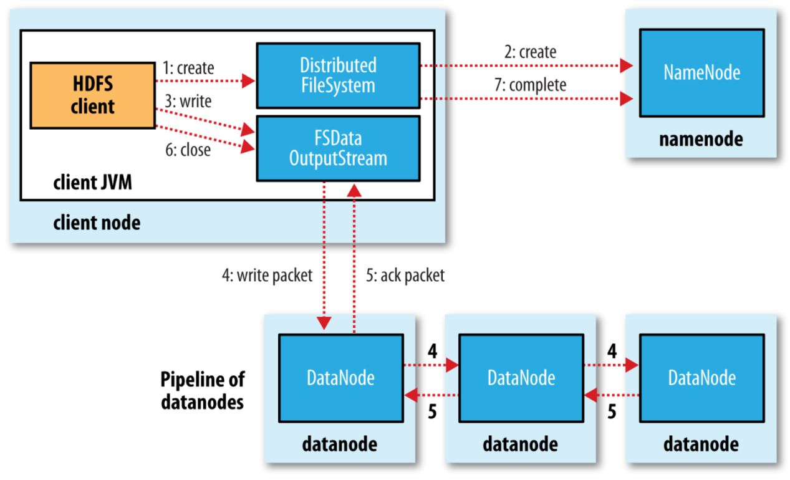

# HDFS 写文件流程

## 存储流程
a) Clinet首先将要存储的数据切分成若干块，然后向NameNode发送存储请求，

b) NameNode检查权限、存储文件是否已存在等信息，确认无误后返回允许存储的响应，这个响应还包括第一个Block要放在哪个DataNode哪个的地址的信息。

c) Clinet得到NameNode的响应，打开文件输出流，向第一个DataNode请求打开管道，DN1接受的信息后继续通知DN2，DN2接受到DN1的信息后通知DN3,DN3接受到信息后确认没有更多副本了，向DN2返回响应信息，DN2获取到DN3的响应后向DN1返回响应，DN1得到响应后向Clinet返回响应

d) Clinet获得响应后，确认pipeline（管线，管线上每个节点都能收到相同的数据流）已开通，开始写入数据。

首先向向缓冲区chunkbuff中写入，当达到一个chunk大小时(512byte)，将chunk写出到packetbuff，每个chunk有一个MD5码（4byte），这个码是由整个chunk的字节算出，因此一个chunk是516byte，当packetbuff达到一个packet大小时(64KB)，将packet写出到DataQueue，DN1 从DataQueue上获取一个packet，packet会在pipeline里传入到DN2、DN3，DN会检验packet中的各个chunk的MD5是否匹配，然后返回响应ack packet放到ack Queue中返回给clinet，如此保证数据的完整正确传输。

e) clinet确认block1完成传输后，向NameNode发送请求，确认block1已存入，NN更新自己的Fsimage，并返回block2的存储地址

f)          重复，直到所有block都存入。

## 读取流程

1）客户端通过Distributed FileSystem向NameNode请求下载文件，NameNode通过查询元数据，找到文件块所在的DataNode地址。

2）挑选一台DataNode（就近原则，然后随机）服务器，请求读取数据。

3）DataNode开始传输数据给客户端（从磁盘里面读取数据输入流，以packet为单位来做校验）。

4）客户端以packet为单位接收，先在本地缓存，然后写入目标文件。