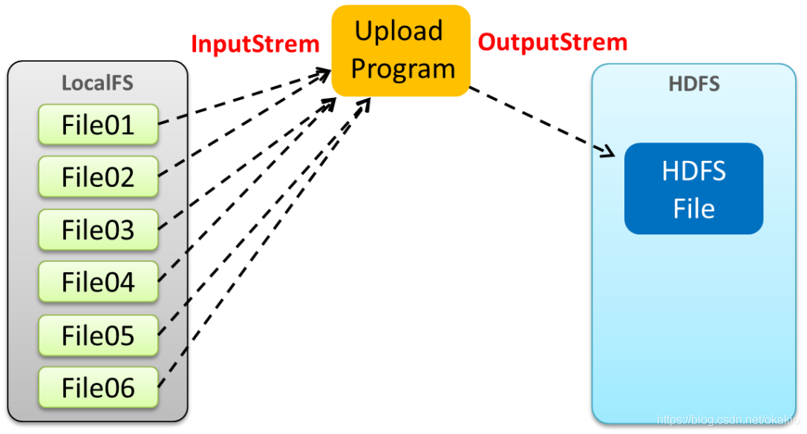

# HDFS 合并小文件

## 概念

在实际项目中，输入数据往往是由许多小文件组成，这里的小文件是指小于HDFS系统Block大小的文件（默认128M）， 然而每一个存储在HDFS中的文件、目录和块都映射为一个对象，存储在NameNode服务器内存中，通常占用150个字节。

由于Hadoop擅长存储大文件，因为大文件的元数据信息比较少，如果Hadoop集群当中有大量的小文件，那么每个小文件都需要维护一份元数据信息，会大大的增加集群管理元数据的内存压力，所以在实际工作当中，如果有必要一定要将小文件合并成大文件进行一起处理。

在我们的hdfs 的 shell命令模式下，可以通过命令行将很多的hdfs文件合并成一个大文件下载到本地，命令是:

	cd /export/servers
	hdfs dfs -getmerge /config/*.xml ./hello.xml

既然可以在下载的时候将这些小文件合并成一个大文件一起下载，那么肯定就可以在上传的时候将小文件合并到一个大文件里面去

## 方法

## 代码

	    /**
	     * 将多个本地系统文件 , 上传到hdfs , 并且合并成一个大的文件
	     * @throws URISyntaxException
	     * @throws IOException
	     * @throws InterruptedException
	     */
	    @Test
	    public void mergeFile() throws URISyntaxException, IOException, InterruptedException {
	        //获取分布式文件系统
	        FileSystem fs=FileSystem.get(new URI("hdfs://192.168.100.100:8020"),new Configuration(),"root");
	        //这里的/t.txt是hdfs里的文件路径
	        FSDataOutputStream outputStream = fs.create(new Path("/t.txt"));
	        //获取本地文件系统
	        LocalFileSystem local = FileSystem.getLocal(new Configuration());
	        //通过本地文件系统获取文件列表 , 为一个集合
	        FileStatus[] fileStatuses = local.listStatus(new Path("file:///E:\\test"));
	        
	        for (FileStatus fileStatus : fileStatuses) {
	            FSDataInputStream inputStream = local.open(fileStatus.getPath());
	            IOUtils.copy(inputStream,outputStream);
	            IOUtils.closeQuietly(inputStream);
	        }
	        
	        IOUtils.closeQuietly(outputStream);
	        local.close();
	        fs.close();
	    }
