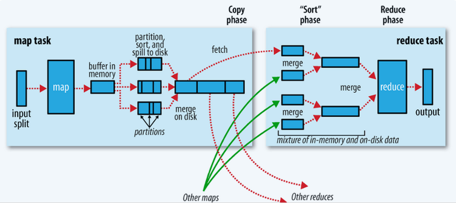

# MR的Shuffle过程

## step1 input

InputFormat读取数据，将数据转换成<key ,value>对,设置FileInputFormat，默认是文本格式（TextInputFormat）

## step2 map

map<KEYIN, VALUEIN, KEYOUT, VALUEOUT> 默认情况下KEYIN:LongWritable,偏移量。VALUEIN:Text，KEYOUT与VALUEOUT要根据我们的具体的业务来定。

## step3 shuffle

map输出到reduce之前这个阶段是mr的shuffle阶段。

map输出的<key , value>对首先放在内存中，当达到一定的内存大小，就会溢写（spill）到本地磁盘中，可能有很多文件。spill过程有两个操作，分区（partition）和排序（sort）。当map task结束后可能有很多的小文件，spill。那么我们需要对这些文件合并（merge），排序成一个大文件。此时map阶段才结束。

Reduce task 会到Map Task运行的机器上，拷贝要处理的数据。然后合并（merge），排序，分组（group）将相同key 的value 放在一起，完成了reduce 数据输入的过程。

## step4 reduce

educe<KEYIN, VALUEIN, KEYOUT, VALUEOUT>，map输出的<key , value>数据类型与reduce输入<key , value>的数据类型一致。

接下来就是执行Reducer 定义的方法了

## step5 output

TextOutputFormat

最后将结果输出到文件系统上，每个< key , value >对， key与value中间分隔符为\t，默认调用 key 和 value 的 toString() 方法。

我们可以在map端输出文件压缩，可设置，combiner（map端的reduce）。