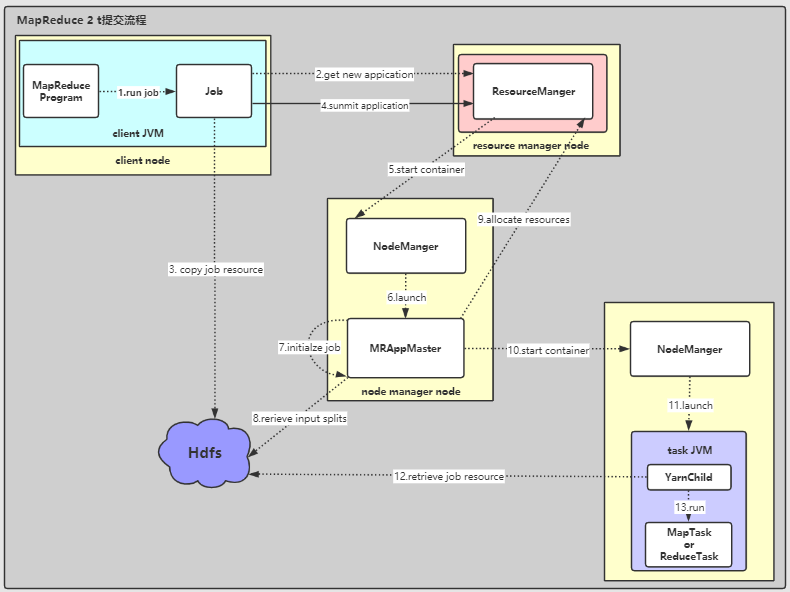

# MapReduce 2 任务提交流程

## 涉及到五个实体：

Client：提交 MapReduce job的客户端
YARN Resource Manager：负责协调分配集群计算资源
YARN Node Managers：启动并监视集群中机器上的计算容器。
MapReduce Application Master：协调MapReduce job的任务执行。
HDFS：用于在其他实体之间共享Job文件

## 提交流程

