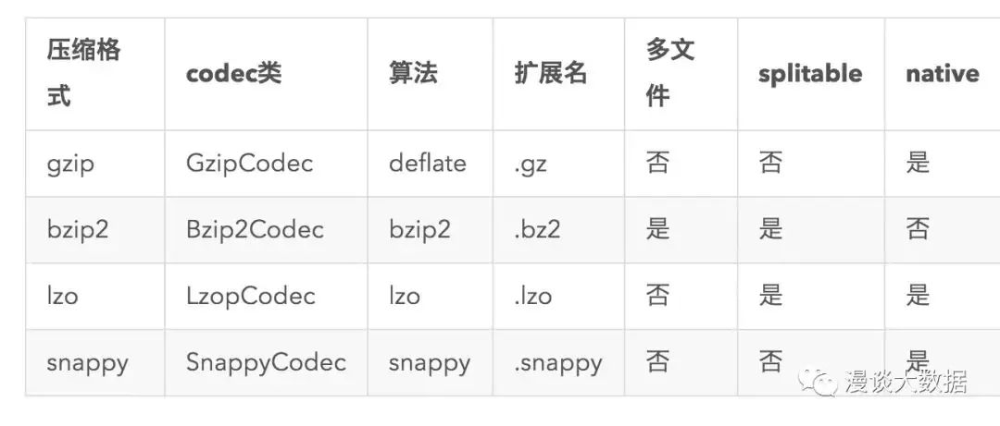
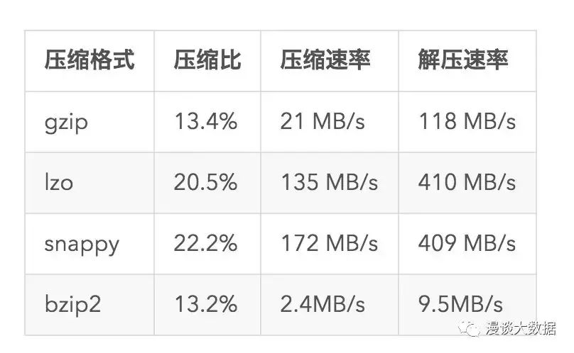

# PB级Hadoop实战优化

## 集群规模 

* 2000台
* 两地三中心

## 数据类型

结构化数据
图像
音频
文件

## 业务挑战

## 方案

### 冷热数据

* HDFS热数据
* OSS冷数据

* 在线数据
* 近线数据
* 离线数据

### 数据压缩

splitable 决定了一个文件是否可切分给多个 mapper 处理，也就是文件是否能被并行处理。

* 原始日志采集落地的时候使用 snappy 压缩，兼顾存储空间和处理速度。
* 周期性的对清洗完的日志文件做 archive，并把 snappy 文件转换为 gzip，以节省空间。
* 对结构化的数据，主要是 Hive 表，采用 parquet+gzip 的方式，gzip 节省空间，而相对于 snappy 的性能劣势，则由 parquet 的性能优势来弥补。

### 存储介质

#### Storage Type

用来表示不同类型的存储，包括：

* ARCHIVE，其实就是更大更便宜的硬盘，花同样多的 RMB 能存下更多的数据。我们生产环境单台 128 TB。
* DISK，常见的普通硬盘，我们生产环境单台空间 48TB。
* SSD，常见的固态硬盘。
* RAM_DISK，其实就是内存，一般不会这么奢侈

#### Storage Policy

用来表示不同的存储策略，可以对应数据的冷热程度，也就是使用频次。包括：

* Hot，热数据，经常被访问到的数据，所有副本都保存到 DISK
* Cold，冷数据，很少访问的数据，所有副本都保存到 ARCHIVE
* Warm，温数据，介于冷热之间的数据，一个副本保存在 DISK，其他全部在 ARCHIVE
* All_SSD，没有冷热对应，所有副本保存在 SSD
* One_SSD，没有冷热对应，一个副本保存在 SSD，其他都在 DISK

### 小文件问题

