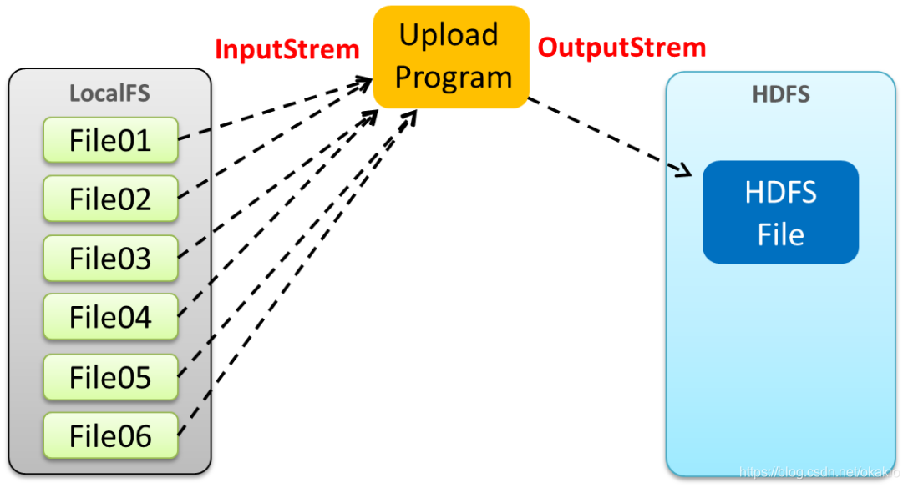

#Windows Hadoop环境的搭建

**配置Hadoop 插件**

在 hadoop-2.8.5\bin 中，添加一下几个插件：

**修改配置Hadoop Home位置**

修改hadoop-3.2.1\etc\hadoop的

**hadoop-env.sh：**

	export JAVA_HOME= "C:\Program Files"\Java\jdk1.8.0_221

注意引号加在C:\Program Files之间

**hadoop-env.cmd**

	set JAVA_HOME= "C:\Program Files"\Java\jdk1.8.0_221

注意引号加在C:\Program Files之间

**设置环境变量**

HADOOP_USER_NAME: {hadoop中的对应登录账户}

